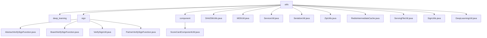

# Basic Information

|      |      |
|------|------|
| Name | utils |
| Language | .java |
| Code Path | WeFe/serving/serving-service/src/main/java/com/welab/wefe/serving/service/utils |
| Package Name | docs.serving.serving-service.src.main.java.com.welab.wefe.serving.service.utils |
| Brief Description | Extensible signature verification framework supporting multiple strategy patterns, including RSA signature verification, identity verification, and other functionalities. Includes utility classes for encryption (SHA256, MD5), serialization, Redis cache operations, file processing, and deep learning service invocation. |

# Description

## Overview  
This module is a server-side toolkit, with core responsibilities including a signature verification framework and general data processing. It employs the strategy pattern to implement multi-scenario signature validation, such as `BoardVerifySignFunction` for verifying memberId. Key data structures include `SignedApiInput` and a strategy mapping table. The encryption utilities provide SHA256/MD5 implementations, similar to standard cryptographic libraries. Dependencies cover Redis, ZIP compression, file operations, etc., such as `RedisIntermediateCache` for managing cache connection pools. Serialization tools support object-to-binary conversion.  

## Core Business Scenarios  
The signature verification process routes strategies based on caller types, e.g., `PartnerVerifySignFunction` handles RSA signature verification. The scorecard processing flow parses TableModel data to compute feature outputs. The file service manages model storage paths, and the deep learning toolchain invokes PaddleServing for prediction execution. Typical interactions are encapsulated via utility classes, such as `SignUtils` for generating ordered parameter signatures and `DeepLearningUtil` for managing service lifecycles via Shell commands. Exception handling uniformly captures scenarios like encryption failures and deserialization errors.

### Package Internal Structure View

This flowchart illustrates the complete structure of the utils directory in the WeFe service module, comprising 3 subdirectories (deep_learning/sign/component) and 10 utility class files. The sign directory contains 4 signature-related implementation classes, the component directory includes 1 scorecard utility class, while the rest are standalone utility files covering various functional components such as encryption, serialization, and caching.

# File List

| Name   | Type  | Description |
|-------|------|-------------|
| [SHA256Utils.java](SHA256Utils.md) | file | The SHA256Utils class provides SHA256 encryption functionality, implementing string encryption through MessageDigest and converting the result into a hexadecimal string. |
| [MD5Util.java](MD5Util.md) | file | The MD5Util class provides MD5 encryption functionality, including the getMD5String method for string encryption and the byte2Hex method for converting bytes to hexadecimal strings. |
| [ServiceUtil.java](ServiceUtil.md) | file | The ServiceUtil utility class provides various functions: obtaining client IP, converting files to byte arrays, generating SQL queries, field parsing, string desensitization processing, shard list and key calculation. |
| [SerializeUtil.java](SerializeUtil.md) | file | The SerializeUtil class provides serialization and deserialization methods to convert objects into byte arrays or vice versa, returning null in case of exceptions. |
| [ZipUtils.java](ZipUtils.md) | file | The ZipUtils class provides file compression functionality, packaging multiple files into a ZIP format output stream. It uses a 2KB buffer to improve efficiency, records processing time, and handles exceptions. |
| [RedisIntermediateCache.java](RedisIntermediateCache.md) | file | Redis Cache Operation Class, utilizing JedisPool for connection management, supports saving, retrieving, and deleting data, with thread safety and logging capabilities. |
| [ServingFileUtil.java](ServingFileUtil.md) | file | The ServingFileUtil class provides file path management functionalities, including obtaining root directories, categorizing directories by type (temporary, machine learning models, deep learning models), and supporting compression, decompression, renaming of deep learning model files, as well as handling prediction result output paths. |
| [SignUtils.java](SignUtils.md) | file | The SignUtils class provides parameter signing methods, converting a TreeMap into a JSON string and signing it with an RSA private key, returning a JSON string containing memberId, signature, and data. It throws StatusCodeWithException in case of errors. |
| [DeepLearningUtil.java](DeepLearningUtil.md) | file | The DeepLearningUtil class provides methods for invoking PaddleServing, including functionalities for starting services, executing commands, and terminating services. It operates through shell scripts while handling input and output streams. |
| [component](component/_module.md) | package | The ScoreCardComponentUtil class processes scorecard information, extracts bScore, binning data, and model weights, calculates the WOE and score for each bin, and ultimately returns results containing bins, WOE, scores, and weights. |
| [sign](sign/_module.md) | package | AbstractVerifySignFunction is an abstract class for signature verification, containing the rsaVerify method that requires implementation by subclasses. BoardVerifySignFunction inherits from it, validating member IDs and signatures. VerifySignUtil is a utility class that manages verification functions for different callers. PartnerVerifySignFunction is used to verify partner signatures, supporting multiple service types. |
| [deep_learning](deep_learning/_module.md) | package |  |

