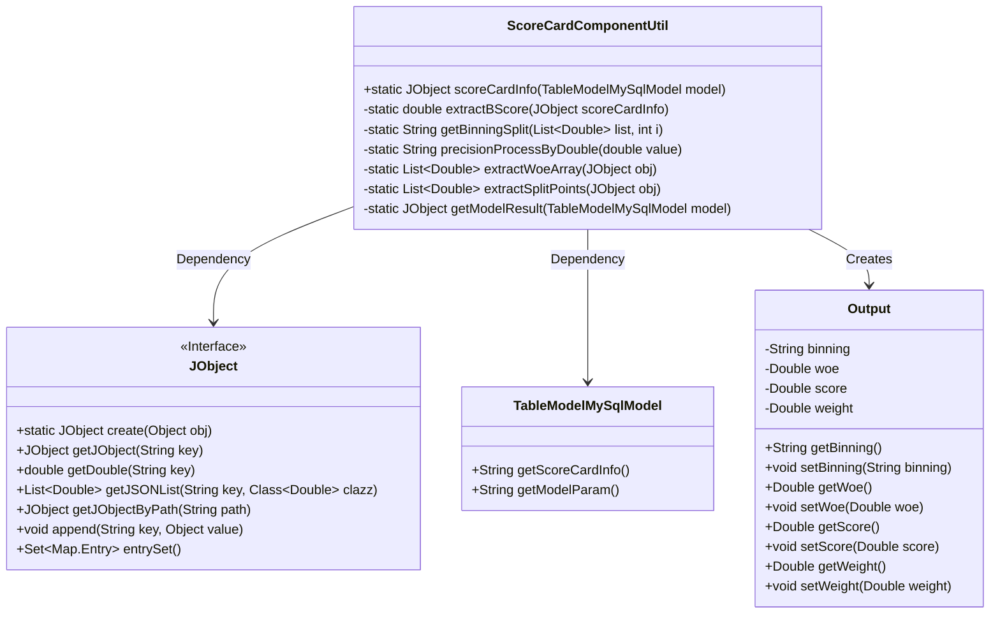
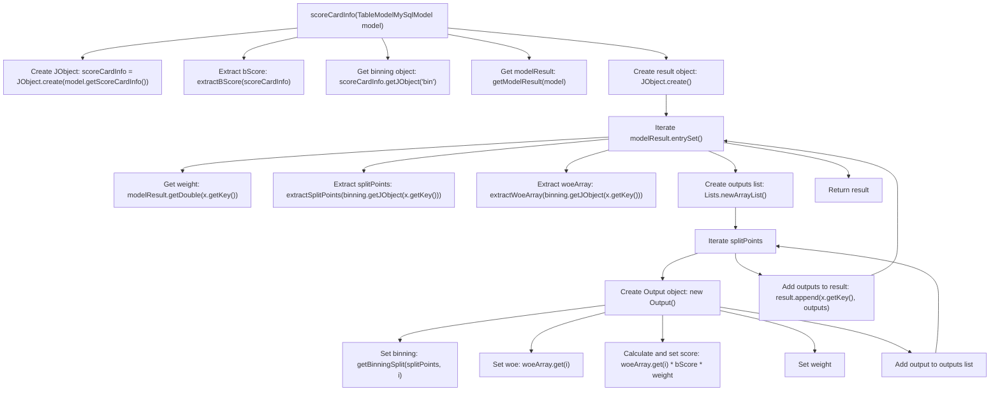

# Basic Information

|      |      |
|------|------|
| Name | ScoreCardComponentUtil |
| Language | .java |
| Code Path | WeFe/serving/serving-service/src/main/java/com/welab/wefe/serving/service/utils/component/ScoreCardComponentUtil.java |
| Package Name | com.welab.wefe.serving.service.utils.component |
| Dependencies | ['com.welab.wefe.common.util.JObject', 'com.welab.wefe.serving.service.database.entity.TableModelMySqlModel', 'org.apache.commons.compress.utils.Lists', 'java.math.BigDecimal', 'java.util.List'] |
| Brief Description | The ScoreCardComponentUtil class processes scorecard information, extracts bScore, binning data, and model weights, calculates the WOE and score for each bin, and ultimately returns a result containing bins, WOE, scores, and weights. |

# Description

The ScoreCardComponentUtil class is used to process scorecard information, including the scoreCardInfo method, which receives a TableModelMySqlModel object and returns a JObject result. The main process involves extracting bScore, binning data, and model weights, then iterating through the model results to calculate the output for each feature. The output includes bin intervals, woe values, scores, and weights. Auxiliary methods include extracting bScore, processing bin split points, formatting numerical precision, extracting woe arrays and split point arrays, as well as obtaining model weights. The inner class Output is used to encapsulate the output results.

# Class Summary

| Name   | Type  | Description |
|-------|------|-------------|
| ScoreCardComponentUtil | class | The ScoreCardComponentUtil class processes scorecard information, extracts B scores, binning data, and model weights, calculates the score for each bin, and returns the results. |

## Class ScoreCardComponentUtil

|      |      |
|------|------|
| Access Modifier | public |
| Type | class |
| Name | ScoreCardComponentUtil |
| Description | The ScoreCardComponentUtil class processes scorecard information, extracts B scores, binning data, and model weights, calculates the score for each bin, and returns the results. |

### UML Class Diagram

This code describes a scorecard utility class `ScoreCardComponentUtil`, primarily used for processing the calculation logic of scorecard models. It retrieves model parameters via `TableModelMySqlModel`, processes JSON data using `JObject`, and ultimately generates output results containing binning intervals, WOE values, weights, and scores. The internal class `Output` encapsulates calculation results with attributes like binning intervals, WOE values, scores, and weights. The entire workflow involves data extraction, computation, and result assembly, ultimately returning a structured JSON object.

### Internal Method Call Graph

This code implements a scorecard information processing utility class, whose main functionality is to extract scorecard information from MySQL model data and calculate bin scores for each feature. The workflow includes: initializing the scorecard information object, extracting the base score (bScore), obtaining binning data and model weight parameters, then iterating through each feature to calculate bin scores (score=woe*bScore*weight), and finally returning an object containing all feature bin score results. Internally, it uses the Output class to encapsulate information such as bin boundaries, WOE values, scores, and weights for each bin.

### Field List

| Name  | Type  | Description |
|-------|-------|------|

### Method List

| Name  | Type  | Description |
|-------|-------|------|
| scoreCardInfo | JObject | This method extracts scorecard information from the model, calculates the score for each feature, including binning, WOE values, and weights, and ultimately returns the feature scoring results. |
| precisionProcessByDouble | String | This method converts a double-precision floating-point number to a BigDecimal and retains two decimal places, applying rounding rules for processing. |
| extractWoeArray | List<Double> | Extract the woeArray field from the JSON object and convert it into a Double list. |
| getModelResult | JObject | The method `getModelResult` receives a `TableModelMySqlModel` object, extracts its `modelParam` attribute and converts it into a `JObject`, then returns the `JObject` object under the `model_param.weight` path. |
| getBinningSplit | String | The method `getBinningSplit` generates a binning interval string. Given an input list and index `i`, it returns the format "lower bound, upper bound". When `i` is 0, the lower bound is -∞; otherwise, it takes the previous value in the list. The upper bound is the current value in the list. The numerical values are processed by `precisionProcessByDouble`. |
| extractSplitPoints | List<Double> | This method extracts a list named "splitPoints" from the JSON object and converts it into a list of Double type before returning it. |
| extractBScore | double | Extract the b_score value from the JSON object and return it. |

