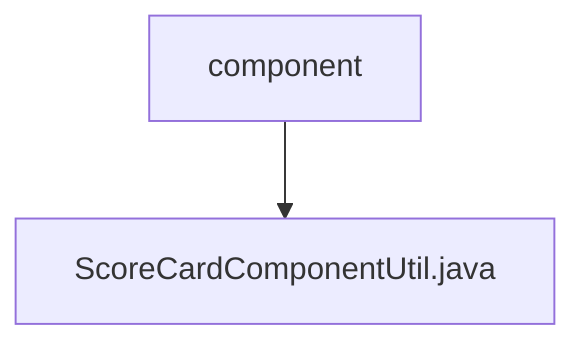

# Basic Information

|      |      |
|------|------|
| Name | component |
| Language | .java |
| Code Path | WeFe/serving/serving-service/src/main/java/com/welab/wefe/serving/service/utils/component |
| Package Name | docs.serving.serving-service.src.main.java.com.welab.wefe.serving.service.utils.component |
| Brief Description | The ScoreCardComponentUtil class processes scorecard information, extracts bScore, binning data, and model weights, calculates the WOE and score for each bin, and ultimately returns results containing bins, WOE, scores, and weights. |

# Description

The `ScoreCardComponentUtil` class is used to process scorecard information and includes the `scoreCardInfo` method, which accepts a `TableModelMySqlModel` object and returns a `JObject` result. The main workflow involves extracting `bScore`, binning data, and model weights, then iterating through the model results to calculate the output for each feature. The output includes bin intervals, woe values, scores, and weights. Helper methods include extracting `bScore`, processing bin split points, formatting numerical precision, extracting woe arrays and split point arrays, as well as retrieving model weights. The inner class `Output` is used to encapsulate the output results.

### Package Internal Structure View

This flowchart illustrates the hierarchical structure of the utils/component directory under the serving-service module in the WeFe project. The top-level node represents the component folder, which contains a single Java utility class file, ScoreCardComponentUtil.java. The structure clearly reflects the storage location of the component utility class as a single file, adhering to the typical organization style of utility classes in Java projects.

# File List

| Name   | Type  | Description |
|-------|------|-------------|
| [ScoreCardComponentUtil.java](ScoreCardComponentUtil.md) | file | The ScoreCardComponentUtil class processes scorecard information, extracts bScore, binning data, and model weights, calculates the WOE and score for each bin, and ultimately returns results containing bins, WOE, scores, and weights. |

