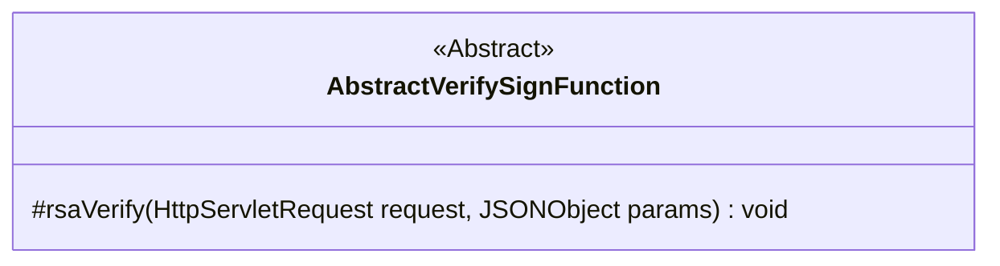
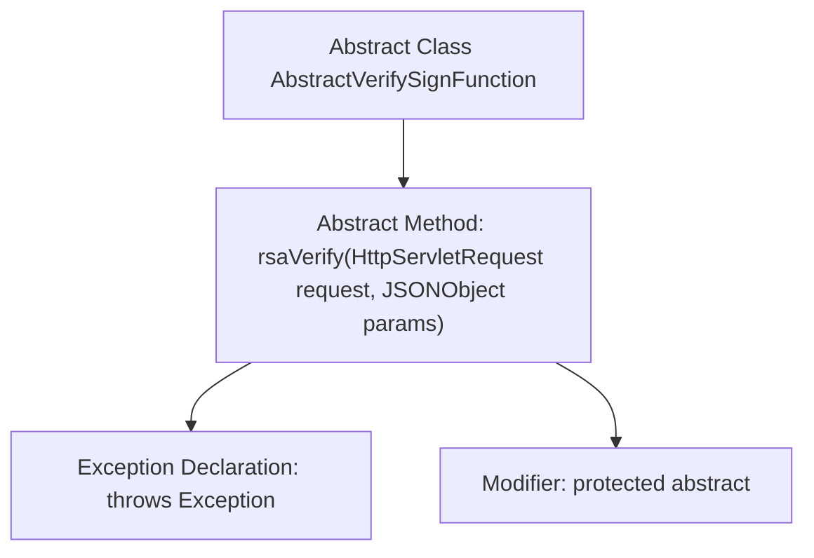

# Basic Information

|      |      |
|------|------|
| Name | AbstractVerifySignFunction |
| Language | .java |
| Code Path | WeFe/serving/serving-service/src/main/java/com/welab/wefe/serving/service/utils/sign/AbstractVerifySignFunction.java |
| Package Name | com.welab.wefe.serving.service.utils.sign |
| Dependencies | ['com.alibaba.fastjson.JSONObject', 'javax.servlet.http.HttpServletRequest'] |
| Brief Description | The abstract class AbstractVerifySignFunction defines a protected method rsaVerify for verifying RSA signatures, which takes request and JSON parameters and may throw exceptions. |

# Description

This is an abstract class named AbstractVerifySignFunction, which defines a protected abstract method rsaVerify. This method takes two parameters, HttpServletRequest and JSONObject, and may throw an Exception. The class is primarily used for signature verification functionality, requiring subclasses to implement the specific RSA verification logic. Being an abstract class, it cannot be instantiated directly and must be inherited by a subclass with its abstract methods implemented before it can be used.

# Class Summary

| Name   | Type  | Description |
|-------|------|-------------|
| AbstractVerifySignFunction | class | The abstract class AbstractVerifySignFunction defines a protected abstract method rsaVerify for RSA signature verification, which takes request and JSON parameters and may throw exceptions. |

## Class AbstractVerifySignFunction

|      |      |
|------|------|
| Access Modifier | public abstract |
| Type | class |
| Name | AbstractVerifySignFunction |
| Description | The abstract class AbstractVerifySignFunction defines a protected abstract method rsaVerify for RSA signature verification, which takes request and JSON parameters and may throw exceptions. |

### UML Class Diagram

This class diagram illustrates an abstract class named AbstractVerifySignFunction, which defines a protected abstract method rsaVerify. The method takes HttpServletRequest and JSONObject as parameters, may throw exceptions, and is designed to implement RSA signature verification functionality. The abstract class is explicitly marked with <<Abstract>>, indicating its design intent as a base class requiring concrete implementation. The diagram clearly conveys the core structure and abstract nature of the class, providing a foundational framework for subsequent implementations of specific verification classes.

### Internal Method Call Graph

This flowchart depicts the structure of an abstract class named AbstractVerifySignFunction. The class contains a protected abstract method rsaVerify, which accepts HttpServletRequest and JSONObject as parameters and declares that it may throw an Exception. The diagram clearly illustrates the hierarchical relationship between the class and its method, along with the method's modifier and exception declaration features, fully presenting the core contractual functionality of this abstract class.

### Field List

| Name  | Type  | Description |
|-------|-------|------|

### Method List

| Name  | Type  | Description |
|-------|-------|------|
| rsaVerify | void | The abstract method `rsaVerify` is used to verify RSA signatures, accepting parameters of `HttpServletRequest` and `JSONObject`, and may throw exceptions. |

