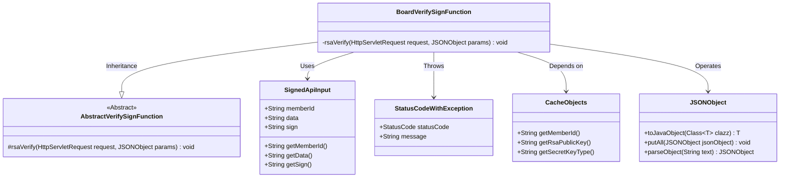
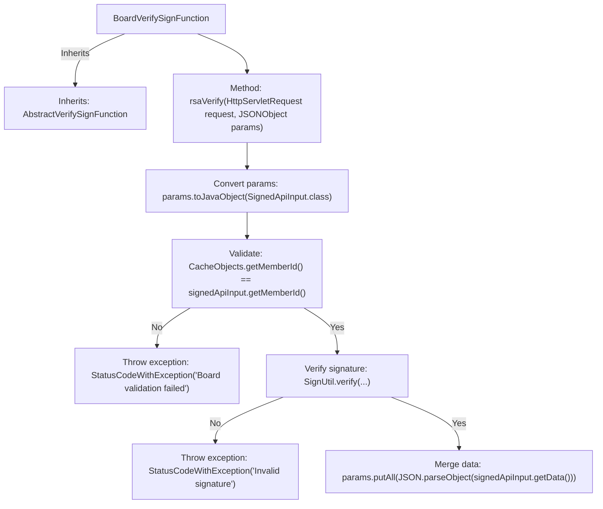

# Basic Information

|      |      |
|------|------|
| Name | BoardVerifySignFunction |
| Language | .java |
| Code Path | WeFe/serving/serving-service/src/main/java/com/welab/wefe/serving/service/utils/sign/BoardVerifySignFunction.java |
| Package Name | com.welab.wefe.serving.service.utils.sign |
| Dependencies | ['com.alibaba.fastjson.JSONObject', 'com.welab.wefe.common.StatusCode', 'com.welab.wefe.common.exception.StatusCodeWithException', 'com.welab.wefe.common.util.RSAUtil', 'com.welab.wefe.common.web.dto.SignedApiInput', 'com.welab.wefe.serving.service.service.CacheObjects', 'javax.servlet.http.HttpServletRequest'] |
| Brief Description | The BoardVerifySignFunction class inherits from AbstractVerifySignFunction, verifies request signatures via RSA, checks memberId matching, throws exceptions upon verification failure, and parses data into params upon success. |

# Description

The `BoardVerifySignFunction` class inherits from `AbstractVerifySignFunction` and is used to verify request signatures. First, it converts the input parameters into a `SignedApiInput` object and checks whether the `memberId` matches the cached value. If they do not match, an exception is thrown. Then, it uses the `SignUtil.verify` method to verify the data signature, throwing an exception if the verification fails. Finally, it merges the parsed data into the parameters. The entire process involves member ID validation and RSA signature verification.

# Class Summary

| Name   | Type  | Description |
|-------|------|-------------|
| BoardVerifySignFunction | class | The BoardVerifySignFunction class inherits from AbstractVerifySignFunction, verifies request signatures via RSA, checks memberId consistency, throws exceptions upon verification failure, and adds data to parameters upon success. |

## Class BoardVerifySignFunction

|      |      |
|------|------|
| Access Modifier | public |
| Type | class |
| Name | BoardVerifySignFunction |
| Description | The BoardVerifySignFunction class inherits from AbstractVerifySignFunction, verifies request signatures via RSA, checks memberId consistency, throws exceptions upon verification failure, and adds data to parameters upon success. |

### UML Class Diagram

This code demonstrates a signature verification class BoardVerifySignFunction, which inherits from the abstract class AbstractVerifySignFunction. It primarily implements the RSA signature verification process: first converting input parameters into a SignedApiInput object, validating whether the memberId matches cached values, then invoking signature tools to verify data signature validity. Upon verification failure, it throws a StatusCodeWithException; upon success, it parses the data into parameter objects. The process involves interactions with utility classes like CacheObjects and JSONObject, reflecting a complete parameter validation and exception handling mechanism.

### Internal Method Call Graph

This code implements a signature verification function class. The main workflow includes: converting input parameters to a specific object, validating whether the member ID matches, verifying data signature using RSA public key, throwing exceptions if verification fails, and merging data into original parameters upon successful verification. The entire process strictly follows secure signature verification protocols to ensure data transmission integrity and identity authenticity.

### Field List

| Name  | Type  | Description |
|-------|-------|------|

### Method List

| Name  | Type  | Description |
|-------|-------|------|
| rsaVerify | void | The method rsaVerify validates the request signature: it checks for memberId matching, verifies the data signature using the RSA public key, throws an exception upon failure, and upon success, parses the data into params. |

