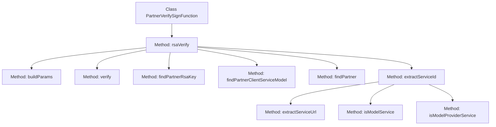
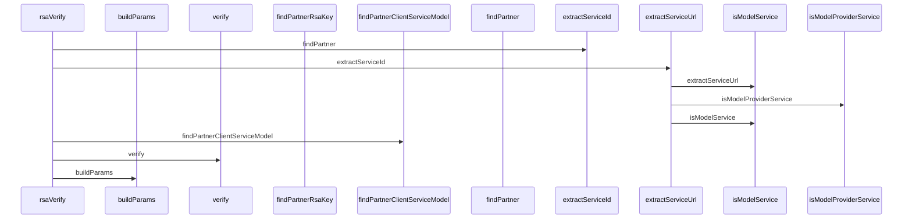

# Basic Information

|      |      |
|------|------|
| Name | PartnerVerifySignFunction |
| Language | .java |
| Code Path | WeFe/serving/serving-service/src/main/java/com/welab/wefe/serving/service/utils/sign/PartnerVerifySignFunction.java |
| Package Name | com.welab.wefe.serving.service.utils.sign |
| Dependencies | ['javax.servlet.http.HttpServletRequest', 'org.slf4j.Logger', 'org.slf4j.LoggerFactory', 'com.alibaba.fastjson.JSONObject', 'com.alibaba.fastjson.parser.Feature', 'com.welab.wefe.common.StatusCode', 'com.welab.wefe.common.constant.SecretKeyType', 'com.welab.wefe.common.exception.StatusCodeWithException', 'com.welab.wefe.common.util.RSAUtil', 'com.welab.wefe.common.util.StringUtil', 'com.welab.wefe.common.web.Launcher', 'com.welab.wefe.common.web.dto.SignedApiInput', 'com.welab.wefe.serving.service.database.entity.ClientServiceMysqlModel', 'com.welab.wefe.serving.service.database.entity.PartnerMysqlModel', 'com.welab.wefe.serving.service.database.entity.TableModelMySqlModel', 'com.welab.wefe.serving.service.database.entity.TableServiceMySqlModel', 'com.welab.wefe.serving.service.database.repository.TableModelRepository', 'com.welab.wefe.serving.service.database.repository.TableServiceRepository', 'com.welab.wefe.serving.service.service.CacheObjects', 'com.welab.wefe.serving.service.service.ClientServiceService', 'com.welab.wefe.serving.service.service.PartnerService'] |
| Brief Description | The PartnerVerifySignFunction class implements RSA signature verification, processes partner request parameters, extracts the service ID, validates the signature's effectiveness, and finally constructs the return parameters. |

# Description

The `PartnerVerifySignFunction` class inherits from `AbstractVerifySignFunction` and is primarily used to verify the signatures of partners. Its core functionalities include parsing request parameters, extracting service IDs, retrieving partner information, validating signature effectiveness, and constructing response parameters. It employs RSA or custom signature tools for signature verification and handles exceptional cases such as invalid signatures or missing partner records. It supports differentiated processing for model services and regular services while logging execution time.

# Class Summary

| Name   | Type  | Description |
|-------|------|-------------|
| PartnerVerifySignFunction | class | The PartnerVerifySignFunction class implements RSA signature verification, processes request parameters, verifies partner identity and service validity, and records execution time. |

## Class PartnerVerifySignFunction

|      |      |
|------|------|
| Access Modifier | public |
| Type | class |
| Name | PartnerVerifySignFunction |
| Description | The PartnerVerifySignFunction class implements RSA signature verification, processes request parameters, verifies partner identity and service validity, and records execution time. |

### UML Class Diagram

```mermaid
classDiagram
    class AbstractVerifySignFunction {
        <<Abstract>>
        +AbstractVerifySignFunction()
        #void rsaVerify(HttpServletRequest request, JSONObject params) throws Exception
    }

    class PartnerVerifySignFunction {
        -Logger LOG
        +PartnerVerifySignFunction()
        #void rsaVerify(HttpServletRequest request, JSONObject params) throws Exception
        -void buildParams(HttpServletRequest request, JSONObject params, SignedApiInput signedApiInput, String serviceId)
        -void verify(SignedApiInput signedApiInput, String partnerRsaKey, SecretKeyType secretKeyType) throws Exception
        -String findPartnerRsaKey(String partnerId, String serviceId) throws StatusCodeWithException
        -ClientServiceMysqlModel findPartnerClientServiceModel(String partnerId, String serviceId) throws StatusCodeWithException
        -String findPartner(String customerId) throws StatusCodeWithException
        -String extractServiceId(HttpServletRequest request, JSONObject params) throws StatusCodeWithException
        -String extractServiceUrl(HttpServletRequest request)
        -boolean isModelService(HttpServletRequest request)
        -boolean isModelProviderService(HttpServletRequest request)
    }

    class SignedApiInput {
        +String memberId
        +String customerId
        +String partnerCode
        +String data
        +String sign
        +String getMemberId()
        +String getCustomerId()
        +String getPartnerCode()
        +String getData()
        +String getSign()
        +void setPartnerCode(String partnerCode)
    }

    class ClientServiceMysqlModel {
        +String publicKey
        +SecretKeyType secretKeyType
        +String getPublicKey()
        +SecretKeyType getSecretKeyType()
    }

    class StatusCodeWithException {
        +StatusCode statusCode
        +String message
        +StatusCodeWithException(StatusCode statusCode, String message)
    }

    class ClientServiceService {
        <<Interface>>
        +ClientServiceMysqlModel queryByIdAndServiceId(String partnerId, String serviceId)
    }

    class PartnerService {
        <<Interface>>
        +PartnerMysqlModel queryByCode(String customerId)
    }

    class TableModelRepository {
        <<Interface>>
        +TableModelMySqlModel findOne(String field, String value, Class~TableModelMySqlModel~ clazz)
    }

    class TableServiceRepository {
        <<Interface>>
        +TableServiceMySqlModel findOne(String field, String value, Class~TableServiceMySqlModel~ clazz)
    }

    AbstractVerifySignFunction <|-- PartnerVerifySignFunction
    PartnerVerifySignFunction --> SignedApiInput : uses
    PartnerVerifySignFunction --> ClientServiceMysqlModel : uses
    PartnerVerifySignFunction --> StatusCodeWithException : throws
    PartnerVerifySignFunction ..> ClientServiceService : depends
    PartnerVerifySignFunction ..> PartnerService : depends
    PartnerVerifySignFunction ..> TableModelRepository : depends
    PartnerVerifySignFunction ..> TableServiceRepository : depends
```

This code demonstrates the implementation class `PartnerVerifySignFunction` for partner signature verification, which inherits from the abstract class `AbstractVerifySignFunction`. Its main functionalities include RSA signature verification, partner information query, service ID extraction, and other operations. The class diagram clearly illustrates the inheritance relationships, dependent interfaces, and key data model classes such as the input parameter class `SignedApiInput` and the service model class `ClientServiceMysqlModel`. This implementation completes the signature verification process through various helper methods and handles various exception scenarios.

### Internal Method Call Graph

This code implements the PartnerVerifySignFunction class, primarily handling the RSA signature verification process. The flowchart illustrates the invocation relationships between various methods within the class, while the sequence diagram details the execution order of sub-methods when the rsaVerify method is called. The code first retrieves partner and service information through findPartner and extractServiceId, then performs signature verification via verify, and finally constructs return parameters using buildParams. The entire process includes exception handling and logging to ensure the security and reliability of signature verification.

### Field List

| Name  | Type  | Description |
|-------|-------|------|
| LOG = LoggerFactory.getLogger(this.getClass()) | Logger | Declare a protected final logger object for logging in the current class. |

### Method List

| Name  | Type  | Description |
|-------|-------|------|
| buildParams | void | The method constructs the request parameters into a JSON object, including input data, client ID, partner code, service ID, and model service identifier. |
| findPartner | String | This method queries partner information by customer ID. If it does not exist, an exception is thrown; if it exists, the partner ID is returned. |
| findPartnerClientServiceModel | ClientServiceMysqlModel | This method queries the partner activation record by partner ID and service ID, and throws an exception if no record is found. It returns the query result. |
| findPartnerRsaKey | String | This method retrieves the RSA public key by querying the partner ID and service ID, throwing an exception if no record is found, and returning the public key upon success. |
| rsaVerify | void | The method `rsaVerify` verifies the request signature, processes the member ID and customer ID, extracts the service ID, looks up the partner, validates the signature, constructs parameters, and records the time taken. |
| verify | void | Verification signature method, using RSA public key and signature type to check the input data signature, throws an exception if it fails. |
| extractServiceId | String | This method extracts the service ID from the HTTP request and JSON parameters. For model provider services, it retrieves the ID directly from the parameters; for model services, it queries the model table via the URL; otherwise, it queries the service table. An exception is thrown if no match is found. |
| extractServiceUrl | String | Extract the part after "api/" in the HTTP request URI as the service URL. |
| isModelService | boolean | Check if the HTTP request URI contains "api/" followed by "predict" to determine whether it is a model service request. |
| isModelProviderService | boolean | Check if the request URI contains "model/provider/status/check" to determine whether it is a model provider service. |

