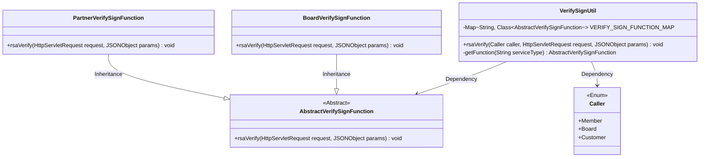
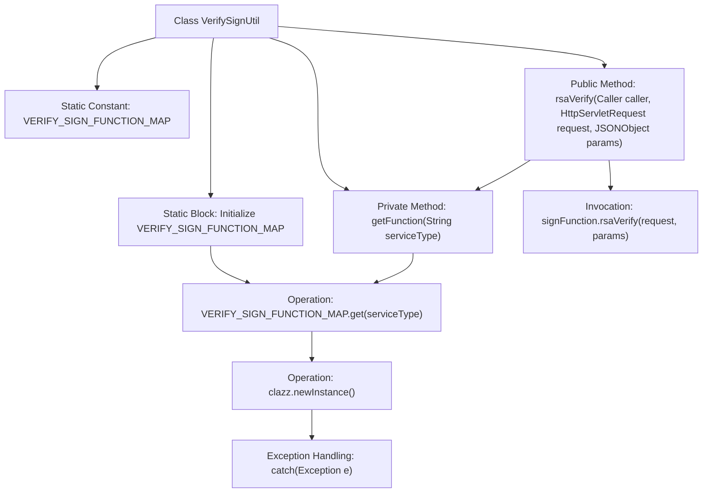

# Basic Information

|      |      |
|------|------|
| Name | VerifySignUtil |
| Language | .java |
| Code Path | WeFe/serving/serving-service/src/main/java/com/welab/wefe/serving/service/utils/sign/VerifySignUtil.java |
| Package Name | com.welab.wefe.serving.service.utils.sign |
| Dependencies | ['com.alibaba.fastjson.JSONObject', 'com.welab.wefe.common.web.api.base.Caller', 'javax.servlet.http.HttpServletRequest', 'java.util.HashMap', 'java.util.Map'] |
| Brief Description | The VerifySignUtil class stores verification function classes for different callers through a static mapping, dynamically instantiates and executes RSA signature verification. |

# Description

VerifySignUtil is a utility class for signature verification, containing a static mapping VERIFY_SIGN_FUNCTION_MAP that stores verification signature function classes corresponding to different caller types. The static initialization block assigns BoardVerifySignFunction and PartnerVerifySignFunction implementation classes for three types of callers: Member, Board, and Customer. The getFunction method retrieves the corresponding verification signature function instance based on the service type. The rsaVerify method obtains the corresponding function instance by caller type and performs RSA signature verification. Exception handling captures instantiation exceptions and prints stack traces.

# Class Summary

| Name   | Type  | Description |
|-------|------|-------------|
| VerifySignUtil | class | The VerifySignUtil class manages signature verification functions for different callers through a static mapping table, providing the rsaVerify method to execute corresponding verification logic based on the caller type. |

## Class VerifySignUtil

|      |      |
|------|------|
| Access Modifier | public |
| Type | class |
| Name | VerifySignUtil |
| Description | The VerifySignUtil class manages signature verification functions for different callers through a static mapping table, providing the rsaVerify method to execute corresponding verification logic based on the caller type. |

### UML Class Diagram

This code demonstrates a signature verification utility class VerifySignUtil, which maintains a mapping between different callers (Caller enum) and concrete verification classes (BoardVerifySignFunction/PartnerVerifySignFunction) through a static Map. The core functionality dynamically selects the corresponding verification implementation class based on the caller type via the rsaVerify method, invoking its rsaVerify method to complete verification. It adopts the Abstract Factory pattern, with AbstractVerifySignFunction serving as the abstract base class to define the verification interface, while concrete implementation classes handle signature verification logic for different business scenarios.

### Internal Method Call Graph

This code demonstrates a signature verification utility class that uses a static mapping table VERIFY_SIGN_FUNCTION_MAP to store verification function classes corresponding to different caller types. The static initialization block preloads mapping relationships for three caller types. The core logic dynamically instantiates the corresponding verification class through the getFunction method, with the rsaVerify method ultimately calling the concrete implementation of the signature verification functionality. The flowchart clearly presents the class structure, initialization process, and method call chain, particularly highlighting exception handling and data flow paths.

### Field List

| Name  | Type  | Description |
|-------|-------|------|
| VERIFY_SIGN_FUNCTION_MAP = new HashMap<>() | Map<String, Class<? extends AbstractVerifySignFunction>> | Defined a static immutable map with string keys and values as subclasses of an abstract signature verification function. |

### Method List

| Name  | Type  | Description |
|-------|-------|------|
| getFunction | AbstractVerifySignFunction | Get the corresponding signature verification function instance based on the service type, returns null if failed. |
| rsaVerify | void | The static method `rsaVerify` validates the RSA signature of the caller's request. It requires the caller, request object, and parameters as input, then invokes the corresponding signature function to complete the verification. |

