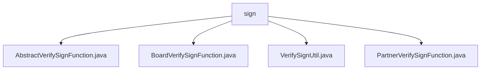

# Basic Information

|      |      |
|------|------|
| Name | sign |
| Language | .java |
| Code Path | WeFe/serving/serving-service/src/main/java/com/welab/wefe/serving/service/utils/sign |
| Package Name | docs.serving.serving-service.src.main.java.com.welab.wefe.serving.service.utils.sign |
| Brief Description | AbstractVerifySignFunction is an abstract class for signature verification, containing the rsaVerify method that requires implementation by subclasses. BoardVerifySignFunction inherits from it, validating member IDs and signatures. VerifySignUtil is a utility class that manages verification functions for different callers. PartnerVerifySignFunction is used to verify partner signatures, supporting multiple service types. |

# Description

## Overview  
The core responsibility of this module is to provide an extensible signature verification framework. It defines a unified interface through abstract classes, with subclasses implementing specific verification logic for different callers. The interface specification requires all verification functions to implement the `rsaVerify` method, which accepts `HttpServletRequest` and `JSONObject` parameters, resembling the design of a gateway's authentication interceptor. Key data structures include `SignedApiInput` (encapsulating signature parameters) and `VERIFY_SIGN_FUNCTION_MAP` (storing verification strategy mappings). Dependencies involve HttpServlet request processing and JSON parsing. For example, `BoardVerifySignFunction` verifies the consistency between memberId and cached data.

## Key Business Scenarios  
The typical workflow involves selecting the corresponding verification strategy based on the caller type (Member/Board/Customer). For instance, a partner call triggers RSA signature verification via `PartnerVerifySignFunction`. The interaction pattern adopts the strategy pattern, routing uniformly to specific implementations through `VerifySignUtil`. The functionality covers member identity verification, signature timestamp checks, etc. For example, `PartnerVerifySignFunction` distinguishes between model services and regular services. During API integration, a service type identifier must be passed, and exception handling captures cases such as invalid signatures or instantiation failures.

### Package Internal Structure View

This flowchart illustrates the hierarchical structure of signature verification utility classes in the WeFe project. The sign directory contains four core files: AbstractVerifySignFunction serves as the abstract base class, BoardVerifySignFunction and PartnerVerifySignFunction implement signature verification logic for different scenarios respectively, while VerifySignUtil provides common verification methods. This architecture embodies the strategy design pattern, facilitating the extension of new verification approaches.

# File List

| Name   | Type  | Description |
|-------|------|-------------|
| [AbstractVerifySignFunction.java](AbstractVerifySignFunction.md) | file | The abstract class AbstractVerifySignFunction defines a protected method rsaVerify for verifying RSA signatures, which takes request and JSON parameters and may throw exceptions. |
| [BoardVerifySignFunction.java](BoardVerifySignFunction.md) | file | The `BoardVerifySignFunction` class inherits from `AbstractVerifySignFunction`, verifies the request signature via RSA, checks for `memberId` matching, throws an exception upon verification failure, and upon success, parses the data into `params`. |
| [VerifySignUtil.java](VerifySignUtil.md) | file | The VerifySignUtil class stores verification function classes for different callers through a static mapping, dynamically instantiates and executes RSA signature verification. |
| [PartnerVerifySignFunction.java](PartnerVerifySignFunction.md) | file | The PartnerVerifySignFunction class implements RSA signature verification, processes partner request parameters, extracts the service ID, validates the signature's effectiveness, and finally constructs the return parameters. |

