# Basic Information

|      |      |
|------|------|
| Name | com |
| Language | .java |
| Code Path | WeFe/union/blockchain-data-sync/src/main/java/com |
| Package Name | docs.union.blockchain-data-sync.src.main.java.com |
| Brief Description | The core components of the blockchain data synchronization system include parsers, utility classes, service layer, and configuration management. Parsers convert contract events into MongoDB operations, utility classes provide auxiliary functions, the service layer handles data persistence, and configuration management initializes the environment. It supports multi-threaded synchronization to ensure data consistency. |

# Description

## Overview  
This module serves as the core component of the blockchain data synchronization system, employing a layered architecture design responsible for parsing, transforming, and persisting on-chain contract events. Key responsibilities include: implementing event parsing (e.g., `MemberContractEventParser`) via the abstract factory pattern, thread-safe data synchronization management (e.g., `SyncConstant`), and toolkit support (e.g., `AbiUtil`). Critical data structures encompass business objects like `EventBO`, block information such as `BlockInfoBO`, and metadata like `ContractABIDefinition`. External dependencies include MongoDB, blockchain node SDK (`BcosBlock`), Java standard library, and WeChat notification APIs. For instance, `BlockSyncHeightService` ensures idempotent block height updates, while `ClassPathScanHandler` dynamically loads parser classes.  

## Key Business Scenarios  
The module supports full lifecycle management of blockchain data in multi-threaded environments, resembling a hybrid model of ETL pipelines and event buses. A typical workflow involves: `InitListener` initializing the environment → `DataSyncTask` synchronizing blocks → `DataProcessor` routing events → subclass `Parser` handling business logic → MongoDB persistence. It primarily addresses three scenarios: entity state changes (e.g., member public key updates), metadata maintenance (e.g., ABI parsing), and resource permission management (e.g., dataset label control). Interaction patterns are uniformly driven by static methods like `parseContractEvent`, such as `UnionNodeContractEventParser` handling node state changes and `BloomFilterContractEventParser` maintaining Bloom filter parameters. API types include factory methods, scanning interfaces, and data processing, with integration cases demonstrating thread-safe height updates and automatic contract parser discovery.

### Package Internal Structure View

```mermaid
graph TD
    com --> welab
    welab --> wefe
    wefe --> parser
    wefe --> enums
    wefe --> constant
    wefe --> util
    wefe --> exception
    wefe --> bo
    wefe --> service
    wefe --> event
    wefe --> tool
    wefe --> task
    wefe --> listener
    wefe --> config
    wefe --> BlockchainDataSyncApp.java
    parser --> MemberContractEventParser.java
    parser --> RealnameAuthAgreementTemplateContractEventParser.java
    parser --> DataSetContractEventParser.java
    parser --> AbstractParser.java
    parser --> TableDataSetContractEventParser.java
    parser --> BlockInfoParser.java
    parser --> MemberFileInfoContractEventParser.java
    parser --> UnionNodeContractEventParser.java
    parser --> TrustCertsContractEventParser.java
    parser --> MemberAuthTypeContractEventParser.java
    parser --> DataResourceContractEventParser.java
    parser --> BloomFilterContractEventParser.java
    parser --> DataSetMemberPermissionContractEventParser.java
    parser --> MemberServiceContractEventParser.java
    parser --> DataSetDefaultTagContractEventParser.java
    parser --> DataResourceDefaultTagContractEventParser.java
    parser --> ImageDataSetContractEventParser.java
    enums --> JavaTypeEnum.java
    constant --> SyncConstant.java
    constant --> ContractConstants.java
    constant --> BinConstant.java
    constant --> BlockConstant.java
    constant --> EventConstant.java
    util --> WechatUtil.java
    util --> AbiUtil.java
    util --> BlockUtil.java
    util --> SolJavaTypeMappingUtil.java
    util --> TransactionUtil.java
    util --> ContractParserUtil.java
    util --> PropertiesUtil.java
    exception --> BusinessException.java
    bo --> contract
    bo --> data
    contract --> ContractInfo.java
    contract --> EventMetaInfo.java
    contract --> ContractContextInfo.java
    contract --> FieldInfo.java
    contract --> MethodMetaInfo.java
    data --> CommonBO.java
    data --> BlockInfoBO.java
    data --> TransactionResponseBO.java
    data --> EventBO.java
    service --> BlockSyncContractHeightService.java
    service --> BlockSyncHeightService.java
    service --> TransactionResponseService.java
    service --> BlockSyncDetailInfoService.java
    service --> BaseService.java
    event --> NewBlockEventCallback.java
    tool --> DataSyncContext.java
    tool --> ClassPathScanHandler.java
    tool --> DataProcessor.java
    task --> DataSyncTask.java
    listener --> InitListener.java
    config --> BlockchainConfig.java
```

This flowchart presents the complete directory structure of a blockchain data synchronization project, starting from the root directory 'com' and expanding hierarchically to various submodules. Core modules include parser (containing 21 contract event parsers), constant (5 constant classes), util (7 utility classes), as well as business modules like service and bo. The overall structure clearly demonstrates a typical layered architecture of a Java project, encompassing foundational utility layer, business logic layer, and data access layer, ultimately pointing to the main application class BlockchainDataSyncApp.java.

# File List

| Name   | Type  | Description |
|-------|------|-------------|
| [welab](welab/_module.md) | package | The core components of the blockchain data synchronization system include parsers, utility classes, service layer, and configuration management. Parsers convert contract events into MongoDB operations, utility classes provide auxiliary functions, the service layer handles data persistence, and configuration management initializes the environment. It supports multi-threaded synchronization to ensure data consistency. |

