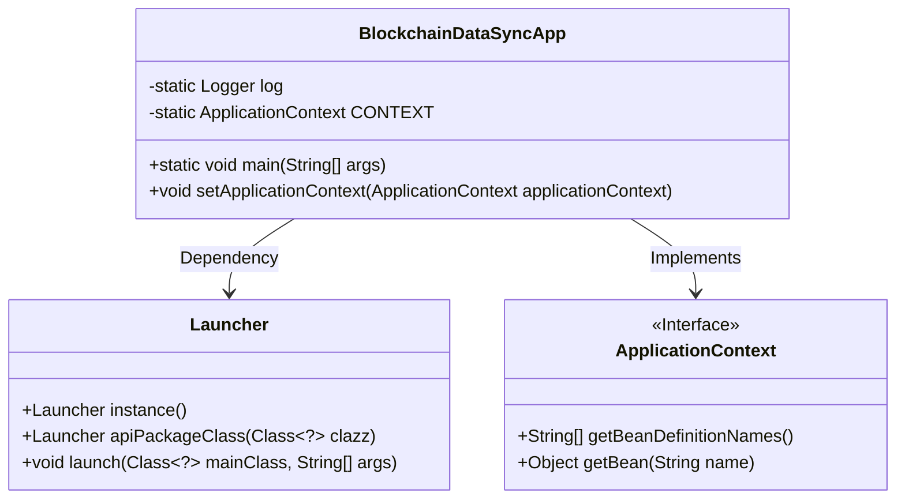
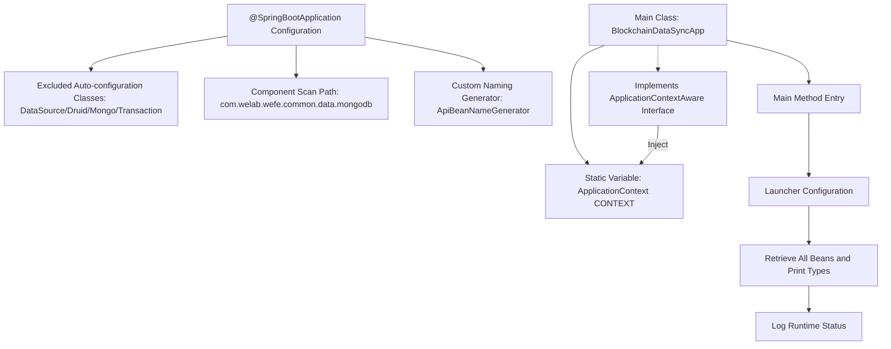

# Basic Information

|      |      |
|------|------|
| Name | BlockchainDataSyncApp |
| Language | .java |
| Code Path | WeFe/union/blockchain-data-sync/src/main/java/com/welab/wefe/BlockchainDataSyncApp.java |
| Package Name | com.welab.wefe |
| Dependencies | ['com.alibaba.druid.spring.boot.autoconfigure.DruidDataSourceAutoConfigure', 'com.welab.wefe.common.web.Launcher', 'com.welab.wefe.common.web.config.ApiBeanNameGenerator', 'org.slf4j.Logger', 'org.slf4j.LoggerFactory', 'org.springframework.beans.BeansException', 'org.springframework.boot.autoconfigure.SpringBootApplication', 'org.springframework.boot.autoconfigure.data.mongo.MongoDataAutoConfiguration', 'org.springframework.boot.autoconfigure.jdbc.DataSourceAutoConfiguration', 'org.springframework.boot.autoconfigure.mongo.MongoAutoConfiguration', 'org.springframework.boot.autoconfigure.transaction.TransactionAutoConfiguration', 'org.springframework.context.ApplicationContext', 'org.springframework.context.ApplicationContextAware', 'org.springframework.context.annotation.ComponentScan', 'org.springframework.scheduling.annotation.EnableScheduling', 'java.util.Arrays'] |
| Brief Description | A SpringBoot application excludes data source configuration, enables scheduled tasks, customizes component scanning paths, implements application context injection, and outputs all Bean information during startup. |

# Description

This is a Spring Boot-based blockchain data synchronization application startup class. The @SpringBootApplication annotation excludes auto-configuration for data sources, MongoDB, and transactions. It uses @ComponentScan to specify the base package scanning path and a custom bean naming generator. The main class implements the ApplicationContextAware interface to obtain the application context, starts the application in the main method, and logs a success message after printing all bean information.

# Class Summary

| Name   | Type  | Description |
|-------|------|-------------|
| BlockchainDataSyncApp | class | A SpringBoot application excludes data source configuration, enables scheduled tasks, customizes component scanning paths, includes the Launcher and BlockchainDataSyncApp classes, and prints all Bean information upon startup. |

## Class BlockchainDataSyncApp

|      |      |
|------|------|
| Access Modifier | @EnableScheduling;@SpringBootApplication(exclude = {;        DataSourceAutoConfiguration.class,;        DruidDataSourceAutoConfigure.class,;        MongoAutoConfiguration.class,;        MongoDataAutoConfiguration.class,;        TransactionAutoConfiguration.class;});@ComponentScan(;        basePackages = {"com.welab.wefe.common.data.mongodb"},;        nameGenerator = ApiBeanNameGenerator.class,;        basePackageClasses = {;                Launcher.class,;                BlockchainDataSyncApp.class;        };);;/**; * @author yuxin.zhang; */;public |
| Type | class |
| Name | BlockchainDataSyncApp |
| Description | A SpringBoot application excludes data source configuration, enables scheduled tasks, customizes component scanning paths, includes the Launcher and BlockchainDataSyncApp classes, and prints all Bean information upon startup. |

### UML Class Diagram

Class Diagram Description: This diagram illustrates the relationship between the BlockchainDataSyncApp class with the Launcher and ApplicationContext interface. BlockchainDataSyncApp serves as the Spring Boot application entry point, which is launched and managed by Launcher while implementing the ApplicationContextAware interface to access the Spring container context. The Launcher class provides instantiation and launch methods, while the ApplicationContext interface defines core methods for retrieving Beans.

### Internal Method Call Graph

This flowchart illustrates the startup process of a Spring Boot application: It excludes specific auto-configurations via @SpringBootApplication, specifies component scan paths and naming rules. The main class BlockchainDataSyncApp launches through Launcher, retrieves the application context and prints all bean information, finally logging successful startup. The class implements the ApplicationContextAware interface to obtain context instances, demonstrating Spring's dependency injection and container initialization mechanisms throughout the process.

### Field List

| Name  | Type  | Description |
|-------|-------|------|
| log = LoggerFactory.getLogger(BlockchainDataSyncApp.class) | Logger | Define a static immutable log object for logging purposes in the BlockchainDataSyncApp class. |
| CONTEXT = null | ApplicationContext | Static public variable CONTEXT, of type ApplicationContext, with an initial value of null. |

### Method List

| Name  | Type  | Description |
|-------|-------|------|
| main | void | Java main method starts the application, scans and sorts all Bean type information for printing, and finally logs a successful run message. |
| setApplicationContext | void | Rewrite the setApplicationContext method to assign the passed ApplicationContext to the static variable CONTEXT. |

