# Basic Information

|      |      |
|------|------|
| Name | wefe |
| Language | .java |
| Code Path | WeFe/union/blockchain-data-sync/src/main/java/com/welab/wefe |
| Package Name | docs.union.blockchain-data-sync.src.main.java.com.welab.wefe |
| Brief Description | The core components of the blockchain data synchronization system include parsers, utility classes, service layer, and configuration management. Parsers convert contract events into MongoDB operations, utility classes provide auxiliary functions, the service layer handles data persistence, and configuration management initializes the environment. It supports multi-threaded synchronization to ensure data consistency. |

# Description

## Overview  
This module serves as the core component of the blockchain data synchronization system, featuring a layered architecture design responsible for parsing, transforming, and persisting on-chain contract events. Key responsibilities include: event parsing via the abstract factory pattern (e.g., `MemberContractEventParser`), thread-safe data synchronization management (e.g., `SyncConstant`), and toolkit support (e.g., `AbiUtil`). Critical data structures encompass business objects like `EventBO`, block information such as `BlockInfoBO`, and metadata like `ContractABIDefinition`. External dependencies include MongoDB, blockchain node SDK (`BcosBlock`), Java standard library, and WeChat notification APIs. For instance, `BlockSyncHeightService` ensures idempotent block height updates, while `ClassPathScanHandler` dynamically loads parser classes.  

## Core Business Scenarios  
The module supports full lifecycle management of blockchain data in multi-threaded environments, resembling a hybrid of ETL pipelines and event bus patterns. A typical workflow involves: `InitListener` initializing the environment → `DataSyncTask` synchronizing blocks → `DataProcessor` routing events → subclass `Parser` handling business logic → MongoDB persistence. It primarily addresses three scenarios: entity state changes (e.g., member public key updates), metadata maintenance (e.g., ABI parsing), and resource permission management (e.g., dataset label control). Interaction is uniformly driven through static methods like `parseContractEvent`, such as `UnionNodeContractEventParser` handling node state changes and `BloomFilterContractEventParser` maintaining Bloom filter parameters. API types include factory methods, scanning interfaces, and data processing, with integration cases demonstrating thread-safe height updates and automatic contract parser discovery.

### Package Internal Structure View

```mermaid
graph TD
    wefe --> BlockchainDataSyncApp.java
    wefe --> parser
    wefe --> enums
    wefe --> constant
    wefe --> util
    wefe --> exception
    wefe --> bo
    wefe --> service
    wefe --> event
    wefe --> tool
    wefe --> task
    wefe --> listener
    wefe --> config
    parser --> MemberContractEventParser.java
    parser --> RealnameAuthAgreementTemplateContractEventParser.java
    parser --> DataSetContractEventParser.java
    parser --> AbstractParser.java
    parser --> TableDataSetContractEventParser.java
    parser --> BlockInfoParser.java
    parser --> MemberFileInfoContractEventParser.java
    parser --> UnionNodeContractEventParser.java
    parser --> TrustCertsContractEventParser.java
    parser --> MemberAuthTypeContractEventParser.java
    parser --> DataResourceContractEventParser.java
    parser --> BloomFilterContractEventParser.java
    parser --> DataSetMemberPermissionContractEventParser.java
    parser --> MemberServiceContractEventParser.java
    parser --> DataSetDefaultTagContractEventParser.java
    parser --> DataResourceDefaultTagContractEventParser.java
    parser --> ImageDataSetContractEventParser.java
    enums --> JavaTypeEnum.java
    constant --> SyncConstant.java
    constant --> ContractConstants.java
    constant --> BinConstant.java
    constant --> BlockConstant.java
    constant --> EventConstant.java
    util --> WechatUtil.java
    util --> AbiUtil.java
    util --> BlockUtil.java
    util --> SolJavaTypeMappingUtil.java
    util --> TransactionUtil.java
    util --> ContractParserUtil.java
    util --> PropertiesUtil.java
    exception --> BusinessException.java
    bo --> contract
    bo --> data
    contract --> ContractInfo.java
    contract --> EventMetaInfo.java
    contract --> ContractContextInfo.java
    contract --> FieldInfo.java
    contract --> MethodMetaInfo.java
    data --> CommonBO.java
    data --> BlockInfoBO.java
    data --> TransactionResponseBO.java
    data --> EventBO.java
    service --> BlockSyncContractHeightService.java
    service --> BlockSyncHeightService.java
    service --> TransactionResponseService.java
    service --> BlockSyncDetailInfoService.java
    service --> BaseService.java
    event --> NewBlockEventCallback.java
    tool --> DataSyncContext.java
    tool --> ClassPathScanHandler.java
    tool --> DataProcessor.java
    task --> DataSyncTask.java
    listener --> InitListener.java
    config --> BlockchainConfig.java
```

This flowchart presents the complete directory structure of a blockchain data synchronization project, starting from the root directory "wefe" and branching into 13 main modules including parser, constants, utility classes, etc. Each module contains specific implementation class files, such as 20 different contract event parsers under the parser module and 5 constant definition files under the constant module. The overall structure clearly demonstrates the functional division and hierarchical relationships within the project.

# File List

| Name   | Type  | Description |
|-------|------|-------------|
| [exception](exception/_module.md) | package | Custom business exception class, extending Exception, with a constructor that includes a message parameter. |
| [BlockchainDataSyncApp.java](BlockchainDataSyncApp.md) | file | A SpringBoot application excludes data source configuration, enables scheduled tasks, customizes component scanning paths, implements application context injection, and outputs all Bean information upon startup. |
| [config](config/_module.md) | package | Blockchain configuration class, including certificate paths, group lists, thread pool parameters, IP and port configurations, providing connection status monitoring and SDK initialization functionality. |
| [listener](listener/_module.md) | package | InitListener monitors application startup events, initializes contract information, registers new block event callbacks, and launches data synchronization tasks. It depends on BcosSDK and contract path configuration. |
| [task](task/_module.md) | package | The DataSyncTask class is used for synchronizing blockchain data, including group ID configuration and WeChat notification URL. It synchronizes block data by group through multithreading, handles exceptions, and records synchronization status. |
| [tool](tool/_module.md) | package | The DataSyncContext manages blockchain interaction configurations, including client, CNS, decoder, and group ID. The ClassPathScanHandler scans the classpath, supporting file and JAR scanning with filtering. The DataProcessor handles block data, dynamically creating parsers and processing events. |
| [event](event/_module.md) | package | The `NewBlockEventCallback` class implements the `BlockNumberNotifyCallback` interface to handle new block events. It retrieves the group ID and block number via the `onReceiveBlockNumberInfo` method and updates the latest block height information for the group. |
| [service](service/_module.md) | package | The BlockSyncContractHeightService records synchronized block height contract information, interacts with MongoDB, saves block data, and processes contract names. The BlockSyncHeightService tracks synchronized block heights, supporting both saving and querying operations. The TransactionResponseService handles transaction response data, dynamically generates collection names, and creates indexes. The BlockSyncDetailInfoService stores block synchronization details, transforming and persisting the data. The BaseService provides foundational functionalities, including error message transmission. |
| [bo](bo/_module.md) | package | Module 1 manages blockchain contract metadata, including contract information, method signatures, and event parameters. It employs a Getter/Setter pattern for access and relies on CnsService for address validation. Module 2 encapsulates blockchain-synchronized data entities in a Java Bean style, supporting block parsing and transaction tracking, with dependencies on the Java standard library. |
| [util](util/_module.md) | package | WechatUtil sends WeChat messages; AbiUtil retrieves ABI event definitions; BlockUtil processes block data and event metadata; SolJavaTypeMappingUtil converts types; TransactionUtil obtains contract information; ContractParserUtil parses contracts; PropertiesUtil reads contract files. |
| [constant](constant/_module.md) | package | The SyncConstant class manages thread-local data synchronization contexts. The ContractConstants class defines empty address constants. The BinConstant class defines metadata hash length constants. The BlockConstant class maintains a thread-safe block height mapping. The EventConstant class defines various event type constants. |
| [enums](enums/_module.md) | package | Java enum class defines data type mappings, including Java type, entity type, SQL type, and conversion methods, providing a parsing method called parse. |
| [parser](parser/_module.md) | package | Multiple parser classes inherit from AbstractParser to handle blockchain contract events and operate MongoDB. These include various event parsers for members, datasets, nodes, certificates, etc., implementing CRUD operations and extended JSON update functionalities to ensure data synchronization and consistency. |

