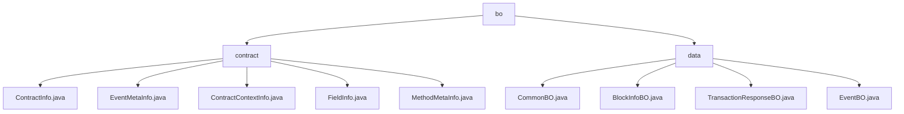

# Basic Information

|      |      |
|------|------|
| Name | bo |
| Language | .java |
| Code Path | WeFe/union/blockchain-data-sync/src/main/java/com/welab/wefe/bo |
| Package Name | docs.union.blockchain-data-sync.src.main.java.com.welab.wefe.bo |
| Brief Description | Module 1 manages blockchain contract metadata, including contract information, method signatures, and event parameters. It employs a Getter/Setter pattern for access and relies on CnsService for address validation. Module 2 encapsulates blockchain-synchronized data entities in a Java Bean style, supporting block parsing and transaction tracking, with dependencies on the Java standard library. |

# Description

## Overview  
The core responsibility of this module is to manage blockchain data entities and contract metadata, adopting a layered design pattern. The interface specification uniformly follows the Getter/Setter pattern, such as ContractInfo providing ABI access and CommonBO encapsulating basic attributes. Key data structures include contract context (ContractContextInfo), cross-chain field definitions (FieldInfo), and block information (BlockInfoBO). External dependencies are limited to CnsService validation and the Java standard library. Implementation examples include contract binary mapping queries (ContractContextInfo.getContractInfoByCode) and transaction list initialization (TransactionResponseBO).

## Main Business Scenarios  
The module supports full lifecycle management of blockchain data, resembling a hybrid model of a configuration center and a data platform. Typical workflows include querying metadata via contract addresses, parsing event structures (EventMetaInfo), and assembling block views (chain aggregation of BlockInfoBO). The interaction model is based on static Map caching and POJO chained calls, such as CONTRACT_BINARY_MAP for accelerated retrieval. Functional completeness is reflected in cross-chain type adaptation (FieldInfo) and core element coverage (EventBO inheritance hierarchy), with typical applications like smart contract monitoring and transaction tracing. API types include metadata queries, structure conversion, and data carriers.

### Package Internal Structure View

This flowchart illustrates the directory structure of Java code in a blockchain data synchronization project. The top-level directory "bo" contains two subdirectories: "contract" and "data". The "contract" directory includes five Java files related to contracts, primarily handling contract information, event metadata, etc. The "data" directory contains four Java files related to data, processing business objects such as block information and transaction responses. The entire structure clearly reflects the data processing hierarchy of the project.

# File List

| Name   | Type  | Description |
|-------|------|-------------|
| [data](data/_module.md) | package | CommonBO encapsulates contract names and entity data. BlockInfoBO stores group IDs, block numbers, events, and transaction lists. TransactionResponseBO contains transaction-related attributes. EventBO inherits from CommonBO, recording event names, block numbers, and address information. |
| [contract](contract/_module.md) | package | The `ContractInfo` class stores contract information, including fields such as name, binary, and ABI. The `EventMetaInfo` class stores event metadata, including name, contract name, and parameter list. The `ContractContextInfo` class manages contract information mappings and provides query methods. The `FieldInfo` class stores field names and types across different environments. The `MethodMetaInfo` class stores method metadata, including input and output parameter lists. |

