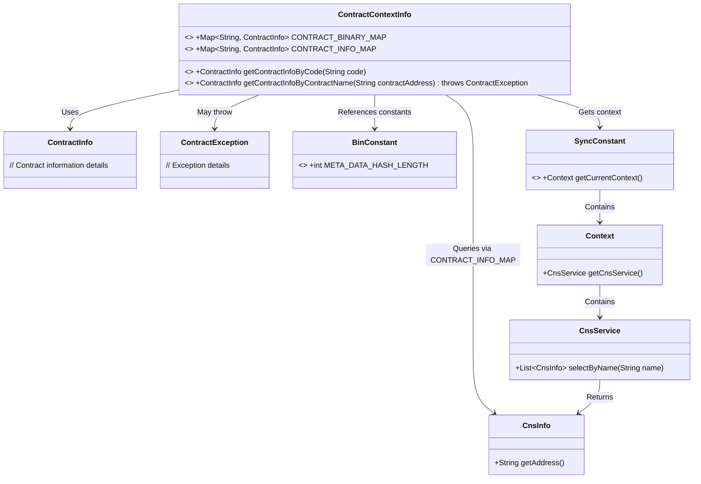
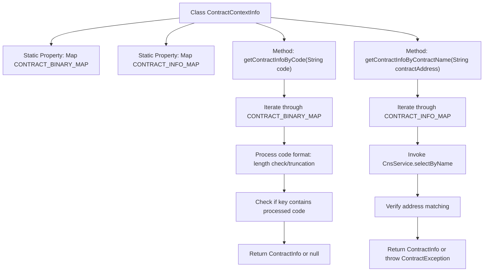

# Basic Information

|      |      |
|------|------|
| Name | ContractContextInfo |
| Language | .java |
| Code Path | WeFe/union/blockchain-data-sync/src/main/java/com/welab/wefe/bo/contract/ContractContextInfo.java |
| Package Name | com.welab.wefe.bo.contract |
| Dependencies | ['com.welab.wefe.constant.BinConstant', 'com.welab.wefe.constant.SyncConstant', 'org.apache.commons.lang3.StringUtils', 'org.fisco.bcos.sdk.contract.precompiled.cns.CnsInfo', 'org.fisco.bcos.sdk.transaction.model.exception.ContractException', 'java.util.HashMap', 'java.util.List', 'java.util.Map', 'java.util.stream.Collectors'] |
| Brief Description | The ContractContextInfo class contains two static Maps for storing contract information, providing methods to query contract details via contract address codes or names. Address code queries handle special formats, while name queries match addresses and return corresponding information. |

# Description

The `ContractContextInfo` class manages contract information and contains two static Maps: `CONTRACT_BINARY_MAP` stores the mapping between contract binaries and their information, while `CONTRACT_INFO_MAP` stores the mapping between contract names and their information. It provides two query methods: `getContractInfoByCode` queries by contract address code, handling code values of varying lengths and formats for matching; `getContractInfoByContractName` queries by contract name, verifying the address validity via `CnsService` before returning the corresponding information. Both methods return `null` if no match is found.

# Class Summary

| Name   | Type  | Description |
|-------|------|-------------|
| ContractContextInfo | class | The ContractContextInfo class contains two static Maps for storing contract information, providing methods to query contract details by contract address code or contract name. |

## Class ContractContextInfo

|      |      |
|------|------|
| Access Modifier | public |
| Type | class |
| Name | ContractContextInfo |
| Description | The ContractContextInfo class contains two static Maps for storing contract information, providing methods to query contract details by contract address code or contract name. |

### UML Class Diagram

This code demonstrates a contract context information management class that maintains mappings between contract binaries and names through two static Maps. Its core functionality involves querying contract information via contract address codes or names, incorporating logic such as hash length validation and address format processing. The class diagram clearly illustrates collaboration with CNS services, context objects, and constant classes, reflecting the complete chain of contract information queries. Exception handling and string operations demonstrate considerations for edge cases.

### Internal Method Call Graph

This flowchart illustrates the structure and core method logic of the ContractContextInfo class. The class maintains two static contract information maps and provides two query approaches: when querying by contract address code, it performs format processing before matching; when querying by contract name, it invokes CNS service to validate address validity. Both methods adopt traversal search strategies, ultimately returning matched contract information or null/exception.

### Field List

| Name  | Type  | Description |
|-------|-------|------|
| CONTRACT_INFO_MAP = new HashMap<>(16) | Map<String, ContractInfo> | Static hash map stores contract information with an initial capacity of 16. |
| CONTRACT_BINARY_MAP = new HashMap<>(16) | Map<String, ContractInfo> | Static hash map with string keys and contract information values, initial capacity 16. |

### Method List

| Name  | Type  | Description |
|-------|-------|------|
| getContractInfoByCode | ContractInfo | The method traverses the contract mapping, adjusts the code format based on the input code length and specific string matching rules, and ultimately returns the matched contract information. If no match is found, it returns null. |
| getContractInfoByContractName | ContractInfo | The static method `getContractInfoByContractName` retrieves contract information by querying the contract address. It iterates through the `CONTRACT_INFO_MAP` and checks whether a matching address exists in the `CnsService`. If found, it returns the corresponding contract information; otherwise, it returns null. |

