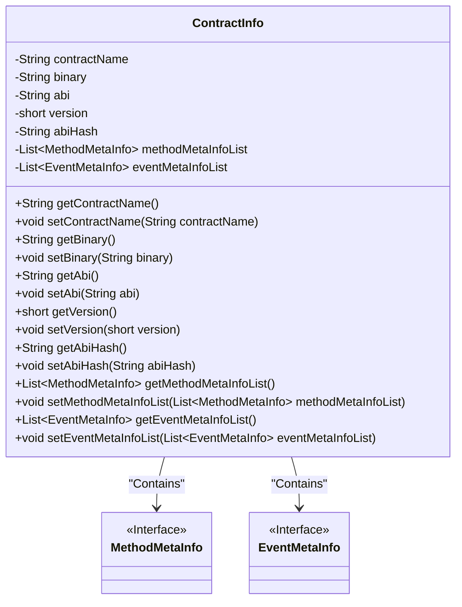

# Basic Information

|      |      |
|------|------|
| Name | ContractInfo |
| Language | .java |
| Code Path | WeFe/union/blockchain-data-sync/src/main/java/com/welab/wefe/bo/contract/ContractInfo.java |
| Package Name | com.welab.wefe.bo.contract |
| Dependencies | ['java.util.List'] |
| Brief Description | The `ContractInfo` class includes the contract name, binary code, ABI, version number, ABI hash value, method metadata list, and event metadata list, providing getter and setter methods for each field. |

# Description

The ContractInfo class is a Java class containing contract-related information, with main fields including contract name, binary data, ABI, version number, ABI hash value, method metadata list, and event metadata list. Each field has corresponding getter and setter methods for retrieving and setting property values. The method metadata list and event metadata list store objects of type MethodMetaInfo and EventMetaInfo, respectively.

# Class Summary

| Name   | Type  | Description |
|-------|------|-------------|
| ContractInfo | class | The ContractInfo class includes the contract name, binary code, ABI, version number, ABI hash value, method metadata list, and event metadata list, providing getter and setter methods for each field. |

## Class ContractInfo

|      |      |
|------|------|
| Access Modifier | public |
| Type | class |
| Name | ContractInfo |
| Description | The ContractInfo class includes the contract name, binary code, ABI, version number, ABI hash value, method metadata list, and event metadata list, providing getter and setter methods for each field. |

### UML Class Diagram

This code defines a `ContractInfo` class for storing smart contract-related information, including contract name, binary code, ABI interface, version number, ABI hash value, and metadata lists for methods and events. The class encapsulates data through private fields and provides complete getter and setter methods. The class diagram illustrates the dependency relationship between `ContractInfo` and two interfaces, `MethodMetaInfo` and `EventMetaInfo`, indicating that the contract information contains metadata lists for methods and events. The overall design complies with the JavaBean specification, facilitating data encapsulation and access control.

### Internal Method Call Graph

```mermaid
graph TD
    A["Class ContractInfo"]
    B["Attribute: String contractName"]
    C["Attribute: String binary"]
    D["Attribute: String abi"]
    E["Attribute: short version"]
    F["Attribute: String abiHash"]
    G["Attribute: List<MethodMetaInfo> methodMetaInfoList"]
    H["Attribute: List<EventMetaInfo> eventMetaInfoList"]
    I["Method: getContractName()"]
    J["Method: setContractName(String)"]
    K["Method: getBinary()"]
    L["Method: setBinary(String)"]
    M["Method: getAbi()"]
    N["Method: setAbi(String)"]
    O["Method: getVersion()"]
    P["Method: setVersion(short)"]
    Q["Method: getAbiHash()"]
    R["Method: setAbiHash(String)"]
    S["Method: getMethodMetaInfoList()"]
    T["Method: setMethodMetaInfoList(List<MethodMetaInfo>)"]
    U["Method: getEventMetaInfoList()"]
    V["Method: setEventMetaInfoList(List<EventMetaInfo>)"]

    A --> B
    A --> C
    A --> D
    A --> E
    A --> F
    A --> G
    A --> H
    A --> I
    A --> J
    A --> K
    A --> L
    A --> M
    A --> N
    A --> O
    A --> P
    A --> Q
    A --> R
    A --> S
    A --> T
    A --> U
    A --> V
```

This flowchart illustrates the complete structure of the ContractInfo class, comprising 8 private attributes and 14 public methods. The attributes include contract name, binary data, ABI, version number, ABI hash value, as well as method and event metadata lists. Each attribute is paired with corresponding getter and setter methods to encapsulate access and modification of these values. The class design complies with JavaBean specifications, exposing attribute operations through methods while maintaining data encapsulation.

### Field List

| Name  | Type  | Description |
|-------|-------|------|
| version | short | Private short integer variable version, used to store the version number. |
| eventMetaInfoList | List<EventMetaInfo> | List of event metadata, a private collection storing EventMetaInfo objects. |
| binary | String | Declare a private string variable named binary. |
| abi | String | Define a private string variable abi. |
| contractName | String | private String variable contractName |
| abiHash | String | The private string variable abiHash is used to store the ABI hash value. |
| methodMetaInfoList | List<MethodMetaInfo> | Class private member variable, storing method metadata information list. |

### Method List

| Name  | Type  | Description |
|-------|-------|------|
| getBinary | String | Methods to obtain a binary string. |
| setContractName | void | The method to set the contract name assigns the input parameter to the class member variable contractName. |
| setEventMetaInfoList | void | Method for setting the event metadata list, which assigns the input list to the class member variable. |
| setAbiHash | void | The method for setting the ABI hash value assigns the input parameter abiHash to the class member variable abiHash. |
| setVersion | void | Public method for setting the version number, which takes a parameter of type short and assigns it to the class member variable version. |
| getAbiHash | String | Public method to obtain the abiHash value. |
| getContractName | String | Methods to obtain the contract name, returning a string-type variable `contractName`. |
| setBinary | void | Methods for setting binary strings, assigning the input value to the class's binary variable. |
| getAbi | String | Methods to obtain the ABI string. |
| setMethodMetaInfoList | void | Set the method meta-information list, assigning the input list to the class member variable methodMetaInfoList. |
| getEventMetaInfoList | List<EventMetaInfo> | The method to retrieve the list of event metadata returns the stored collection of event metadata. |
| setAbi | void | A public method `setAbi` is defined to set the class's `abi` property value to the passed string parameter. |
| getMethodMetaInfoList | List<MethodMetaInfo> | The method to obtain the list of method metadata returns a list storing the method metadata. |
| getVersion | short | Get the short integer method of the current version number. |

