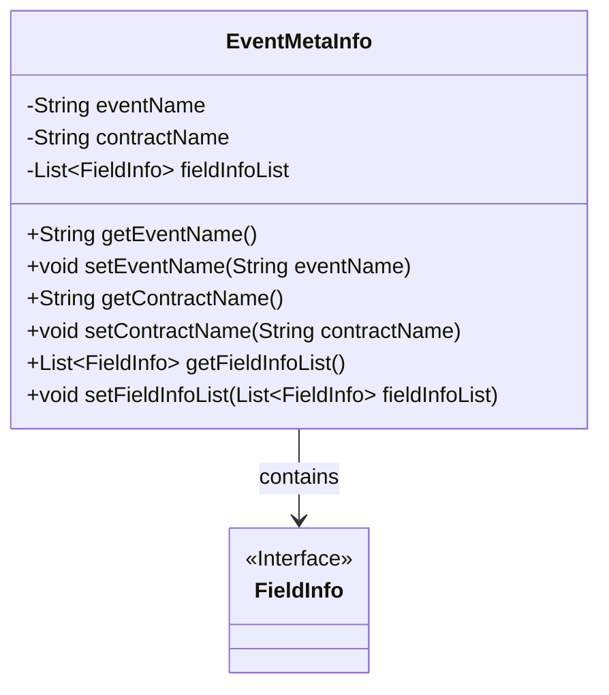
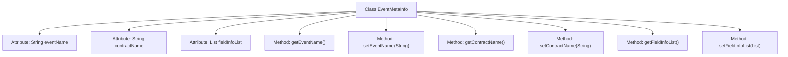

# Basic Information

|      |      |
|------|------|
| Name | EventMetaInfo |
| Language | .java |
| Code Path | WeFe/union/blockchain-data-sync/src/main/java/com/welab/wefe/bo/contract/EventMetaInfo.java |
| Package Name | com.welab.wefe.bo.contract |
| Dependencies | ['java.util.List'] |
| Brief Description | The EventMetaInfo class contains the event name, contract name, and event parameter list, providing corresponding getter and setter methods. |

# Description

The EventMetaInfo class is used to store event metadata and contains three main attributes: eventName represents the event name, contractName represents the contract name, and fieldInfoList is a list of FieldInfo type that stores event parameters. The class provides getter and setter methods for these three attributes to retrieve and set the corresponding values.

# Class Summary

| Name   | Type  | Description |
|-------|------|-------------|
| EventMetaInfo | class | The EventMetaInfo class contains the event name, contract name, and a list of event parameters, providing corresponding getter and setter methods. |

## Class EventMetaInfo

|      |      |
|------|------|
| Access Modifier | public |
| Type | class |
| Name | EventMetaInfo |
| Description | The EventMetaInfo class contains the event name, contract name, and a list of event parameters, providing corresponding getter and setter methods. |

### UML Class Diagram

This code defines an `EventMetaInfo` class for storing event metadata, including the event name, contract name, and a list of field information. The class provides getter and setter methods for its private fields and manages the field information collection through the generic `List<FieldInfo>`. The class diagram illustrates the dependency relationship between `EventMetaInfo` and the `FieldInfo` interface, indicating that event metadata contains multiple field information objects. This is a typical data encapsulation class used for structured storage and transmission of event-related data.

### Internal Method Call Graph

This code defines a class named EventMetaInfo for storing event metadata. The class contains three private attributes: eventName represents the event name, contractName denotes the contract name, and fieldInfoList stores a list of field information for event parameters. It provides six public methods, including getter and setter methods for each attribute, to retrieve and modify these attribute values. This class is primarily used to encapsulate and manage event-related metadata, facilitating access and modification by other code modules.

### Field List

| Name  | Type  | Description |
|-------|-------|------|
| fieldInfoList | List<FieldInfo> | A list of field information that stores a collection of FieldInfo objects. |
| eventName | String | The private string variable `eventName` is used to store the event name. |
| contractName | String | Private string variable contractName |

### Method List

| Name  | Type  | Description |
|-------|-------|------|
| setEventName | void | This is a Java method used to set the event name. The method takes a string parameter `eventName` and assigns it to the class's member variable `eventName`. |
| setFieldInfoList | void | Method for setting the field information list, which assigns the passed field information list to the member variables of the current object. |
| getContractName | String | This is a Java method that returns the value of the string-type variable `contractName`. |
| getEventName | String | Methods to obtain the event name, returns the event name as a string type. |
| getFieldInfoList | List<FieldInfo> | This method returns a list of FieldInfo type named fieldInfoList. |
| setContractName | void | This is a Java method used to set the contract name. The method takes a string parameter contractName and assigns it to the class member variable contractName. |

