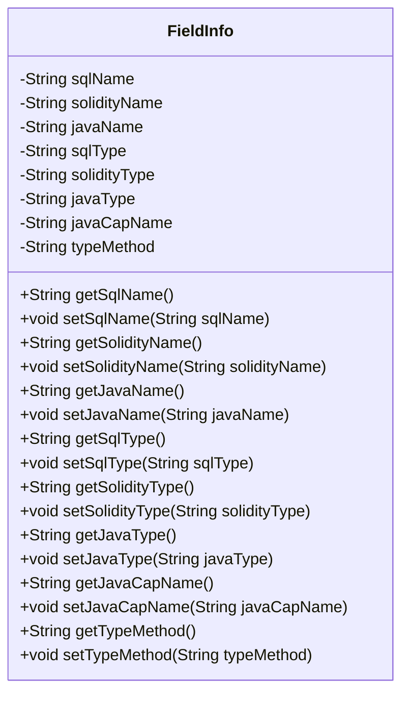

# Basic Information

|      |      |
|------|------|
| Name | FieldInfo |
| Language | .java |
| Code Path | WeFe/union/blockchain-data-sync/src/main/java/com/welab/wefe/bo/contract/FieldInfo.java |
| Package Name | com.welab.wefe.bo.contract |
| Dependencies | [] |
| Brief Description | The FieldInfo class contains field names, types, and methods for SQL, Solidity, and Java, providing getter and setter methods. |

# Description

The FieldInfo class is a Java class used to store field information, containing the names and types of fields in different environments. This class has eight private string attributes: sqlName, solidityName, javaName, sqlType, solidityType, javaType, javaCapName, and typeMethod. Each attribute has corresponding getter and setter methods for retrieving and setting the attribute values. These attributes respectively represent the names and types of the field in SQL, Solidity, and Java, as well as the capitalized name and type method in Java.

# Class Summary

| Name   | Type  | Description |
|-------|------|-------------|
| FieldInfo | class | The FieldInfo class contains field names and types for SQL, Solidity, and Java, providing getter and setter methods. |

## Class FieldInfo

|      |      |
|------|------|
| Access Modifier | public |
| Type | class |
| Name | FieldInfo |
| Description | The FieldInfo class contains field names and types for SQL, Solidity, and Java, providing getter and setter methods. |

### UML Class Diagram

This code defines a `FieldInfo` class for storing and managing field names and type information across different programming languages (SQL, Solidity, Java). The class contains 8 private string attributes representing field names and types in the three languages, along with Java capitalized name and type method. Public getter and setter methods are provided to access and modify these attributes. This class may be used in multi-language code generation or data mapping scenarios to help uniformly manage cross-platform field definitions.

### Internal Method Call Graph

```mermaid
graph TD
    A["Class FieldInfo"]
    B["Property: String sqlName"]
    C["Property: String solidityName"]
    D["Property: String javaName"]
    E["Property: String sqlType"]
    F["Property: String solidityType"]
    G["Property: String javaType"]
    H["Property: String javaCapName"]
    I["Property: String typeMethod"]
    J["Method: getSqlName()"]
    K["Method: setSqlName(String)"]
    L["Method: getSolidityName()"]
    M["Method: setSolidityName(String)"]
    N["Method: getJavaName()"]
    O["Method: setJavaName(String)"]
    P["Method: getSqlType()"]
    Q["Method: setSqlType(String)"]
    R["Method: getSolidityType()"]
    S["Method: setSolidityType(String)"]
    T["Method: getJavaType()"]
    U["Method: setJavaType(String)"]
    V["Method: getJavaCapName()"]
    W["Method: setJavaCapName(String)"]
    X["Method: getTypeMethod()"]
    Y["Method: setTypeMethod(String)"]

    A --> B
    A --> C
    A --> D
    A --> E
    A --> F
    A --> G
    A --> H
    A --> I
    A --> J
    A --> K
    A --> L
    A --> M
    A --> N
    A --> O
    A --> P
    A --> Q
    A --> R
    A --> S
    A --> T
    A --> U
    A --> V
    A --> W
    A --> X
    A --> Y
```

This code defines a FieldInfo class containing 8 private String properties and corresponding getter/setter methods. The class stores field name and type information across different technology stacks (SQL/Solidity/Java), where javaCapName likely represents the Java field name with capitalized first letter, and typeMethod may indicate type conversion methods. All properties are encapsulated through standard accessor methods, reflecting the JavaBean design pattern.

### Field List

| Name  | Type  | Description |
|-------|-------|------|
| typeMethod | String | Declare a private string variable typeMethod. |
| solidityName | String | Declare a private string variable solidityName. |
| javaType | String | Declare a private String variable javaType. |
| javaCapName | String | The private string variable javaCapName is used to store the name. |
| solidityType | String | Declare a private string variable solidityType. |
| sqlName | String | Private string variable sqlName. |
| sqlType | String | The private string variable sqlType is used to store SQL type information. |
| javaName | String | Private String variable javaName. |

### Method List

| Name  | Type  | Description |
|-------|-------|------|
| getSolidityName | String | Methods to obtain solidityName, returning a string type value. |
| setSqlName | void | This is a Java method used to set the value of the sqlName property for a class. The method takes a string parameter sqlName and assigns it to the member variable of the same name in the class. |
| setJavaName | void | This is a Java method used to set the value of the javaName property of a class. The method takes a string parameter javaName and assigns it to the member variable of the same name in the class. |
| getSqlType | String | This is a Java method that returns the string-type sqlType property value. |
| setSolidityType | void | This is a Java method used to set the value of the solidityType property. The method takes a string parameter and assigns it to the member variable of the class. |
| getSolidityType | String | Methods to obtain Solidity types, returning the solidityType as a string. |
| getJavaName | String | Methods to obtain the Java name, returning the value of the variable javaName. |
| setSolidityName | void | Methods for setting the Solidity name, assigning the input parameter to the member variable `solidityName` of the class. |
| getJavaType | String | Get the string method of Java type. |
| setJavaType | void | Set a public method of Java type with a parameter String javaType, and assign it to the member variable this.javaType. |
| setSqlType | void | Java Method: Setting SQL Type String Parameters. |
| getJavaCapName | String | This is a Java method that returns the value of the member variable javaCapName of type String. |
| setJavaCapName | void | This is a Java method used to set the value of the class member variable javaCapName. The method accepts a string parameter and assigns it to the javaCapName property of the current object. |
| setTypeMethod | void | This is a Java method used to set the value of the typeMethod property in a class. The method takes a string parameter typeMethod and assigns it to the member variable of the same name in the class. |
| getSqlName | String | This is a Java method that returns the sqlName property value of string type. |
| getTypeMethod | String | Public method to obtain the value of typeMethod. |

