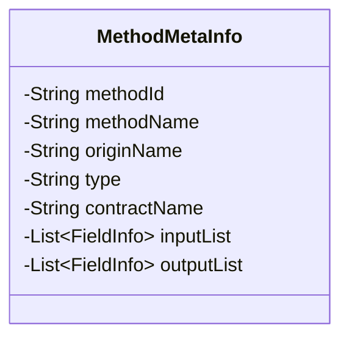
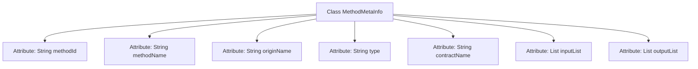

# Basic Information

|      |      |
|------|------|
| Name | MethodMetaInfo |
| Language | .java |
| Code Path | WeFe/union/blockchain-data-sync/src/main/java/com/welab/wefe/bo/contract/MethodMetaInfo.java |
| Package Name | com.welab.wefe.bo.contract |
| Dependencies | ['java.util.List'] |
| Brief Description | The MethodMetaInfo class contains the method ID, name, original name, type, contract name, and lists of input and output parameters. |

# Description

The MethodMetaInfo class is used to store method metadata, including fields such as method ID, method name, original name, type, and contract name. Among them, inputList and outputList represent the input and output parameter lists of the method, respectively, composed of FieldInfo objects. Key fields in the class are annotated to explain their purposes.

# Class Summary

| Name   | Type  | Description |
|-------|------|-------------|
| MethodMetaInfo | class | The MethodMetaInfo class contains the method ID, name, original name, type, contract name, and lists of input and output parameters. |

## Class MethodMetaInfo

|      |      |
|------|------|
| Access Modifier | public |
| Type | class |
| Name | MethodMetaInfo |
| Description | The MethodMetaInfo class contains the method ID, name, original name, type, contract name, and lists of input and output parameters. |

### UML Class Diagram

This class diagram depicts the structure of the `MethodMetaInfo` class, which is an entity class containing method metadata. The private attributes of this class include method ID, method name, original name, type, contract name, and input/output parameter lists (stored using the generic `List<FieldInfo>`). All fields are private with no exposed public methods, suggesting initialization may occur via an external constructor or Builder pattern. The class design focuses on encapsulating comprehensive method description information, making it suitable for scenarios requiring documentation of method signatures, associated contracts, and parameter details.

### Internal Method Call Graph

This flowchart depicts the structure of the MethodMetaInfo class, comprising seven core attributes: methodId (method identifier), methodName (method name), originName (original name), type (type), contractName (contract name), as well as inputList (input parameter list) and outputList (output parameter list). The diagram clearly illustrates the hierarchical relationship between the class and its attributes, with each attribute connected to the main class via arrows, forming a complete class structure view. This structure is commonly used for storing method metadata information, particularly suited for scenarios requiring detailed records of method signatures, parameter types, and other specifics.

### Field List

| Name  | Type  | Description |
|-------|-------|------|
| type | String | Declare a private string variable type. |
| methodId | String | Private string type variable methodId. |
| methodName | String | Private string variable methodName |
| contractName | String | Private string variable contractName |
| originName | String | private String variable originName |
| inputList | List<FieldInfo> | The private field `inputList`, which is a list of type `FieldInfo`. |
| outputList | List<FieldInfo> | The private field `outputList`, which is a list of type `FieldInfo`. |

### Method List

| Name  | Type  | Description |
|-------|-------|------|

