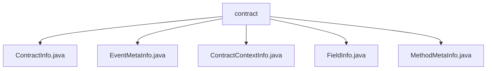

# Basic Information

|      |      |
|------|------|
| Name | contract |
| Language | .java |
| Code Path | WeFe/union/blockchain-data-sync/src/main/java/com/welab/wefe/bo/contract |
| Package Name | docs.union.blockchain-data-sync.src.main.java.com.welab.wefe.bo.contract |
| Brief Description | The `ContractInfo` class stores contract information, including fields such as name, binary, and ABI. The `EventMetaInfo` class stores event metadata, including name, contract name, and parameter list. The `ContractContextInfo` class manages contract information mappings and provides query methods. The `FieldInfo` class stores field names and types across different environments. The `MethodMetaInfo` class stores method metadata, including input and output parameter lists. |

# Description

## Overview  
The core responsibility of this module is to manage blockchain contract metadata, including the structured storage of contract basic information, method signatures, and event parameters. The interface specification uniformly adopts the Getter/Setter pattern to access fields. For example, ContractInfo provides access to attributes such as contract ABI/version number, while EventMetaInfo encapsulates event names and parameter lists. Key data structures include contract binary mapping (ContractContextInfo), cross-language field definitions (FieldInfo), and method input/output templates (MethodMetaInfo). External dependencies only involve CnsService address validation. Implementation examples include querying information via contract address codes (ContractContextInfo.getContractInfoByCode), among others.

## Main Business Scenarios  
The module supports full lifecycle management of contracts, similar to a configuration center model. Typical workflows include querying metadata via contract addresses or names (ContractContextInfo), parsing method signatures (MethodMetaInfo.inputList), and event structures (EventMetaInfo.fieldInfoList). Interaction modes are all based on static Map caches, such as CONTRACT_BINARY_MAP to accelerate binary data retrieval. Functional completeness is reflected in cross-chain environment field adaptation (FieldInfo defines SQL/Solidity/Java type mappings), with typical applications such as parsing parameter types during smart contract event listening. API types include metadata queries and structural conversion.

### Package Internal Structure View

This flowchart illustrates the file structure relationships within the `contract` directory of a blockchain data synchronization project. The `contract` serves as the parent node, encompassing five Java class files: `ContractInfo`, `EventMetaInfo`, `ContractContextInfo`, `FieldInfo`, and `MethodMetaInfo`. These files collectively constitute the data model definitions related to smart contracts.

# File List

| Name   | Type  | Description |
|-------|------|-------------|
| [ContractInfo.java](ContractInfo.md) | file | The ContractInfo class includes the contract name, binary code, ABI, version number, ABI hash value, method metadata list, and event metadata list, providing getter and setter methods for each field. |
| [EventMetaInfo.java](EventMetaInfo.md) | file | The EventMetaInfo class contains the event name, contract name, and event parameter list, providing corresponding getter and setter methods. |
| [ContractContextInfo.java](ContractContextInfo.md) | file | The `ContractContextInfo` class contains two static Maps for storing contract information, providing methods to query contract details either by contract address code or name. Address code queries handle special formats, while name queries match addresses and return corresponding information. |
| [FieldInfo.java](FieldInfo.md) | file | The FieldInfo class contains field names, types, and methods for SQL, Solidity, and Java, providing getter and setter methods. |
| [MethodMetaInfo.java](MethodMetaInfo.md) | file | The MethodMetaInfo class contains the method ID, name, original name, type, contract name, and input/output parameter lists. |

