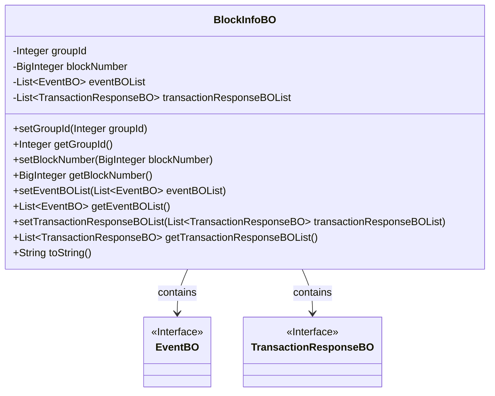

# Basic Information

|      |      |
|------|------|
| Name | BlockInfoBO |
| Language | .java |
| Code Path | WeFe/union/blockchain-data-sync/src/main/java/com/welab/wefe/bo/data/BlockInfoBO.java |
| Package Name | com.welab.wefe.bo.data |
| Dependencies | ['java.math.BigInteger', 'java.util.ArrayList', 'java.util.List'] |
| Brief Description | The BlockInfoBO class contains attributes such as groupId, blockNumber, eventBOList, and transactionResponseBOList, provides getter and setter methods, and the toString method outputs key fields. |

# Description

BlockInfoBO is a Java class designed to encapsulate block information. It contains four main attributes: groupId represents the group ID, blockNumber stores the block number, eventBOList holds a list of event objects, and transactionResponseBOList stores a list of transaction response objects. The class provides getter and setter methods for these attributes and overrides the toString method to output the string representation of groupId, blockNumber, and eventBOList. transactionResponseBOList is initialized as an empty ArrayList upon declaration.

# Class Summary

| Name   | Type  | Description |
|-------|------|-------------|
| BlockInfoBO | class | The BlockInfoBO class includes attributes such as groupId, blockNumber, eventBOList, and transactionResponseBOList, provides getter and setter methods, and the toString method outputs partial attributes. |

## Class BlockInfoBO

|      |      |
|------|------|
| Access Modifier | public |
| Type | class |
| Name | BlockInfoBO |
| Description | The BlockInfoBO class includes attributes such as groupId, blockNumber, eventBOList, and transactionResponseBOList, provides getter and setter methods, and the toString method outputs partial attributes. |

### UML Class Diagram

This class diagram illustrates the structure of the BlockInfoBO class, which is a business object containing block information. It has two basic attributes, groupId and blockNumber, along with two list-type attributes: eventBOList and transactionResponseBOList. The class provides standard getter and setter methods and overrides the toString method. BlockInfoBO has association relationships with the EventBO and TransactionResponseBO interfaces, indicating that it contains lists of objects of these two types. The diagram clearly shows the dependency relationships between classes and attribute types, conforming to standard UML class diagram specifications.

### Internal Method Call Graph

```mermaid
graph TD
    A["Class BlockInfoBO"]
    B["Attribute: Integer groupId"]
    C["Attribute: BigInteger blockNumber"]
    D["Attribute: List<EventBO> eventBOList"]
    E["Attribute: List<TransactionResponseBO> transactionResponseBOList"]
    F["Method: toString()"]
    G["Method: getGroupId()"]
    H["Method: setGroupId(Integer)"]
    I["Method: getEventBOList()"]
    J["Method: setEventBOList(List<EventBO>)"]
    K["Method: getBlockNumber()"]
    L["Method: setBlockNumber(BigInteger)"]
    M["Method: getTransactionResponseBOList()"]
    N["Method: setTransactionResponseBOList(List<TransactionResponseBO>)"]

    A --> B
    A --> C
    A --> D
    A --> E
    A --> F
    A --> G
    A --> H
    A --> I
    A --> J
    A --> K
    A --> L
    A --> M
    A --> N
```

This code defines a class named BlockInfoBO for storing block information, including group ID, block number, event list, and transaction response list. The class provides getter and setter methods for attributes, along with an overridden toString method for formatted object output. The flowchart illustrates the class structure and relationships between attributes and methods, where all methods directly belong to the BlockInfoBO class for operating or accessing corresponding private attributes.

### Field List

| Name  | Type  | Description |
|-------|-------|------|
| blockNumber | BigInteger | A private big integer type variable used to store the block number. |
| eventBOList | List<EventBO> | List of Private Event Business Objects. |
| groupId | Integer | The private integer variable groupId is used to store the group ID. |
| transactionResponseBOList = new ArrayList<>() | List<TransactionResponseBO> | Declare a private list variable transactionResponseBOList, initialized as an empty ArrayList, to store objects of type TransactionResponseBO. |

### Method List

| Name  | Type  | Description |
|-------|-------|------|
| getEventBOList | List<EventBO> | The method to obtain the event BO list directly returns the member variable eventBOList. |
| toString | String | Java overrides the toString method to return a string containing groupId, blockNumber, and eventBOList. |
| setEventBOList | void | Method for setting the event object list, which assigns the input list to the class member variable eventBOList. |
| getGroupId | Integer | Methods to obtain the group ID, which returns an integer-type groupId. |
| setGroupId | void | This is a Java method used to set the groupId property of an object, accepting an Integer type parameter. |
| getBlockNumber | BigInteger | Methods to obtain the block number, returning a BigInteger-type blockNumber value. |
| setBlockNumber | void | This is a Java method used to set the blockNumber property of an object, with the parameter type being BigInteger. |
| getTransactionResponseBOList | List<TransactionResponseBO> | The method to obtain the transaction response BO list directly returns the member variable transactionResponseBOList. |
| setTransactionResponseBOList | void | This is a Java method used to set the value of the transactionResponseBOList property, with the parameter being a list of type TransactionResponseBO. |

