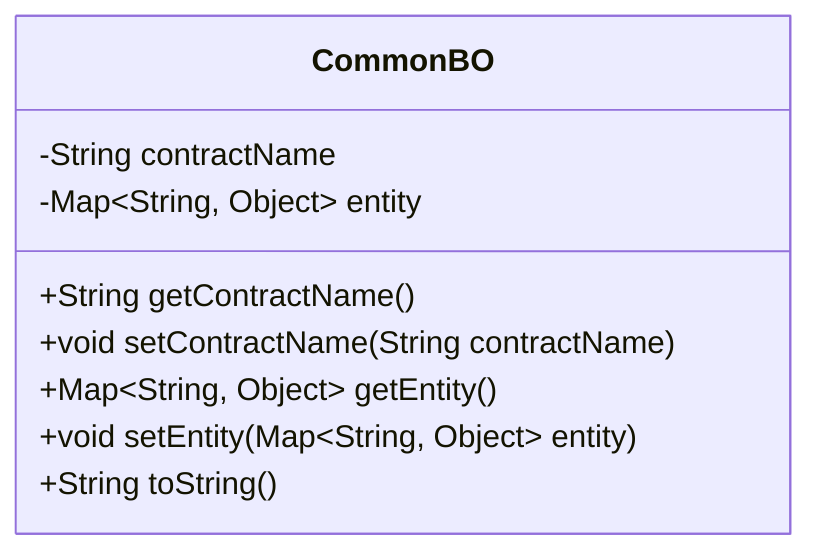
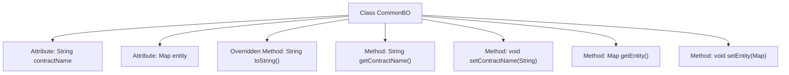

# Basic Information

|      |      |
|------|------|
| Name | CommonBO |
| Language | .java |
| Code Path | WeFe/union/blockchain-data-sync/src/main/java/com/welab/wefe/bo/data/CommonBO.java |
| Package Name | com.welab.wefe.bo.data |
| Dependencies | ['java.util.Map'] |
| Brief Description | The Java class CommonBO includes the attributes contractName and entity, provides getter/setter methods, and the toString method returns the attribute values. |

# Description

CommonBO is a Java class that contains two private attributes: contractName (String type) and entity (Map type, with String keys and Object values). The class provides getter and setter methods for these two attributes. Additionally, it overrides the toString method to return a formatted string containing the values of contractName and entity. This class is primarily used to encapsulate contract names and entity data.

# Class Summary

| Name   | Type  | Description |
|-------|------|-------------|
| CommonBO | class | The Java class CommonBO contains contract names and entity mappings, providing getter/setter methods and toString method. |

## Class CommonBO

|      |      |
|------|------|
| Access Modifier | public |
| Type | class |
| Name | CommonBO |
| Description | The Java class CommonBO contains contract names and entity mappings, providing getter/setter methods and toString method. |

### UML Class Diagram

This code defines a class named CommonBO, which contains two private member variables: contractName (String type) and entity (Map type with String keys and Object values). The class provides getter and setter methods for these variables, and overrides the toString method to format the object's content for output. This class is primarily used to encapsulate contract names and associated entity data, making it suitable for business scenarios that involve processing contract-related data.

### Internal Method Call Graph

This flowchart illustrates the structure of the CommonBO class, containing two private attributes (contractName and entity) and five methods. The core method is toString() for formatted object content output, along with four standard getter/setter methods for attribute access control. All methods are directly linked to the class body without nested call relationships, demonstrating a typical Java Bean design pattern.

### Field List

| Name  | Type  | Description |
|-------|-------|------|
| contractName | String | private string variable contractName |
| entity | Map<String, Object> | The private mapping variable `entity` has keys of string type and values of object type. |

### Method List

| Name  | Type  | Description |
|-------|-------|------|
| setContractName | void | The method to set the contract name assigns the input parameter to the class member variable contractName. |
| getContractName | String | Methods to obtain the contract name, returning a string-type variable `contractName`. |
| toString | String | Override the toString method to return a string containing contractName and entity. |
| getEntity | Map<String, Object> | The method returns a Map object named entity, with keys of type String and values of type Object. |
| setEntity | void | This is a Java method used to set the entity attribute of a class, with the parameter being of Map type, where the key is String and the value is Object. |

