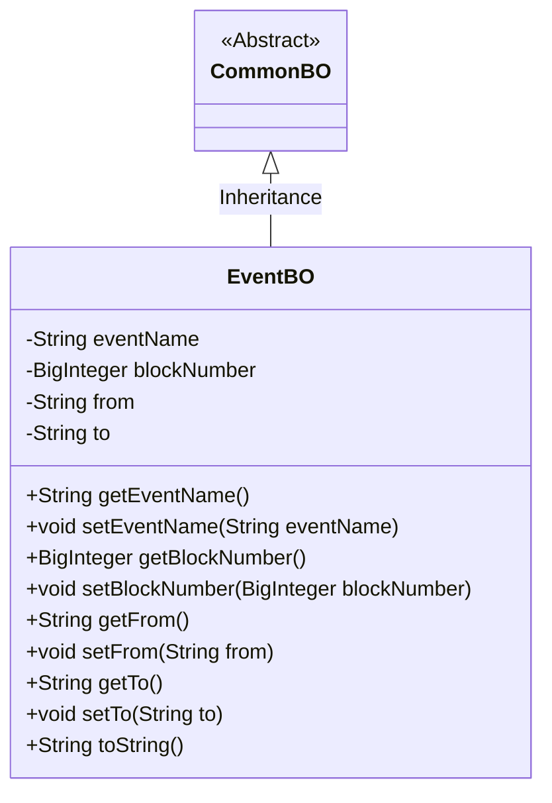

# Basic Information

|      |      |
|------|------|
| Name | EventBO |
| Language | .java |
| Code Path | WeFe/union/blockchain-data-sync/src/main/java/com/welab/wefe/bo/data/EventBO.java |
| Package Name | com.welab.wefe.bo.data |
| Dependencies | ['java.math.BigInteger'] |
| Brief Description | The EventBO class inherits from CommonBO and includes attributes such as event name, block number, sender, and receiver. It provides getter/setter methods and a toString implementation. |

# Description

The EventBO class inherits from CommonBO and contains four private attributes: eventName (event name), blockNumber (block number), from (source address), and to (destination address). It provides getter and setter methods for each attribute and overrides the toString method to return a formatted string containing all attributes.

# Class Summary

| Name   | Type  | Description |
|-------|------|-------------|
| EventBO | class | The EventBO class inherits from CommonBO and includes fields for event name, block number, sender, and receiver, providing getter and setter methods along with a toString implementation. |

## Class EventBO

|      |      |
|------|------|
| Access Modifier | public |
| Type | class |
| Name | EventBO |
| Description | The EventBO class inherits from CommonBO and includes fields for event name, block number, sender, and receiver, providing getter and setter methods along with a toString implementation. |

### UML Class Diagram

This code demonstrates an EventBO class that inherits from the abstract class CommonBO, primarily used to encapsulate event-related business object data. EventBO contains four core attributes: event name, block number, source, and destination, encapsulated through getter/setter methods, and overrides the toString() method to achieve JSON-formatted output. The class diagram clearly illustrates the inheritance relationship and the class member structure, conforming to the design pattern of JavaBean specifications.

### Internal Method Call Graph

```mermaid
graph TD
    A["Class EventBO extends CommonBO"]
    B["Attribute: String eventName"]
    C["Attribute: BigInteger blockNumber"]
    D["Attribute: String from"]
    E["Attribute: String to"]
    F["Overridden method: String toString()"]
    G["Method: String getEventName()"]
    H["Method: void setEventName(String)"]
    I["Method: BigInteger getBlockNumber()"]
    J["Method: void setBlockNumber(BigInteger)"]
    K["Method: String getFrom()"]
    L["Method: void setFrom(String)"]
    M["Method: String getTo()"]
    N["Method: void setTo(String)"]

    A --> B
    A --> C
    A --> D
    A --> E
    A --> F
    A --> G
    A --> H
    A --> I
    A --> J
    A --> K
    A --> L
    A --> M
    A --> N
```

This code demonstrates an EventBO class that inherits from CommonBO, containing four private attributes (eventName, blockNumber, from, to) with corresponding getter/setter methods, and overrides the toString() method for formatted object output. The flowchart clearly illustrates the class inheritance relationship, attribute declarations, and method structure, where all methods are directly associated with the EventBO class, embodying the standard Java Bean design pattern for encapsulating event-related data and supporting chained operations.

### Field List

| Name  | Type  | Description |
|-------|-------|------|
| eventName | String | Private string variable storing the event name. |
| blockNumber | BigInteger | A private big integer variable blockNumber is defined. |
| from | String | Declare a private string variable named from. |
| to | String | Declare a private string variable to. |

### Method List

| Name  | Type  | Description |
|-------|-------|------|
| getBlockNumber | BigInteger | This is a Java method that returns the value of a BigInteger type variable named blockNumber. |
| setBlockNumber | void | This is a Java method used to set the blockNumber property of an object, with the parameter type being BigInteger. The method assigns the passed blockNumber to the current object's property of the same name. |
| setEventName | void | The method to set the event name assigns the input string to the class's eventName variable. |
| toString | String | Override the toString method to return a string containing the eventName, blockNumber, from, and to fields. |
| getFrom | String | Common methods to obtain the value of the from field. |
| setFrom | void | Methods for setting the source string, assigning the parameter `from` to the class member variable `this.from`. |
| getTo | String | Methods to obtain the target address, returning a string-type variable `to`. |
| setTo | void | The method to set the target address assigns the parameter `to` to the class member variable `this.to`. |
| getEventName | String | Methods to obtain the event name, returning the event name as a string type. |

