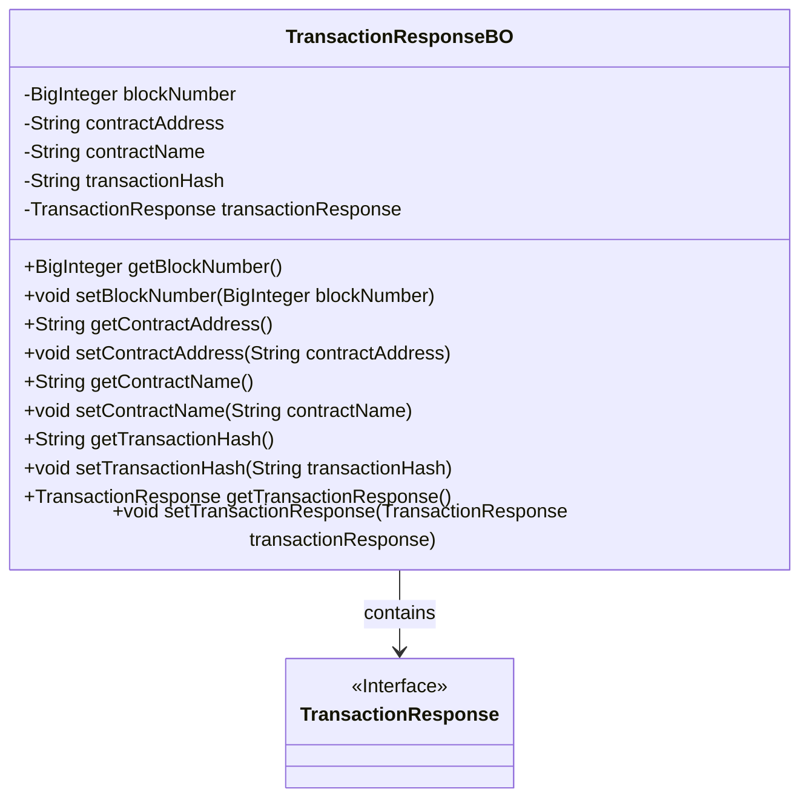

# Basic Information

|      |      |
|------|------|
| Name | TransactionResponseBO |
| Language | .java |
| Code Path | WeFe/union/blockchain-data-sync/src/main/java/com/welab/wefe/bo/data/TransactionResponseBO.java |
| Package Name | com.welab.wefe.bo.data |
| Dependencies | ['org.fisco.bcos.sdk.transaction.model.dto.TransactionResponse', 'java.math.BigInteger'] |
| Brief Description | Transaction response class, including block number, contract address, contract name, transaction hash, and transaction response information. |

# Description

The TransactionResponseBO class includes block number, contract address, contract name, transaction hash, and transaction response object, providing corresponding getter and setter methods for accessing and modifying these attributes.

# Class Summary

| Name   | Type  | Description |
|-------|------|-------------|
| TransactionResponseBO | class | The TransactionResponseBO class includes attributes such as block number, contract address, contract name, transaction hash, and transaction response, along with their corresponding getter and setter methods. |

## Class TransactionResponseBO

|      |      |
|------|------|
| Access Modifier | public |
| Type | class |
| Name | TransactionResponseBO |
| Description | The TransactionResponseBO class includes attributes such as block number, contract address, contract name, transaction hash, and transaction response, along with their corresponding getter and setter methods. |

### UML Class Diagram

This class diagram illustrates the structure of the TransactionResponseBO class, which is a business object class containing blockchain transaction-related data. The class has five private attributes: blockNumber (block number), contractAddress (contract address), contractName (contract name), transactionHash (transaction hash), and transactionResponse (transaction response object). Public getter and setter methods are provided to access and modify these attributes. The transactionResponse attribute is associated with a TransactionResponse interface, indicating that the class depends on the implementation of this interface. The overall structure clearly reflects the data encapsulation and association relationships of the transaction response business object.

### Internal Method Call Graph

```mermaid
graph TD
    A["Class TransactionResponseBO"]
    B["Attribute: BigInteger blockNumber"]
    C["Attribute: String contractAddress"]
    D["Attribute: String contractName"]
    E["Attribute: String transactionHash"]
    F["Attribute: TransactionResponse transactionResponse"]
    G["Method: getBlockNumber()"]
    H["Method: setBlockNumber(BigInteger)"]
    I["Method: getContractAddress()"]
    J["Method: setContractAddress(String)"]
    K["Method: getContractName()"]
    L["Method: setContractName(String)"]
    M["Method: getTransactionHash()"]
    N["Method: setTransactionHash(String)"]
    O["Method: getTransactionResponse()"]
    P["Method: setTransactionResponse(TransactionResponse)"]

    A --> B
    A --> C
    A --> D
    A --> E
    A --> F
    A --> G
    A --> H
    A --> I
    A --> J
    A --> K
    A --> L
    A --> M
    A --> N
    A --> O
    A --> P
```

This code defines a Java class named TransactionResponseBO for encapsulating blockchain transaction response data. The class contains five private attributes: blockNumber (block number), contractAddress (contract address), contractName (contract name), transactionHash (transaction hash), and transactionResponse (transaction response object), with standard getter and setter methods provided for each attribute. This data structure is primarily used for storing and transmitting blockchain transaction-related response information, allowing secure access and modification of these attribute values through methods.

### Field List

| Name  | Type  | Description |
|-------|-------|------|
| contractName | String | Declare a private string variable contractName. |
| blockNumber | BigInteger | Defined a private big integer variable blockNumber. |
| contractAddress | String | Contract address string variable |
| transactionResponse | TransactionResponse | Private transaction response object. |
| transactionHash | String | Transaction hash string variable |

### Method List

| Name  | Type  | Description |
|-------|-------|------|
| getBlockNumber | BigInteger | Methods to obtain the block number, returning a BigInteger-type blockNumber value. |
| getTransactionResponse | TransactionResponse | Methods for obtaining transaction response objects. |
| getContractName | String | This is a Java method that returns the value of a string variable named contractName. |
| setBlockNumber | void | Defines a public method `setBlockNumber` for setting the `blockNumber` property of the object, with the parameter type as `BigInteger`. |
| getContractAddress | String | Methods to obtain the contract address, returning a string-type variable `contractAddress`. |
| getTransactionHash | String | Methods to obtain the transaction hash, returning a string-type variable transactionHash. |
| setContractName | void | This is a Java method used to set the contract name. The method takes a string parameter `contractName` and assigns it to the class's member variable `contractName`. |
| setContractAddress | void | The method for setting the contract address assigns the input parameter to the class member variable contractAddress. |
| setTransactionResponse | void | Method for setting the transaction response object, which assigns the incoming `transactionResponse` to the property of the same name in the current object. |
| setTransactionHash | void | The method for setting the transaction hash assigns the input parameter to the `transactionHash` member variable of the class. |

