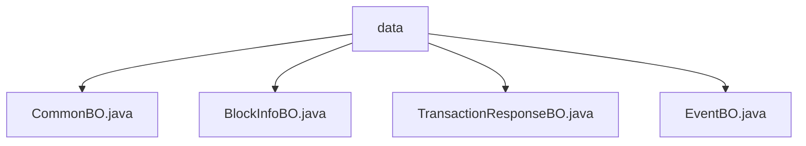

# Basic Information

|      |      |
|------|------|
| Name | data |
| Language | .java |
| Code Path | WeFe/union/blockchain-data-sync/src/main/java/com/welab/wefe/bo/data |
| Package Name | docs.union.blockchain-data-sync.src.main.java.com.welab.wefe.bo.data |
| Brief Description | CommonBO encapsulates contract names and entity data. BlockInfoBO stores group IDs, block numbers, events, and transaction lists. TransactionResponseBO contains transaction-related attributes. EventBO inherits from CommonBO, recording event names, block numbers, and address information. |

# Description

## Overview  
The core responsibility of this module is to encapsulate fundamental data entities involved in blockchain synchronization, resembling a data middle platform model. The interface specification uniformly adopts the Java Bean style, including private attributes and corresponding getter/setter methods. For example, CommonBO provides access interfaces for `contractName` and `entity`. Key data structures include: CommonBO (contract base data), BlockInfoBO (block information), TransactionResponseBO (transaction response), and EventBO (event object). External dependencies are limited to Java standard library collection classes such as Map and ArrayList. For instance, TransactionResponseBO uses ArrayList to initialize transaction lists.  

## Primary Business Scenarios  
The module primarily supports blockchain data synchronization scenarios by mapping on-chain data to business systems through a layered object model. The interaction pattern employs chained assembly—for example, BlockInfoBO aggregates EventBO and TransactionResponseBO to form a complete block view. Functional completeness is reflected in covering core on-chain elements such as block numbers and transaction hashes. For instance, EventBO inherits from CommonBO and extends event-specific fields. Typical applications include block parsing and transaction tracing. All API types act as POJO data carriers, such as using `toString()` for debug log output.

### Package Internal Structure View

This flowchart illustrates the class file structure of the BO layer in a blockchain data synchronization project. The parent node "data" encompasses four business object classes: CommonBO, BlockInfoBO, TransactionResponseBO, and EventBO. These class files reside at the same hierarchical level and collectively form the core business object module for blockchain data synchronization.

# File List

| Name   | Type  | Description |
|-------|------|-------------|
| [CommonBO.java](CommonBO.md) | file | The Java class CommonBO contains the attributes contractName and entity, provides getter/setter methods, and the toString method returns the attribute values. |
| [BlockInfoBO.java](BlockInfoBO.md) | file | The BlockInfoBO class contains attributes such as groupId, blockNumber, eventBOList, and transactionResponseBOList, provides getter and setter methods, and the toString method outputs key fields. |
| [TransactionResponseBO.java](TransactionResponseBO.md) | file | Transaction response class, including block number, contract address, contract name, transaction hash, and transaction response information. |
| [EventBO.java](EventBO.md) | file | The EventBO class inherits from CommonBO and includes attributes such as event name, block number, sender, and receiver, providing getter/setter methods and toString implementation. |

