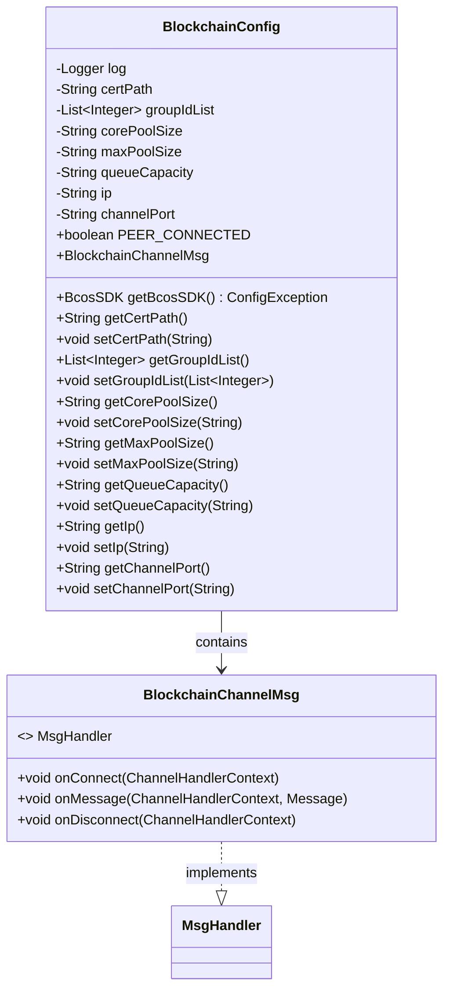
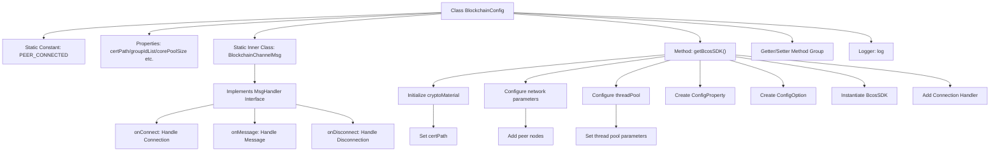

# Basic Information

|      |      |
|------|------|
| Name | BlockchainConfig |
| Language | .java |
| Code Path | WeFe/union/blockchain-data-sync/src/main/java/com/welab/wefe/config/BlockchainConfig.java |
| Package Name | com.welab.wefe.config |
| Dependencies | ['io.netty.channel.ChannelHandlerContext', 'org.fisco.bcos.sdk.BcosSDK', 'org.fisco.bcos.sdk.config.ConfigOption', 'org.fisco.bcos.sdk.config.exceptions.ConfigException', 'org.fisco.bcos.sdk.config.model.ConfigProperty', 'org.fisco.bcos.sdk.model.Message', 'org.fisco.bcos.sdk.network.MsgHandler', 'org.slf4j.Logger', 'org.slf4j.LoggerFactory', 'org.springframework.boot.context.properties.ConfigurationProperties', 'org.springframework.context.annotation.Bean', 'org.springframework.context.annotation.Configuration', 'java.util.ArrayList', 'java.util.HashMap', 'java.util.List', 'java.util.Map'] |
| Brief Description | Blockchain configuration class, including certificate paths, group lists, thread pool parameters, IP and port configurations, providing connection status monitoring and SDK initialization functionality. |

# Description

The code defines a configuration class named `BlockchainConfig`, which is used to initialize the blockchain SDK. The class includes configuration attributes such as certificate paths, group ID lists, thread pool parameters, IP addresses, and channel ports. The inner class `BlockchainChannelMsg` implements the handling logic for connection, message reception, and disconnection. Through the `@Bean`-annotated `getBcosSDK` method, it configures cryptographic materials, network nodes, and thread pool parameters, and initializes the `BcosSDK` instance. Additionally, it adds handlers for connection and disconnection events. The class provides getter and setter methods for each attribute, supporting external configuration.

# Class Summary

| Name   | Type  | Description |
|-------|------|-------------|
| BlockchainConfig | class | Blockchain configuration class, containing certificate paths, group ID lists, thread pool parameters, IP addresses, and ports. Provides connection status management and BcosSDK initialization functionality, supporting network, cryptographic material, and thread pool configurations. |

## Class BlockchainConfig

|      |      |
|------|------|
| Access Modifier | @Configuration;@ConfigurationProperties(prefix = "sdk");public |
| Type | class |
| Name | BlockchainConfig |
| Description | Blockchain configuration class, containing certificate paths, group ID lists, thread pool parameters, IP addresses, and ports. Provides connection status management and BcosSDK initialization functionality, supporting network, cryptographic material, and thread pool configurations. |

### UML Class Diagram

Class diagram description: BlockchainConfig is a configuration class used to initialize blockchain SDK parameters, including certificate paths, network configurations, and thread pool settings. The inner static class BlockchainChannelMsg implements the MsgHandler interface to handle connection and disconnection events. BlockchainConfig creates and configures a BcosSDK instance through the getBcosSDK method while registering connection and disconnection handlers.

### Internal Method Call Graph

This code represents a Spring Boot configuration class for a blockchain SDK, primarily performing the following functions: 1) Loading SDK configuration parameters via @ConfigurationProperties; 2) Defining an inner message handler BlockchainChannelMsg to manage node connection status changes; 3) The core method getBcosSDK() constructs a blockchain SDK instance, encompassing the complete configuration process for cryptographic materials, network nodes, and thread pools; 4) Providing standard Getter/Setter methods for all configuration properties. The flowchart clearly illustrates the main structure of the configuration class and the key method invocation chain, particularly highlighting the assembly sequence of various configuration modules during SDK initialization.

### Field List

| Name  | Type  | Description |
|-------|-------|------|
| channelPort = "20200" | String | The private string variable channelPort has an initial value of "20200". |
| PEER_CONNECTED = true | boolean | The static boolean variable PEER_CONNECTED, with a value of true, indicates the connection status. |
| ip = "127.0.0.1" | String | Define a private string variable ip with an initial value of the local loopback address 127.0.0.1. |
| certPath = "conf" | String | Define a string variable certPath with an initial value of "conf". |
| queueCapacity | String | The private string variable queueCapacity is used to represent the queue capacity. |
| corePoolSize | String | Core thread pool size parameter |
| groupIdList | List<Integer> | Private integer list variable storing a collection of group IDs. |
| log =            LoggerFactory.getLogger(BlockchainConfig.class) | Logger | Define a private static logger instance for the blockchain configuration class. |
| maxPoolSize | String | Declare a private string variable maxPoolSize. |

### Method List

| Name  | Type  | Description |
|-------|-------|------|
| getCertPath | String | Methods to obtain the certificate path, returns a string-type variable certPath. |
| setMaxPoolSize | void | A public method to set the maximum pool size, which assigns the input parameter to the class member variable maxPoolSize. |
| getGroupIdList | List<Integer> | This is a Java method that returns a list of integers named groupIdList. The method is named getGroupIdList and takes no parameters. |
| setCorePoolSize | void | A public method for setting the core size of the thread pool, with the parameter being the number of core threads. |
| getCorePoolSize | String | Methods to obtain the core thread count of a thread pool. |
| getMaxPoolSize | String | Method to obtain the maximum thread pool size. |
| setCertPath | void | The method to set the certificate path assigns the input parameter certPath to the class member variable certPath. |
| getBcosSDK | BcosSDK | Initialize BcosSDK, configure certificate paths, node network, and thread pool parameters, create ConfigOption and instantiate BcosSDK, then add connection and disconnection handlers. |
| setGroupIdList | void | Method for setting the group ID list, which assigns the input list to the member variable of the class. |
| setQueueCapacity | void | The method for setting the queue capacity assigns the input parameter `queueCapacity` to the class property of the same name. |
| getQueueCapacity | String | Methods for obtaining queue capacity, returning the queue capacity value as a string type. |
| getIp | String | Methods to obtain the IP address, returning the IP value as a string type. |
| setIp | void | The method to set the IP address is to assign the parameter ip to the member variable ip of the class. |
| getChannelPort | String | Public method to obtain the channelPort value. |
| setChannelPort | void | The method to set the channel port assigns the input parameter `channelPort` to the class member variable of the same name. |

