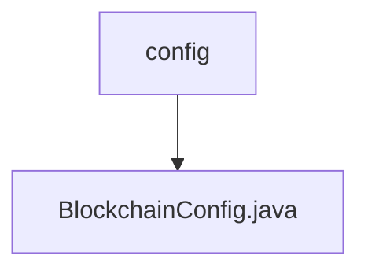

# Basic Information

|      |      |
|------|------|
| Name | config |
| Language | .java |
| Code Path | WeFe/union/blockchain-data-sync/src/main/java/com/welab/wefe/config |
| Package Name | docs.union.blockchain-data-sync.src.main.java.com.welab.wefe.config |
| Brief Description | Blockchain configuration class, including certificate paths, group lists, thread pool parameters, IP and port configurations, providing connection status monitoring and SDK initialization functionality. |

# Description

The code defines a configuration class named `BlockchainConfig`, which is used to initialize the blockchain SDK. The class includes configuration attributes such as certificate paths, group ID lists, thread pool parameters, IP addresses, and channel ports. The inner class `BlockchainChannelMsg` implements the handling logic for connection, message reception, and disconnection. Through the `@Bean`-annotated `getBcosSDK` method, it configures cryptographic materials, network nodes, thread pool parameters, and initializes a `BcosSDK` instance. Additionally, it adds handlers for connection and disconnection events. The class provides getter and setter methods for each attribute, supporting external configuration.

### Package Internal Structure View

This flowchart illustrates the hierarchical relationship of the configuration module in a blockchain data synchronization project. The top-level node is the config folder, which contains a specific configuration file BlockchainConfig.java. This structure reflects a typical Java project configuration management approach, where core configuration classes are organized within dedicated configuration packages to facilitate centralized management and maintenance of project configuration parameters.

# File List

| Name   | Type  | Description |
|-------|------|-------------|
| [BlockchainConfig.java](BlockchainConfig.md) | file | Blockchain configuration class, including certificate paths, group lists, thread pool parameters, IP and port configurations, providing connection status monitoring and SDK initialization functionality. |

