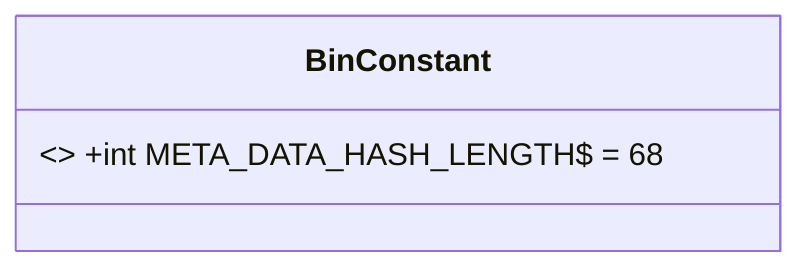
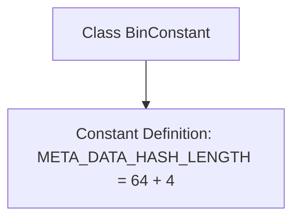

# Basic Information

|      |      |
|------|------|
| Name | BinConstant |
| Language | .java |
| Code Path | WeFe/union/blockchain-data-sync/src/main/java/com/welab/wefe/constant/BinConstant.java |
| Package Name | com.welab.wefe.constant |
| Dependencies | [] |
| Brief Description | The BinConstant class defines a static constant META_DATA_HASH_LENGTH with a value of 68 (64+4). |

# Description

The content defines a public class named BinConstant, which contains a static constant META_DATA_HASH_LENGTH with a value of 64 plus 4, equating to 68. This constant is used to represent the length of metadata hash, likely serving as a fixed-length parameter in certain binary data processing operations.

# Class Summary

| Name   | Type  | Description |
|-------|------|-------------|
| BinConstant | class | The class BinConstant defines the constant META_DATA_HASH_LENGTH with a value of 68 (64+4). |

## Class BinConstant

|      |      |
|------|------|
| Access Modifier | public |
| Type | class |
| Name | BinConstant |
| Description | The class BinConstant defines the constant META_DATA_HASH_LENGTH with a value of 68 (64+4). |

### UML Class Diagram

This code defines a class named BinConstant, which contains a public static constant META_DATA_HASH_LENGTH with a value of 68 (64+4). The constant is marked as final, indicating its value cannot be modified, and the $ symbol denotes it as a static member. The class diagram clearly illustrates this simple constant class structure, suitable for storing immutable configuration values or metadata length information, facilitating easy reference throughout the program.

### Internal Method Call Graph

This flowchart illustrates the simple structure of the `BinConstant` class, which contains only one static constant `META_DATA_HASH_LENGTH` definition. The constant value is 68 (result of 64+4 calculation) and is used to store the fixed length of metadata hash values. Due to the class's single functionality, the flowchart solely depicts the ownership relationship between the class and the constant, without complex method calls or interaction logic.

### Field List

| Name  | Type  | Description |
|-------|-------|------|
| META_DATA_HASH_LENGTH = 64 + 4 | int | Define the metadata hash length as 64 bytes plus 4 bytes. |

### Method List

| Name  | Type  | Description |
|-------|-------|------|

