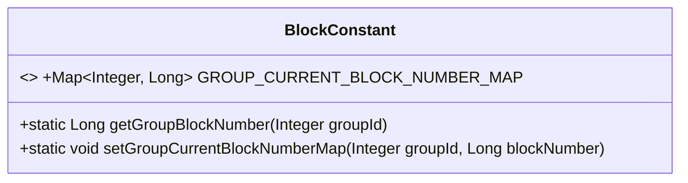
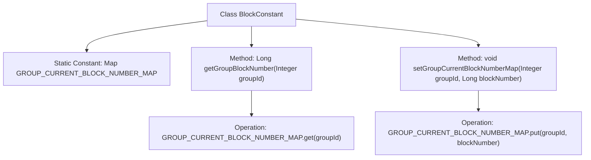

# Basic Information

|      |      |
|------|------|
| Name | BlockConstant |
| Language | .java |
| Code Path | WeFe/union/blockchain-data-sync/src/main/java/com/welab/wefe/constant/BlockConstant.java |
| Package Name | com.welab.wefe.constant |
| Dependencies | ['java.util.Map', 'java.util.concurrent.ConcurrentHashMap'] |
| Brief Description | The BlockConstant class maintains the latest block height for each group, providing methods for retrieval and updates, and stores data using ConcurrentHashMap. |

# Description

The BlockConstant class maintains a thread-safe ConcurrentHashMap to store the latest block heights for different groups. It provides two static methods: getGroupBlockNumber retrieves the corresponding block height by group ID, while setGroupCurrentBlockNumberMap updates the block height for a specified group. This class implements thread-safe storage and querying functionalities for multi-group block heights.

# Class Summary

| Name   | Type  | Description |
|-------|------|-------------|
| BlockConstant | class | The BlockConstant class maintains the current block height for each group, providing static methods to retrieve and update block heights, with thread safety ensured by ConcurrentHashMap. |

## Class BlockConstant

|      |      |
|------|------|
| Access Modifier | public |
| Type | class |
| Name | BlockConstant |
| Description | The BlockConstant class maintains the current block height for each group, providing static methods to retrieve and update block heights, with thread safety ensured by ConcurrentHashMap. |

### UML Class Diagram

This code defines a utility class named `BlockConstant`, primarily used for managing the latest block heights of different blockchain groups. The class contains a static thread-safe map `GROUP_CURRENT_BLOCK_NUMBER_MAP` that stores group IDs and their corresponding latest block heights. It also provides two static methods, `getGroupBlockNumber` and `setGroupCurrentBlockNumberMap`, for querying and updating the latest block height of a specified group, respectively. Implemented using `ConcurrentHashMap`, this data structure supports multi-threaded concurrent access, making it suitable for height synchronization scenarios in distributed blockchain systems.

### Internal Method Call Graph

This flowchart illustrates the structure of the BlockConstant class, which maintains a thread-safe ConcurrentHashMap for storing the latest block numbers (blockNumber) corresponding to different groups (groupId). The class provides two core methods: getGroupBlockNumber for querying the block number of a specified group, and setGroupCurrentBlockNumberMap for updating the block number of a group. The flowchart clearly reflects the data storage structure and method invocation relationships, highlighting the operational characteristics of the concurrent-safe Map.

### Field List

| Name  | Type  | Description |
|-------|-------|------|
| GROUP_CURRENT_BLOCK_NUMBER_MAP = new ConcurrentHashMap<>() | Map<Integer, Long> | Define a thread-safe static constant map GROUP_CURRENT_BLOCK_NUMBER_MAP with integer keys and long values. |

### Method List

| Name  | Type  | Description |
|-------|-------|------|
| getGroupBlockNumber | Long | This method retrieves and returns the corresponding block number from GROUP_CURRENT_BLOCK_NUMBER_MAP based on the incoming groupId. |
| setGroupCurrentBlockNumberMap | void | The static method `setGroupCurrentBlockNumberMap` stores the given `groupId` and `blockNumber` into the `GROUP_CURRENT_BLOCK_NUMBER_MAP` mapping. |

