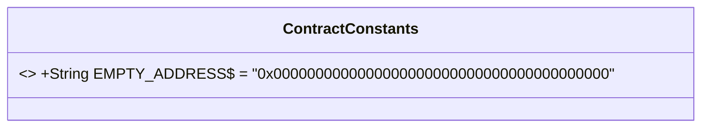
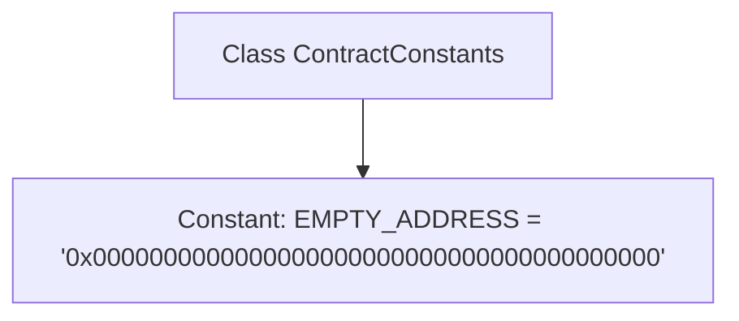

# Basic Information

|      |      |
|------|------|
| Name | ContractConstants |
| Language | .java |
| Code Path | WeFe/union/blockchain-data-sync/src/main/java/com/welab/wefe/constant/ContractConstants.java |
| Package Name | com.welab.wefe.constant |
| Dependencies | [] |
| Brief Description | The ContractConstants class defines a public static constant EMPTY_ADDRESS, representing a hexadecimal string of an empty address. |

# Description

The code defines a public class named ContractConstants, which contains a static constant EMPTY_ADDRESS with the value "0x0000000000000000000000000000000000000000", a hexadecimal string representing an empty address. This constant is commonly used in blockchain or smart contract development to denote an invalid or unset address.

# Class Summary

| Name   | Type  | Description |
|-------|------|-------------|
| ContractConstants | class | The ContractConstants class defines a public static constant EMPTY_ADDRESS, representing the hexadecimal string value of an empty address. |

## Class ContractConstants

|      |      |
|------|------|
| Access Modifier | public |
| Type | class |
| Name | ContractConstants |
| Description | The ContractConstants class defines a public static constant EMPTY_ADDRESS, representing the hexadecimal string value of an empty address. |

### UML Class Diagram

This code defines a class named `ContractConstants`, which contains a public static constant `EMPTY_ADDRESS` representing the empty address (all-zero address) on the Ethereum blockchain. The constant is marked as `final` to indicate immutability, and the `$` symbol denotes its static property. This design pattern is commonly used to store globally accessible constant values in a project, particularly for special address identifiers in blockchain development.

### Internal Method Call Graph

This code defines a class named ContractConstants, which contains a public static constant EMPTY_ADDRESS initialized to the string "0x0000000000000000000000000000000000000000", representing an empty address. This empty address is commonly used in blockchain or smart contract development to denote an invalid or unset address. The class serves to centrally manage contract-related constants, facilitating code maintenance and reuse. The flowchart clearly illustrates the simple hierarchical relationship between the class and the constant.

### Field List

| Name  | Type  | Description |
|-------|-------|------|
| EMPTY_ADDRESS = "0x0000000000000000000000000000000000000000" | String | A public static constant EMPTY_ADDRESS is defined, representing an empty address with a value of a hexadecimal string consisting of all zeros. |

### Method List

| Name  | Type  | Description |
|-------|-------|------|

