# Basic Information

|      |      |
|------|------|
| Name | EventConstant |
| Language | .java |
| Code Path | WeFe/union/blockchain-data-sync/src/main/java/com/welab/wefe/constant/EventConstant.java |
| Package Name | com.welab.wefe.constant |
| Dependencies | [] |
| Brief Description | The EventConstant class defines multiple event constants, including general events (such as RUN_SUCCESS_CODE), dataset events (such as INSERT_EVENT), member events (such as UPDATE_PUBLICKEY_EVENT), permission events (such as DELETE_BY_DATASETID_EVENT), etc., covering operations like addition, deletion, and modification. |

# Description

The code defines a public class named EventConstant, which contains multiple static constant strings and nested classes to represent various event types. It primarily includes the run success code RUN_SUCCESS_CODE, as well as multiple nested classes such as DataSetEvent, ImageDataSetEvent, MemberEvent, etc. Each nested class defines different types of event constants, such as insert, update, delete operations. These event constants are used to identify operation types across different modules, such as datasets, member permissions, data resources, etc. The overall structure is clear, facilitating easy reference and maintenance in the code.

# Class Summary

| Name   | Type  | Description |
|-------|------|-------------|
| EventConstant | class | The EventConstant class defines multiple event constants, including event types for operations such as dataset, member, and data resource additions, deletions, and modifications, such as INSERTEVENT, UPDATEEVENT, etc., used to identify operations in different business scenarios. |

## Class EventConstant

|      |      |
|------|------|
| Access Modifier | public |
| Type | class |
| Name | EventConstant |
| Description | The EventConstant class defines multiple event constants, including event types for operations such as dataset, member, and data resource additions, deletions, and modifications, such as INSERTEVENT, UPDATEEVENT, etc., used to identify operations in different business scenarios. |

### UML Class Diagram

```mermaid
classDiagram
    class EventConstant {
        <<final>>
        +String RUN_SUCCESS_CODE
        +String UPDATE_EXTJSON_EVENT
        +String DELETE_BY_DATA_RESOURCE_ID_EVENT
    }

    class DataSetEvent {
        <<final>>
        +String INSERT_EVENT
        +String UPDATE_EVENT
        +String DELETE_BY_DATASETID_EVENT
    }

    class ImageDataSetEvent {
        <<final>>
        +String INSERT_EVENT
        +String UPDATE_EVENT
        +String DELETE_BY_DATA_RESOURCE_ID_EVENT
        +String UPDATE_ENABLE_EVENT
    }

    class MemberEvent {
        <<final>>
        +String INSERT_EVENT
        +String UPDATE_EVENT
        +String UPDATE_EXCLUDE_PUBLICKEY_EVENT
        +String UPDATE_PUBLICKEY_EVENT
        +String DELETE_BY_ID_EVENT
        +String UPDATE_EXCLUDE_LOGO_EVENT
        +String UPDATE_LOGO_BY_ID_EVENT
        +String UPDATE_LAST_ACTIVITY_TIME_BY_ID_EVENT
    }

    class DataSetMemberPermissionEvent {
        <<final>>
        +String INSERT_EVENT
        +String UPDATE_EVENT
        +String DELETE_BY_DATASETID_EVENT
    }

    class DataSetDefaultTagEvent {
        <<final>>
        +String INSERT_EVENT
        +String UPDATE_EVENT
        +String DELETE_BY_TAGID_EVENT
    }

    class MemberAuthTypeEvent {
        <<final>>
        +String INSERT_EVENT
        +String UPDATE_EVENT
        +String DELETE_BY_TYPEID_EVENT
    }

    class UnionNodeEvent {
        <<final>>
        +String INSERT_EVENT
        +String UPDATE_EVENT
        +String UPDATE_ENABLE_EVENT
        +String UPDATE_PUBLIC_KEY_EVENT
        +String DELETE_BY_UNIONNODEID_EVENT
    }

    class DataResourceEvent {
        <<final>>
        +String INSERT_EVENT
        +String UPDATE_EVENT
        +String UPDATE_ENABLE_EVENT
    }

    class TableDataSetEvent {
        <<final>>
        +String INSERT_EVENT
        +String UPDATE_EVENT
    }

    class BloomFilterEvent {
        <<final>>
        +String INSERT_EVENT
        +String UPDATE_HASH_FUNCTION_EVENT
    }

    class MemberService {
        <<final>>
        +String INSERT_EVENT
        +String UPDATE_EVENT
        +String DELETE_BY_SERVICE_ID_EVENT
        +String UPDATE_SERVICE_STATUS_EVENT
    }

    class DataResourceDefaultTagEvent {
        <<final>>
        +String INSERT_EVENT
        +String UPDATE_EVENT
        +String DELETE_BY_TAGID_EVENT
    }

    class TrustCerts {
        <<final>>
        +String INSERT_EVENT
        +String DELETE_BY_SERIAL_NUMBER
    }

    EventConstant --> DataSetEvent : contains
    EventConstant --> ImageDataSetEvent : contains
    EventConstant --> MemberEvent : contains
    EventConstant --> DataSetMemberPermissionEvent : contains
    EventConstant --> DataSetDefaultTagEvent : contains
    EventConstant --> MemberAuthTypeEvent : contains
    EventConstant --> UnionNodeEvent : contains
    EventConstant --> DataResourceEvent : contains
    EventConstant --> TableDataSetEvent : contains
    EventConstant --> BloomFilterEvent : contains
    EventConstant --> MemberService : contains
    EventConstant --> DataResourceDefaultTagEvent : contains
    EventConstant --> TrustCerts : contains
```

Class diagram description: This diagram illustrates an event constant class `EventConstant` and its 12 nested static inner classes, all declared as final and containing only public static string constants. The main class incorporates subclasses through composition relationships, with each subclass representing event type constants for different modules (e.g., dataset, member, authentication type, etc.). This design enables centralized management and categorized storage of event types, facilitating unified referencing of event identifiers across system modules.

### Internal Method Call Graph

```mermaid
graph TD
    A["Class EventConstant"]
    B["Constant: RUN_SUCCESS_CODE"]
    C["Constant: UPDATE_EXTJSON_EVENT"]
    D["Constant: DELETE_BY_DATA_RESOURCE_ID_EVENT"]
    E["Inner Class DataSetEvent"]
    F["Inner Class ImageDataSetEvent"]
    G["Inner Class MemberEvent"]
    H["Inner Class DataSetMemberPermissionEvent"]
    I["Inner Class DataSetDefaultTagEvent"]
    J["Inner Class MemberAuthTypeEvent"]
    K["Inner Class UnionNodeEvent"]
    L["Inner Class DataResourceEvent"]
    M["Inner Class TableDataSetEvent"]
    N["Inner Class BloomFilterEvent"]
    O["Inner Class MemberService"]
    P["Inner Class DataResourceDefaultTagEvent"]
    Q["Inner Class TrustCerts"]

    A --> B
    A --> C
    A --> D
    A --> E
    A --> F
    A --> G
    A --> H
    A --> I
    A --> J
    A --> K
    A --> L
    A --> M
    A --> N
    A --> O
    A --> P
    A --> Q
```

This code defines a class named EventConstant, primarily used for storing constant strings of various event types. The class contains 15 static inner classes, each representing event types for different modules (e.g., dataset events, member events). Each event type has specific operation constants (e.g., INSERT_EVENT indicates an insert operation). The overall structure adopts a hierarchical design, where the top-level class manages generic constants, and inner classes organize event constants for specific domains, facilitating unified reference to event identifiers across system modules. This design pattern is commonly used in event-driven architectures or messaging systems to ensure global uniqueness and maintainability of event type identifiers.

### Field List

| Name  | Type  | Description |
|-------|-------|------|
| UPDATE_EXTJSON_EVENT = "UPDATEEXTJSONEVENT" | String | Static constant string UPDATE_EXTJSON_EVENT with the value "UPDATEEXTJSONEVENT". |
| RUN_SUCCESS_CODE = "0" | String | Define a static constant RUN_SUCCESS_CODE with the value "0", representing the success status code. |
| DELETE_BY_DATA_RESOURCE_ID_EVENT = "DELETEBYDATARESOURCEIDEVENT" | String | Static constant DELETE_BY_DATA_RESOURCE_ID_EVENT, with the value "DELETEBYDATARESOURCEIDEVENT", represents the event of deletion by data resource ID. |

### Method List

| Name  | Type  | Description |
|-------|-------|------|

