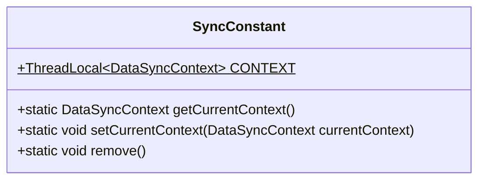
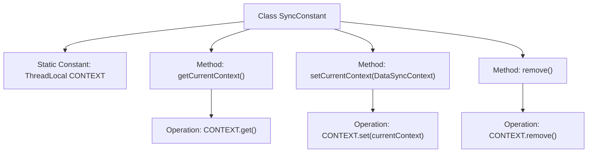

# Basic Information

|      |      |
|------|------|
| Name | SyncConstant |
| Language | .java |
| Code Path | WeFe/union/blockchain-data-sync/src/main/java/com/welab/wefe/constant/SyncConstant.java |
| Package Name | com.welab.wefe.constant |
| Dependencies | ['com.welab.wefe.tool.DataSyncContext'] |
| Brief Description | The SyncConstant class provides thread-local storage management for DataSyncContext, including methods for obtaining, setting, and removing the context. |

# Description

The SyncConstant class is a utility class designed for managing thread-local data synchronization contexts. It maintains a DataSyncContext instance through the ThreadLocal mechanism, providing three static methods: getCurrentContext retrieves the current thread's context, setCurrentContext sets the current thread's context, and remove clears the current thread's context. This class ensures data isolation between threads, making it suitable for data synchronization scenarios in multi-threaded environments.

# Class Summary

| Name   | Type  | Description |
|-------|------|-------------|
| SyncConstant | class | The SyncConstant class uses ThreadLocal to store DataSyncContext, providing methods to get, set, and remove the current thread context. |

## Class SyncConstant

|      |      |
|------|------|
| Access Modifier | public |
| Type | class |
| Name | SyncConstant |
| Description | The SyncConstant class uses ThreadLocal to store DataSyncContext, providing methods to get, set, and remove the current thread context. |

### UML Class Diagram

This code defines a `SyncConstant` utility class for managing the thread-local variable `CONTEXT`, which stores an object of type `DataSyncContext`. The class provides three static methods: `getCurrentContext` retrieves the current thread's context, `setCurrentContext` sets the current thread's context, and `remove` clears the current thread's context. Through the `ThreadLocal` mechanism, it achieves isolation of contexts between threads, ensuring data synchronization safety in multi-threaded environments. The class diagram illustrates the public access modifiers of static variables and methods, as well as the generic parameter structure of `ThreadLocal`.

### Internal Method Call Graph

This flowchart illustrates the structure of the SyncConstant class, which is a static utility class designed to maintain the thread-local variable CONTEXT. It provides methods to retrieve the current thread context via getCurrentContext(), set a new context with setCurrentContext(), and clear thread state using remove(). All methods directly operate on the ThreadLocal instance, ensuring thread-safe data isolation.

### Field List

| Name  | Type  | Description |
|-------|-------|------|
| CONTEXT = new ThreadLocal<>() | ThreadLocal<DataSyncContext> | A static constant CONTEXT is defined, of type ThreadLocal<DataSyncContext>, used for thread-local storage of DataSyncContext objects. |

### Method List

| Name  | Type  | Description |
|-------|-------|------|
| getCurrentContext | DataSyncContext | Get the DataSyncContext instance of the current thread. |
| setCurrentContext | void | Set the current data synchronization context by storing the passed currentContext into the static variable CONTEXT. |
| remove | void | The static method remove() invokes CONTEXT.remove() to clear the context. |

