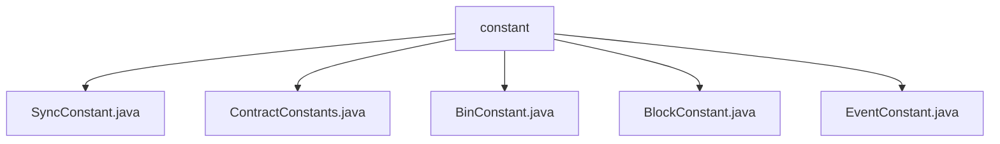

# Basic Information

|      |      |
|------|------|
| Name | constant |
| Language | .java |
| Code Path | WeFe/union/blockchain-data-sync/src/main/java/com/welab/wefe/constant |
| Package Name | docs.union.blockchain-data-sync.src.main.java.com.welab.wefe.constant |
| Brief Description | The SyncConstant class manages thread-local data synchronization contexts. The ContractConstants class defines empty address constants. The BinConstant class defines metadata hash length constants. The BlockConstant class maintains a thread-safe block height mapping. The EventConstant class defines various event type constants. |

# Description

## Overview  
This module serves as the core constant management system for blockchain data synchronization, achieving thread-safe data isolation and event management through multiple sets of utility classes. The interface specifications include ThreadLocal context operations (SyncConstant), ConcurrentHashMap block height maintenance (BlockConstant), and static constant definitions (e.g., ContractConstants.EMPTY_ADDRESS). Key data structures comprise the DataSyncContext thread context, group block height mappings stored in ConcurrentHashMap, and a 68-byte metadata hash length (BinConstant). External dependencies are limited to Java's standard library ThreadLocal and ConcurrentHashMap. For instance, SyncConstant employs ThreadLocal for thread isolation, while BlockConstant ensures atomicity in multi-group block height updates via ConcurrentHashMap.

## Primary Business Scenarios  
The module supports blockchain data synchronization and event distribution in multi-threaded environments, resembling an event bus pattern. Typical workflows include: managing thread-local synchronization contexts through SyncConstant, maintaining the latest block heights for each group via BlockConstant, and business operations driven by event types defined in EventConstant (e.g., DataSetEvent.INSERT). Interaction modes span the entire chain from address validation (ContractConstants) and binary data processing (BinConstant) to event-driven workflows, such as member permission changes triggering MemberEvent.UPDATE. APIs consist exclusively of static methods or constants, with integration examples including thread-safe height updates and event identifier references.

### Package Internal Structure View

This flowchart illustrates the file structure of the constants package in a blockchain data synchronization project. The root node "constant" contains five constant class files: SyncConstant, ContractConstants, BinConstant, BlockConstant, and EventConstant. These files are likely used to define constant configurations such as synchronization parameters, contract parameters, binary parameters, block parameters, and event parameters, respectively. This structure clearly organizes different types of constant definitions, making them easy to maintain and use.

# File List

| Name   | Type  | Description |
|-------|------|-------------|
| [SyncConstant.java](SyncConstant.md) | file | The SyncConstant class provides thread-local storage management for DataSyncContext, including methods for obtaining, setting, and removing contexts. |
| [ContractConstants.java](ContractConstants.md) | file | The ContractConstants class defines a public static constant EMPTY_ADDRESS, representing a hexadecimal string of an empty address. |
| [BinConstant.java](BinConstant.md) | file | The BinConstant class defines a static constant META_DATA_HASH_LENGTH with a value of 68 (64+4). |
| [BlockConstant.java](BlockConstant.md) | file | The BlockConstant class maintains the latest block height for each group, providing methods for retrieval and updates, and uses ConcurrentHashMap to store the data. |
| [EventConstant.java](EventConstant.md) | file | The `EventConstant` class defines multiple event constants, including general events (such as `RUN_SUCCESS_CODE`), dataset events (such as `INSERT_EVENT`), member events (such as `UPDATE_PUBLICKEY_EVENT`), permission events (such as `DELETE_BY_DATASETID_EVENT`), etc., covering operations like addition, deletion, and modification. |

