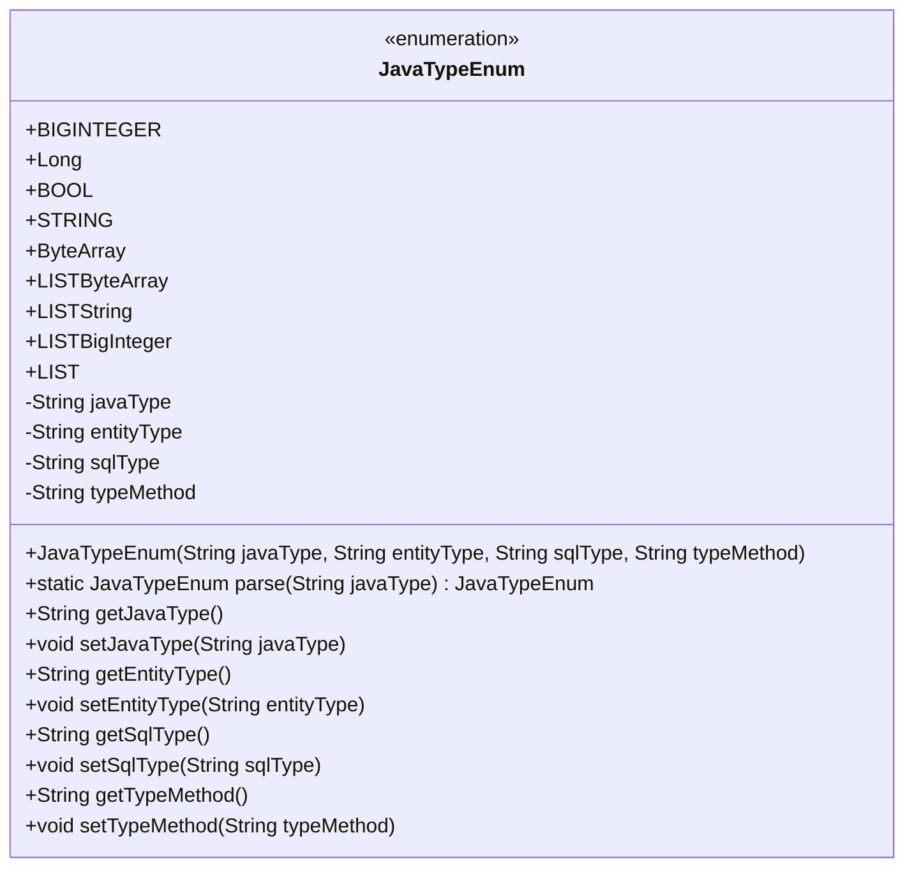

# Basic Information

|      |      |
|------|------|
| Name | JavaTypeEnum |
| Language | .java |
| Code Path | WeFe/union/blockchain-data-sync/src/main/java/com/welab/wefe/enums/JavaTypeEnum.java |
| Package Name | com.welab.wefe.enums |
| Dependencies | ['org.apache.commons.lang3.StringUtils'] |
| Brief Description | Java enum class defines data type mappings, including Java type, entity type, SQL type, and conversion methods, providing a parsing method called parse. |

# Description

The JavaTypeEnum enumeration defines various Java data types and their related attributes, including javaType (Java type), entityType (entity type), sqlType (SQL type), and typeMethod (type conversion method). The enumeration includes types such as BIGINTEGER, Long, BOOL, and STRING, and supports List generic processing. The parse method can match the corresponding enumeration value based on the javaType string, and each attribute has getter and setter methods.

# Class Summary

| Name   | Type  | Description |
|-------|------|-------------|
| JavaTypeEnum | enum | The JavaTypeEnum defines the mapping relationships between Java types and entity types, SQL types, as well as conversion methods, including parsing methods and property accessors. |

## Class JavaTypeEnum

|      |      |
|------|------|
| Access Modifier | public |
| Type | enum |
| Name | JavaTypeEnum |
| Description | The JavaTypeEnum defines the mapping relationships between Java types and entity types, SQL types, as well as conversion methods, including parsing methods and property accessors. |

### UML Class Diagram

This code defines an enumeration class `JavaTypeEnum` that represents the mapping relationships between Java types and entity types, SQL types, and type conversion methods. The enumeration includes 9 predefined types (such as BIGINTEGER, Long, etc.), with each enum instance storing four attributes: javaType, entityType, sqlType, and typeMethod, along with corresponding getter/setter methods. The core functionality is provided by the parse method, which matches the input javaType string to the corresponding enum value and supports generic type resolution (e.g., List<String>). This design is primarily used for type system conversion scenarios, simplifying the maintenance of type mappings.

### Internal Method Call Graph

```mermaid
graph TD
    A["Enum JavaTypeEnum"]
    B["Enum Values: BIGINTEGER/Long/BOOL/STRING/ByteArray/LISTByteArray/LISTString/LISTBigInteger/LIST"]
    C["Property: String javaType"]
    D["Property: String entityType"]
    E["Property: String sqlType"]
    F["Property: String typeMethod"]
    G["Constructor: JavaTypeEnum(String, String, String, String)"]
    H["Static Method: parse(String javaType)"]
    I["Method: getJavaType()"]
    J["Method: setJavaType(String)"]
    K["Method: getEntityType()"]
    L["Method: setEntityType(String)"]
    M["Method: getSqlType()"]
    N["Method: setSqlType(String)"]
    O["Method: getTypeMethod()"]
    P["Method: setTypeMethod(String)"]

    A --> B
    A --> C
    A --> D
    A --> E
    A --> F
    A --> G
    A --> H
    A --> I
    A --> J
    A --> K
    A --> L
    A --> M
    A --> N
    A --> O
    A --> P
```

This flowchart illustrates the structure of the JavaTypeEnum enumeration, which includes 9 predefined enum values, 4 core properties, and 10 methods. The core functionality is to map strings to corresponding enum values via the parse method, with each enum value associated with a Java type, entity type, SQL type, and type conversion method. The constructor initializes enum instances, while other methods handle property access and modification. The overall design serves for type system mapping and conversion.

### Field List

| Name  | Type  | Description |
|-------|-------|------|

### Method List

| Name  | Type  | Description |
|-------|-------|------|

