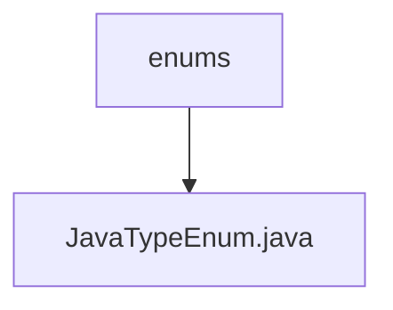

# Basic Information

|      |      |
|------|------|
| Name | enums |
| Language | .java |
| Code Path | WeFe/union/blockchain-data-sync/src/main/java/com/welab/wefe/enums |
| Package Name | docs.union.blockchain-data-sync.src.main.java.com.welab.wefe.enums |
| Brief Description | Java enum class defines data type mappings, including Java type, entity type, SQL type, and conversion methods, providing a parsing method called parse. |

# Description

The JavaTypeEnum enumeration defines various Java data types and their related attributes, including javaType (Java type), entityType (entity type), sqlType (SQL type), and typeMethod (type conversion method). The enumeration includes types such as BIGINTEGER, Long, BOOL, and STRING, with support for List generic handling. The parse method can match the corresponding enumeration value based on the javaType string, and each attribute has getter and setter methods.


### Package Internal Structure View



This flowchart illustrates the hierarchical relationship of enum types in the WeFe project. The root node "enums" represents the package path where the enum classes reside, while the child node "JavaTypeEnum.java" is a specific enum class file under this package. The entire structure is concise and clear, reflecting the typical package-class hierarchy in Java projects.

# File List

| Name   | Type  | Description |
|-------|------|-------------|
| [JavaTypeEnum.java](JavaTypeEnum.md) | file | You are a professional translation assistant. Please accurately translate the following content into the target language.  Strictly adhere to the following guidelines:  1. Maintain consistency with the original text's semantics, context, and style.  2. Preserve the original hierarchical structure and numbering system in full.  3. Strictly retain all formatting elements from the original text, such as code block identifiers (```text/```, ```mermaid/```), etc.  4. Translate only the natural language content, without adjusting formats, supplementing content, or providing explanatory processing.  5. Output only the translated result of the original text, without any additional prompt messages.  Content to be translated:  Java enum class defines data type mappings, including Java types, entity types, SQL types, and conversion methods, providing a parsing method called parse.  Target language code: en |


