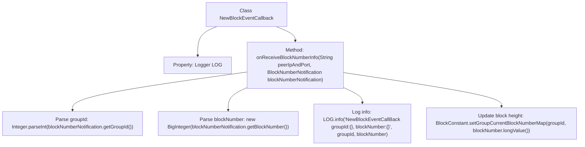

# Basic Information

|      |      |
|------|------|
| Name | NewBlockEventCallback |
| Language | .java |
| Code Path | WeFe/union/blockchain-data-sync/src/main/java/com/welab/wefe/event/NewBlockEventCallback.java |
| Package Name | com.welab.wefe.event |
| Dependencies | ['com.welab.wefe.constant.BlockConstant', 'org.fisco.bcos.sdk.service.callback.BlockNumberNotifyCallback', 'org.fisco.bcos.sdk.service.model.BlockNumberNotification', 'org.slf4j.Logger', 'org.slf4j.LoggerFactory', 'java.math.BigInteger'] |
| Brief Description | The `NewBlockEventCallback` class implements the `BlockNumberNotifyCallback` interface to handle new block events. It retrieves the group ID and block number via the `onReceiveBlockNumberInfo` method and updates the latest block height information for the group. |

# Description

The code defines a class named `NewBlockEventCallback`, which implements the `BlockNumberNotifyCallback` interface. Its primary function is to handle callbacks upon receiving new block number information. When the `onReceiveBlockNumberInfo` method is triggered, it parses the group ID and block height from the parameters, logs the information, and updates the latest block height for the corresponding group. The class includes a static logger object for outputting log messages. Internally, the method converts the group ID from a string to an integer and the block height to a big integer type, then updates the group's current block height mapping via the `BlockConstant` utility class.

# Class Summary

| Name   | Type  | Description |
|-------|------|-------------|
| NewBlockEventCallback | class | The `NewBlockEventCallback` class implements the `BlockNumberNotifyCallback` interface to handle new block events. It retrieves the group ID and block height via the `onReceiveBlockNumberInfo` method and updates the latest block information for the group. |


## Class NewBlockEventCallback

|      |      |
|------|------|
| Access Modifier | public |
| Type | class |
| Name | NewBlockEventCallback |
| Description | The `NewBlockEventCallback` class implements the `BlockNumberNotifyCallback` interface to handle new block events. It retrieves the group ID and block height via the `onReceiveBlockNumberInfo` method and updates the latest block information for the group. |


### UML Class Diagram

```mermaid
classDiagram
    class NewBlockEventCallback {
        -Logger LOG
        +onReceiveBlockNumberInfo(String peerIpAndPort, BlockNumberNotification blockNumberNotification) void
    }
    <<Interface>> BlockNumberNotifyCallback {
        <<abstract>>
        +onReceiveBlockNumberInfo(String peerIpAndPort, BlockNumberNotification blockNumberNotification) void
    }
    class BlockNumberNotification {
        +String getGroupId()
        +String getBlockNumber()
    }
    class BlockConstant {
        +setGroupCurrentBlockNumberMap(int groupId, long blockNumber) void
    }

    NewBlockEventCallback ..|> BlockNumberNotifyCallback : implements
    NewBlockEventCallback --> BlockNumberNotification : uses
    NewBlockEventCallback --> BlockConstant : invokes
```

This code demonstrates a blockchain event callback handler class NewBlockEventCallback, which implements the BlockNumberNotifyCallback interface for receiving new block notifications. Its primary function is to parse block group IDs and block height information, updating the in-memory latest block height mapping. The class diagram clearly illustrates the interface implementation relationship (NewBlockEventCallback implements BlockNumberNotifyCallback) and its collaboration with other classes (BlockNumberNotification, BlockConstant), showcasing the complete workflow from receiving notifications to processing data.


### Internal Method Call Graph



This flowchart illustrates the core processing logic of the NewBlockEventCallback class. Upon receiving a new block notification, it first parses the group ID and block number, then logs the information, and finally updates the latest block height for that group. The entire process clearly depicts the complete handling flow from event triggering to data updating, demonstrating the callback function's response mechanism to blockchain network events.

### Field List

| Name  | Type  | Description |
|-------|-------|------|
| LOG = LoggerFactory.getLogger(NewBlockEventCallback.class) | Logger | Defined a static immutable logger instance for logging output in the NewBlockEventCallback class. |

### Method List

| Name  | Type  | Description |
|-------|-------|------|
| onReceiveBlockNumberInfo | void | The method receives block number information, parses the group ID and block number, logs the details, and updates the latest block height of the group. |


