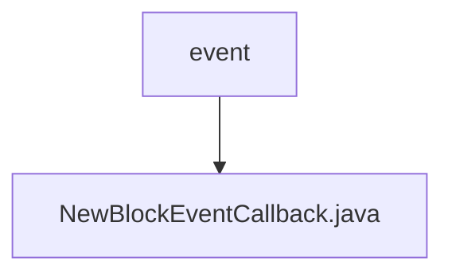

# Basic Information

|      |      |
|------|------|
| Name | event |
| Language | .java |
| Code Path | WeFe/union/blockchain-data-sync/src/main/java/com/welab/wefe/event |
| Package Name | docs.union.blockchain-data-sync.src.main.java.com.welab.wefe.event |
| Brief Description | The `NewBlockEventCallback` class implements the `BlockNumberNotifyCallback` interface to handle new block events. It retrieves the group ID and block number via the `onReceiveBlockNumberInfo` method and updates the latest block height information for the group. |

# Description

The code defines a class named `NewBlockEventCallback`, which implements the `BlockNumberNotifyCallback` interface. Its primary function is to handle callbacks upon receiving new block number information. When the `onReceiveBlockNumberInfo` method is triggered, it parses the group ID and block height from the parameters, logs the information, and updates the latest block height for the corresponding group. The class includes a static logger object for outputting log messages. Internally, the method converts the group ID from a string to an integer and the block height to a big integer type, then updates the group's current block height mapping table via the `BlockConstant` utility class.

### Package Internal Structure View

This flowchart illustrates the simple structure of the event module in a blockchain data synchronization project. The root node "event" contains a specific event callback implementation file "NewBlockEventCallback.java", indicating that this is a callback class for handling new block events. The entire structure clearly reflects the minimalistic organization of the event processing module.

# File List

| Name   | Type  | Description |
|-------|------|-------------|
| [NewBlockEventCallback.java](NewBlockEventCallback.md) | file | The `NewBlockEventCallback` class implements the `BlockNumberNotifyCallback` interface to handle new block events. It retrieves the group ID and block number via the `onReceiveBlockNumberInfo` method and updates the latest block height information for the group. |

