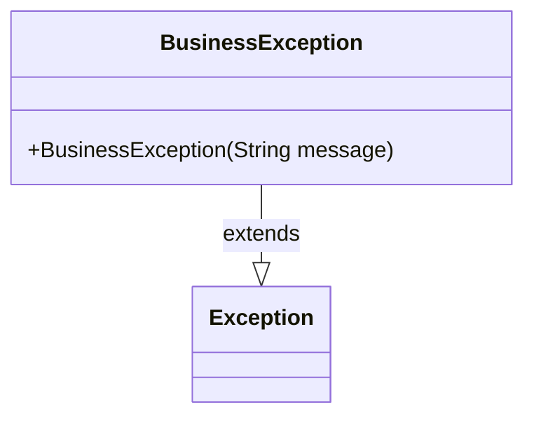
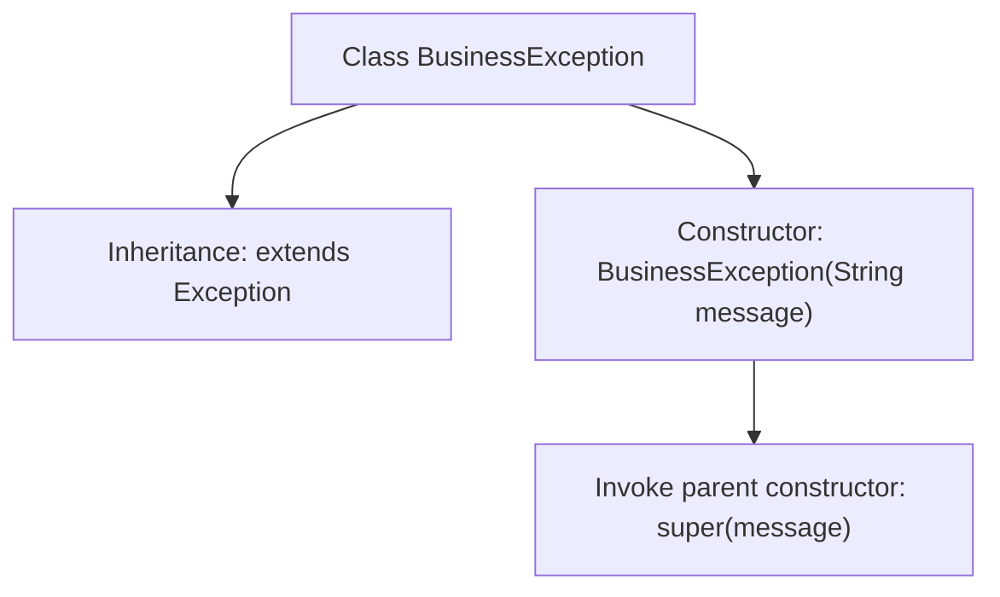

# Basic Information

|      |      |
|------|------|
| Name | BusinessException |
| Language | .java |
| Code Path | WeFe/union/blockchain-data-sync/src/main/java/com/welab/wefe/exception/BusinessException.java |
| Package Name | com.welab.wefe.exception |
| Dependencies | [] |
| Brief Description | Custom business exception class, inherits from Exception, includes a constructor with a message parameter. |

# Description

The content defines a custom exception class named BusinessException, which inherits from the Exception base class in the Java standard library. This class includes a constructor that accepts a message parameter of type String and passes the message to the parent class Exception's constructor via a super call. This design allows for throwing custom exceptions with specific error messages in business logic, making it easier to distinguish and handle different types of business errors. The entire implementation is concise and clear, adhering to the fundamental norms of Java exception handling.

# Class Summary

| Name   | Type  | Description |
|-------|------|-------------|
| BusinessException | class | Custom business exception class, inherits from Exception, includes a constructor with a message parameter. |

## Class BusinessException

|      |      |
|------|------|
| Access Modifier | public |
| Type | class |
| Name | BusinessException |
| Description | Custom business exception class, inherits from Exception, includes a constructor with a message parameter. |

### UML Class Diagram

This class diagram depicts a simple exception class `BusinessException`, which inherits from the `Exception` class in Java's standard library. The `BusinessException` class provides a public constructor that accepts a string parameter for passing exception messages. Through inheritance, `BusinessException` inherits all features of standard exceptions while being capable of representing business logic-related error scenarios. This design pattern is commonly used to throw specific types of exceptions at the business layer, enabling calling parties to distinguish and handle them effectively.

### Internal Method Call Graph

This flowchart depicts the structure of the BusinessException class, which inherits from the Exception base class. Its core is a constructor with a String parameter that invokes the parent class's super(message) method to pass the exception message. This design pattern is a canonical implementation of Java's standard exception system, used to create business exception types with custom messages. The inheritance ensures consistency in exception handling mechanisms.

### Field List

| Name  | Type  | Description |
|-------|-------|------|

### Method List

| Name  | Type  | Description |
|-------|-------|------|

