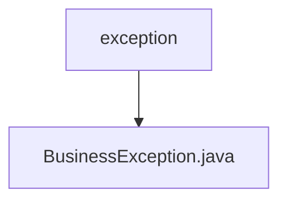

# Basic Information

|      |      |
|------|------|
| Name | exception |
| Language | .java |
| Code Path | WeFe/union/blockchain-data-sync/src/main/java/com/welab/wefe/exception |
| Package Name | docs.union.blockchain-data-sync.src.main.java.com.welab.wefe.exception |
| Brief Description | Custom business exception class, extending Exception, with a constructor that includes a message parameter. |

# Description

The content defines a custom exception class named `BusinessException`, which inherits from the `Exception` base class in the Java standard library. This class includes a constructor that accepts a `message` parameter of type `String` and passes the message to the parent `Exception` class's constructor via the `super` call. This design allows throwing custom exceptions with specific error messages in business logic, making it easier to distinguish and handle different types of business errors. The entire implementation is concise and clear, adhering to the fundamental norms of Java exception handling.

### Package Internal Structure View

This flowchart illustrates a simple hierarchy of exception handling in the WeFe project. The parent directory `exception` contains the file `BusinessException.java`, indicating the location of the business exception class. Such a structure is common in Java projects to centrally manage custom exception classes, ensuring clear code organization.

# File List

| Name   | Type  | Description |
|-------|------|-------------|
| [BusinessException.java](BusinessException.md) | file | Custom business exception class, inherits from Exception, includes a constructor with a message parameter. |

