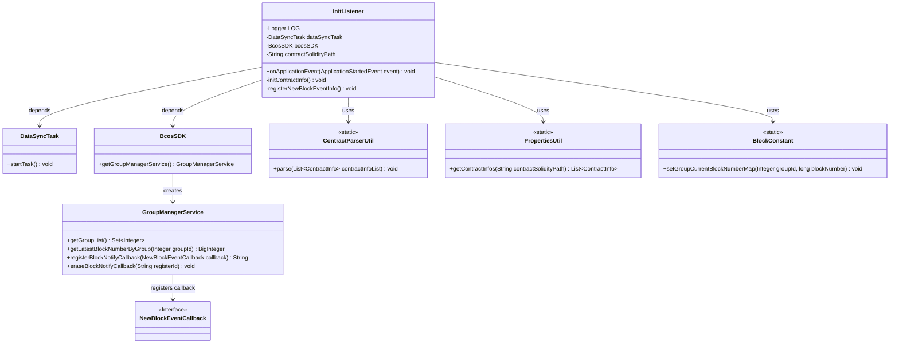
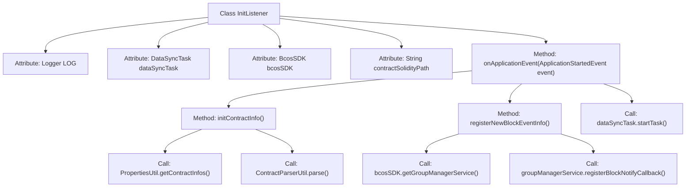
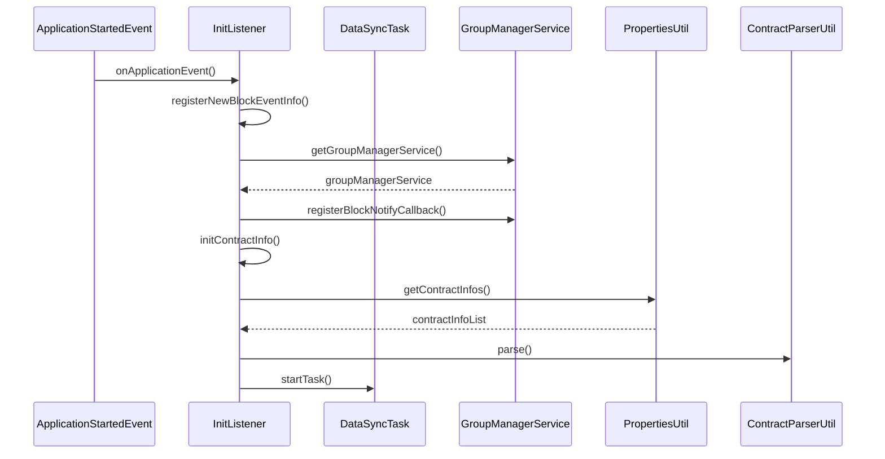

# Basic Information

|      |      |
|------|------|
| Name | InitListener |
| Language | .java |
| Code Path | WeFe/union/blockchain-data-sync/src/main/java/com/welab/wefe/listener/InitListener.java |
| Package Name | com.welab.wefe.listener |
| Dependencies | ['com.welab.wefe.bo.contract.ContractInfo', 'com.welab.wefe.constant.BlockConstant', 'com.welab.wefe.event.NewBlockEventCallback', 'com.welab.wefe.task.DataSyncTask', 'com.welab.wefe.util.ContractParserUtil', 'com.welab.wefe.util.PropertiesUtil', 'org.apache.commons.collections4.CollectionUtils', 'org.fisco.bcos.sdk.BcosSDK', 'org.fisco.bcos.sdk.service.GroupManagerService', 'org.slf4j.Logger', 'org.slf4j.LoggerFactory', 'org.springframework.beans.factory.annotation.Autowired', 'org.springframework.beans.factory.annotation.Value', 'org.springframework.boot.context.event.ApplicationStartedEvent', 'org.springframework.context.ApplicationListener', 'org.springframework.stereotype.Component', 'java.util.List', 'java.util.Set'] |
| Brief Description | The InitListener monitors application startup events, initializes contract information, registers new block event callbacks, and starts data synchronization tasks. It depends on BcosSDK and contract path configuration. |

# Description

The InitListener is a Spring component that monitors application startup events. It injects DataSyncTask and BcosSDK via @Autowired and retrieves the contract file path through @Value. During startup, it performs three operations: registering a new block event callback, initializing contract information, and starting the data synchronization task. When initializing the contract, it checks for the presence of the contract ABI/BIN files in the specified path—exiting the system if they are missing. During block event registration, it fetches the latest block numbers for each group and sets up callbacks, deregistering them and exiting if exceptions occur. The entire process logs critical operations and errors.

# Class Summary

| Name   | Type  | Description |
|-------|------|-------------|
| InitListener | class | InitListener monitors application startup events, initializes contract information, registers new block event callbacks, and starts data synchronization tasks. It depends on BcosSDK and contract path configuration. |

## Class InitListener

|      |      |
|------|------|
| Access Modifier | @Component;public |
| Type | class |
| Name | InitListener |
| Description | InitListener monitors application startup events, initializes contract information, registers new block event callbacks, and starts data synchronization tasks. It depends on BcosSDK and contract path configuration. |

### UML Class Diagram

This diagram illustrates the InitListener class and its dependencies. InitListener is a Spring component that listens to application startup events, with primary functions including initializing contract information, registering new block event callbacks, and initiating data synchronization tasks. It relies on DataSyncTask to perform synchronization tasks, interacts with the blockchain via BcosSDK, loads contract information using PropertiesUtil, parses contracts with ContractParserUtil, and maintains block number mappings through BlockConstant. GroupManagerService manages blockchain groups and handles block notification callbacks.

### Internal Method Call Graph

The flowchart illustrates the structure of the InitListener class and its method invocation relationships, while the sequence diagram details the execution flow triggered by the application startup event. As a Spring component, InitListener listens for the ApplicationStartedEvent during application startup, sequentially executing block event registration, contract information initialization, and data synchronization task initiation. Key operations involve interactions with blockchain services (fetching latest block numbers, registering callbacks), contract file parsing, and exception handling to ensure system stability. The entire process embodies modular design and separation of concerns principles, with core logic concentrated in three private methods.

### Field List

| Name  | Type  | Description |
|-------|-------|------|
| dataSyncTask | DataSyncTask | The code snippet uses Spring's @Autowired annotation to automatically inject an instance of DataSyncTask. |
| bcosSDK | BcosSDK | Use @Autowired to automatically inject the BcosSDK instance. |
| LOG = LoggerFactory.getLogger(InitListener.class) | Logger | Declare a private static immutable log object for logging in the InitListener class. |
| contractSolidityPath | String | The code defines a private String variable named contractSolidityPath, whose value is injected from the configuration property contract.solidity-path via the @Value annotation. |

### Method List

| Name  | Type  | Description |
|-------|-------|------|
| onApplicationEvent | void | When the application starts, it performs three operations: registering new block events, initializing contract information, and starting the data synchronization task. |
| initContractInfo | void | Initializing contract information: Load contract data, check if it is empty; if empty, prompt to upload ABI and BIN files and exit; otherwise, parse the contract information. |
| registerNewBlockEventInfo | void | Register a new block event callback to retrieve and store the latest block numbers of each group, and unregister the callback and exit in case of exceptions. |

