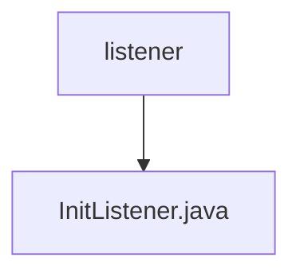

# Basic Information

|      |      |
|------|------|
| Name | listener |
| Language | .java |
| Code Path | WeFe/union/blockchain-data-sync/src/main/java/com/welab/wefe/listener |
| Package Name | docs.union.blockchain-data-sync.src.main.java.com.welab.wefe.listener |
| Brief Description | InitListener monitors application startup events, initializes contract information, registers new block event callbacks, and launches data synchronization tasks. It depends on BcosSDK and contract path configuration. |

# Description

The InitListener is a Spring component that monitors application startup events. It injects DataSyncTask and BcosSDK via @Autowired and retrieves the contract file path through @Value. During startup, it performs three operations: registering a new block event callback, initializing contract information, and starting the data synchronization task. When initializing the contract, it checks for the presence of the contract ABI/BIN files in the specified path—exiting the system if they are missing. During block event registration, it fetches the latest block numbers for each group and sets up callbacks, deregistering them and exiting in case of exceptions. The entire process logs critical operations and errors.

### Package Internal Structure View

This flowchart illustrates the simple structure of the listener module in a blockchain data synchronization project. The root node "listener" represents the listener directory, which contains a concrete listener implementation file "InitListener.java". Such a structure is commonly found in Java projects requiring listener initialization, typically used to execute specific operations or register event handlers during application startup.

# File List

| Name   | Type  | Description |
|-------|------|-------------|
| [InitListener.java](InitListener.md) | file | InitListener monitors application startup events, initializes contract information, registers new block event callbacks, and starts data synchronization tasks. It relies on BcosSDK and contract path configuration. |

