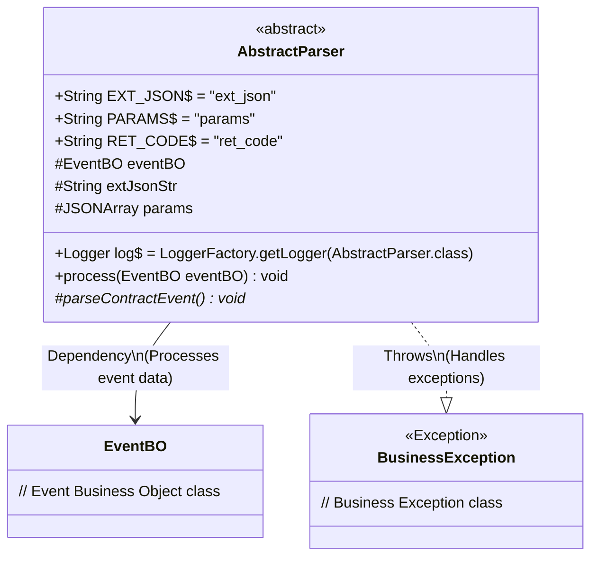
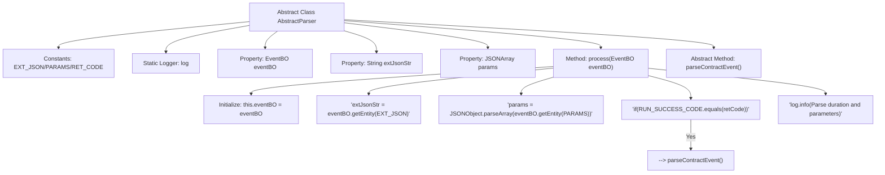

# Basic Information

|      |      |
|------|------|
| Name | AbstractParser |
| Language | .java |
| Code Path | WeFe/union/blockchain-data-sync/src/main/java/com/welab/wefe/parser/AbstractParser.java |
| Package Name | com.welab.wefe.parser |
| Dependencies | ['com.alibaba.fastjson.JSONArray', 'com.alibaba.fastjson.JSONObject', 'com.welab.wefe.bo.data.EventBO', 'com.welab.wefe.constant.EventConstant', 'com.welab.wefe.exception.BusinessException', 'org.slf4j.Logger', 'org.slf4j.LoggerFactory'] |
| Brief Description | The abstract class AbstractParser defines the foundational logic for event parsing, including constants, logging, and the key method `process` for handling event data. Upon success, it invokes the abstract method `parseContractEvent` and logs the time consumed. |

# Description

This is an abstract class named AbstractParser, which defines the foundational framework for event parsing. The class includes three static constants—EXT_JSON, PARAMS, and RET_CODE—used to identify key fields in event entities. The core method, `process`, receives an EventBO object, extracts `extJsonStr` and `params` data from it, and determines whether to invoke the abstract method `parseContractEvent` to execute specific parsing logic based on `retCode`. Before and after method execution, performance logs are recorded, including details such as the parser class name, block number, event name, and extended JSON. The `parseContractEvent` method is an abstract method left for subclasses to implement, intended for handling specific contract events. The entire class provides a generic processing flow for event parsing and logging functionality.

# Class Summary

| Name   | Type  | Description |
|-------|------|-------------|
| AbstractParser | class | The abstract class AbstractParser defines the fundamental logic for handling events, including constants, logging, and parsing methods. Subclasses must implement the parseContractEvent method. |

## Class AbstractParser

|      |      |
|------|------|
| Access Modifier | public abstract |
| Type | class |
| Name | AbstractParser |
| Description | The abstract class AbstractParser defines the fundamental logic for handling events, including constants, logging, and parsing methods. Subclasses must implement the parseContractEvent method. |

### UML Class Diagram

This code demonstrates the design of an abstract class `AbstractParser`, primarily used for parsing Event Business Objects (EventBO). The class contains three static constant definitions, a logger, and three protected member variables. The core method `process()` handles event data processing, including parsing JSON parameters and return codes, and determines whether to call the abstract method `parseContractEvent()` based on the return code. This design employs the Template Method pattern, enforcing subclasses to implement specific event parsing logic while uniformly handling logging and performance monitoring. The class diagram clearly illustrates the dependency relationship with EventBO and the potential BusinessException that may be thrown.

### Internal Method Call Graph

Flowchart Description: This flowchart illustrates the core structure and workflow of the AbstractParser abstract class. The class contains constant definitions, a logger object, and three key properties. The process method first initializes eventBO, then extracts extJsonStr and params parameters, determines whether to call the abstract method parseContractEvent based on retCode, and finally logs the parsing duration. The entire process reflects the complete lifecycle of event parsing, including key steps such as parameter extraction, conditional judgment, and logging.

### Field List

| Name  | Type  | Description |
|-------|-------|------|
| log = LoggerFactory.getLogger(AbstractParser.class) | Logger | Define a static constant logger `log` for logging output in the `AbstractParser` class. |
| extJsonStr | String | Protect the string-type variable extJsonStr |
| RET_CODE = "ret_code" | String | Define a static constant string RET_CODE with the value "ret_code". |
| EXT_JSON = "ext_json" | String | Define a static constant string EXT_JSON with the value "ext_json". |
| params | JSONArray | Protected JSON array parameters. |
| PARAMS = "params" | String | Defined a public static constant string PARAMS with the value "params". |
| eventBO | EventBO | Define the protected event business object variable eventBO. |

### Method List

| Name  | Type  | Description |
|-------|-------|------|
| parseContractEvent | void | The abstract method `parseContractEvent` is used to parse contract events and may throw the business exception `BusinessException`. |
| process | void | The method `process` handles the EventBO event, parses parameters and return codes, and upon success, invokes `parseContractEvent`, recording the parsing duration and key information. |

