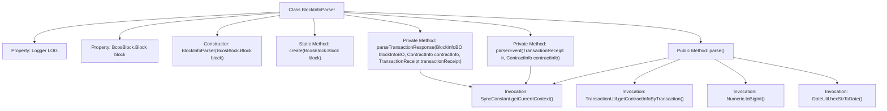
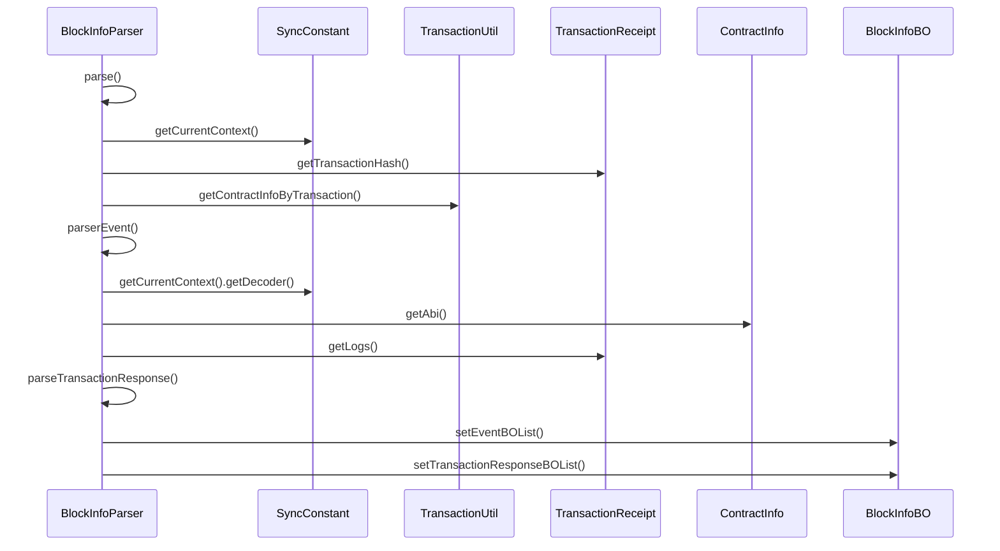

# Basic Information

|      |      |
|------|------|
| Name | BlockInfoParser |
| Language | .java |
| Code Path | WeFe/union/blockchain-data-sync/src/main/java/com/welab/wefe/parser/BlockInfoParser.java |
| Package Name | com.welab.wefe.parser |
| Dependencies | ['com.welab.wefe.bo.contract.ContractInfo', 'com.welab.wefe.bo.contract.EventMetaInfo', 'com.welab.wefe.bo.contract.FieldInfo', 'com.welab.wefe.bo.data.BlockInfoBO', 'com.welab.wefe.bo.data.EventBO', 'com.welab.wefe.bo.data.TransactionResponseBO', 'com.welab.wefe.common.util.DateUtil', 'com.welab.wefe.common.util.JObject', 'com.welab.wefe.common.util.StringUtil', 'com.welab.wefe.constant.ContractConstants', 'com.welab.wefe.constant.SyncConstant', 'com.welab.wefe.util.TransactionUtil', 'org.apache.commons.collections4.CollectionUtils', 'org.fisco.bcos.sdk.abi.ABICodecException', 'org.fisco.bcos.sdk.client.protocol.model.JsonTransactionResponse', 'org.fisco.bcos.sdk.client.protocol.response.BcosBlock', 'org.fisco.bcos.sdk.client.protocol.response.BcosTransactionReceipt', 'org.fisco.bcos.sdk.model.TransactionReceipt', 'org.fisco.bcos.sdk.transaction.codec.decode.TransactionDecoderInterface', 'org.fisco.bcos.sdk.transaction.model.dto.TransactionResponse', 'org.fisco.bcos.sdk.transaction.model.exception.ContractException', 'org.fisco.bcos.sdk.utils.Numeric', 'org.slf4j.Logger', 'org.slf4j.LoggerFactory', 'java.util', 'java.util.stream.Collectors'] |
| Brief Description | The BlockInfoParser class parses blockchain block information, processes transaction receipts and event logs, and generates a BlockInfoBO object containing event and transaction responses. |

# Description

The `BlockInfoParser` class is designed to parse blockchain block information, including event logs and transaction responses. Its constructor accepts a `BcosBlock.Block` object and provides a static `create` method for instantiating the class. The `parserEvent` method decodes transaction event logs, converting event data into a list of `EventBO` objects. The `parse` method processes transactions within the block, retrieves transaction receipts, and parses events and transaction responses, ultimately generating a `BlockInfoBO` object that contains the block number, group ID, event list, and transaction response list. The `parseTransactionResponse` method decodes transaction responses and stores the results in a `TransactionResponseBO` object. The entire process involves event decoding, contract information handling, and exception catching.

# Class Summary

| Name   | Type  | Description |
|-------|------|-------------|
| BlockInfoParser | class | The BlockInfoParser class parses blockchain transactions and event logs to generate event and transaction response objects. It includes functionalities for event parsing, transaction response processing, and block information extraction. |


## Class BlockInfoParser

|      |      |
|------|------|
| Access Modifier | public |
| Type | class |
| Name | BlockInfoParser |
| Description | The BlockInfoParser class parses blockchain transactions and event logs to generate event and transaction response objects. It includes functionalities for event parsing, transaction response processing, and block information extraction. |


### UML Class Diagram

```mermaid
classDiagram
    class BlockInfoParser {
        -Logger LOG
        -BcosBlock.Block block
        +BlockInfoParser(BcosBlock.Block block)
        +BlockInfoParser create(BcosBlock.Block block)$
        -List~EventBO~ parserEvent(TransactionReceipt tr, ContractInfo contractInfo)
        +BlockInfoBO parse()
        -void parseTransactionResponse(BlockInfoBO blockInfoBO, ContractInfo contractInfo, TransactionReceipt transactionReceipt)
    }

    class BcosBlock {
        <<inner>>
        class Block {
            +List~TransactionResult~ getTransactions()
            +String getNumber()
            +String getTimestamp()
        }
        <<inner>>
        class TransactionResult {
        }
        <<inner>>
        class TransactionObject {
            +JsonTransactionResponse get()
        }
    }

    class TransactionReceipt {
        +String getTransactionHash()
        +String getContractAddress()
        +String getBlockNumber()
        +String getFrom()
        +String getTo()
        +List~Log~ getLogs()
        +void setContractAddress(String address)
    }

    class ContractInfo {
        +String getContractName()
        +String getAbi()
        +List~EventMetaInfo~ getEventMetaInfoList()
    }

    class EventMetaInfo {
        +String getEventName()
        +String getContractName()
        +List~FieldInfo~ getFieldInfoList()
    }

    class FieldInfo {
        +String getSqlName()
    }

    class EventBO {
        +void setContractName(String name)
        +void setEventName(String name)
        +void setBlockNumber(String number)
        +void setFrom(String from)
        +void setTo(String to)
        +void setEntity(Map~String, Object~ entity)
    }

    class BlockInfoBO {
        +void setBlockNumber(String number)
        +void setGroupId(String groupId)
        +void setEventBOList(List~EventBO~ list)
        +List~TransactionResponseBO~ getTransactionResponseBOList()
    }

    class TransactionResponseBO {
        +void setTransactionHash(String hash)
        +void setBlockNumber(String number)
        +void setContractAddress(String address)
        +void setContractName(String name)
        +void setTransactionResponse(TransactionResponse response)
    }

    class TransactionResponse {
    }

    class JsonTransactionResponse {
        +String getHash()
        +String getTo()
    }

    class BcosTransactionReceipt {
        +Optional~TransactionReceipt~ getTransactionReceipt()
    }

    BlockInfoParser --> BcosBlock.Block : contains
    BlockInfoParser --> TransactionReceipt : parses
    BlockInfoParser --> ContractInfo : depends on
    BlockInfoParser --> EventBO : generates
    BlockInfoParser --> BlockInfoBO : generates
    BlockInfoParser --> TransactionResponseBO : generates
    ContractInfo --> EventMetaInfo : contains
    EventMetaInfo --> FieldInfo : contains
    BcosBlock.TransactionResult <|-- BcosBlock.TransactionObject
    BcosBlock.TransactionObject --> JsonTransactionResponse : contains
    BcosTransactionReceipt --> TransactionReceipt : contains
    BlockInfoBO --> TransactionResponseBO : contains
```

This code implements a blockchain block information parser, whose main functionality is to parse transactions and event logs within blocks. The BlockInfoParser class takes a BcosBlock.Block object and uses the parse() method to extract block information, generating a BlockInfoBO object that contains event lists and transaction responses. The parsing process involves transaction receipt processing, contract information matching, event log decoding, and other operations, utilizing multiple helper classes such as TransactionReceipt, ContractInfo, and EventBO to encapsulate intermediate data. The overall design adopts a layered processing model, breaking down the complex blockchain data parsing process into multiple methods with single responsibilities.


### Internal Method Call Graph





Flowchart Description: This flowchart illustrates the structure of the BlockInfoParser class, including properties, constructor, static creation method, and three core business methods. parse() serves as the main entry point, invoking parserEvent() to parse event logs and parseTransactionResponse() to process transaction responses. It relies on SyncConstant to obtain context decoders and TransactionUtil to retrieve contract information. The sequence diagram details the interaction flow during the execution of the parse() method, including collaboration with external components.

### Field List

| Name  | Type  | Description |
|-------|-------|------|
| block | BcosBlock.Block | Private block object, type BcosBlock.Block. |
| LOG = LoggerFactory.getLogger(BlockInfoParser.class) | Logger | Define a private static log object LOG for the BlockInfoParser class, obtaining an instance using LoggerFactory. |

### Method List

| Name  | Type  | Description |
|-------|-------|------|
| parse | BlockInfoBO | Parse block information, extract transaction results and events, and generate a BlockInfoBO object. Process transaction receipts and contract information, filter out invalid data, parse events and transaction responses, and ultimately return a block information object containing a list of events. |
| parserEvent | List<EventBO> | Parse transaction event logs to generate a list of event objects. Check contract event metadata, decode log data, map fields, and populate event attributes—including timestamp, transaction hash, contract address, etc.—before returning the event list. |
| create | BlockInfoParser | Create a BlockInfoParser instance, pass in the BcosBlock.Block object, and return it. |
| parseTransactionResponse | void | Parsing transaction response method: Decode transaction receipts, extract information such as transaction hash, block number, contract address, and name, construct a transaction response object, and incorporate block information. Log error messages in case of exceptions. |


