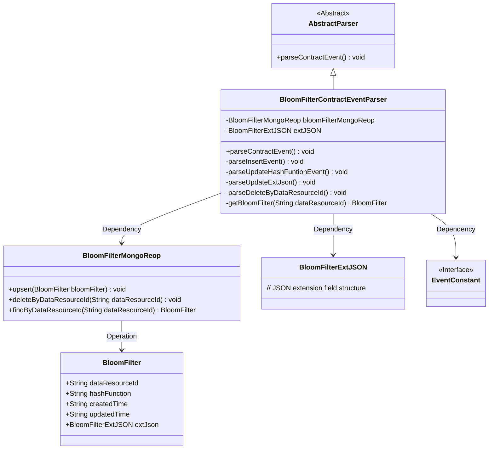
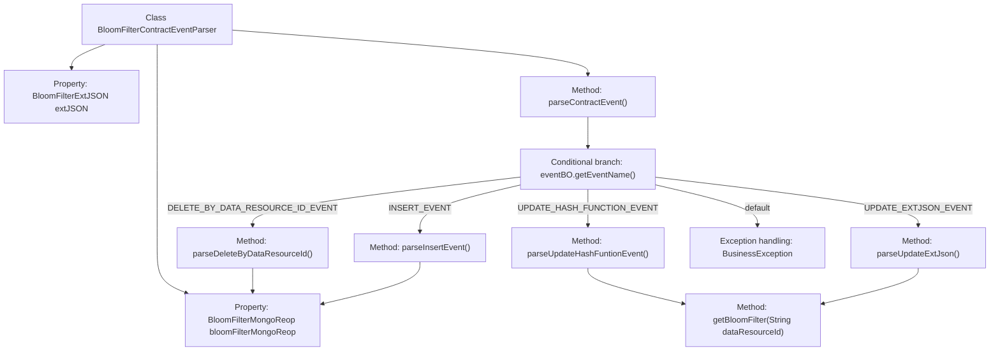

# Basic Information

|      |      |
|------|------|
| Name | BloomFilterContractEventParser |
| Language | .java |
| Code Path | WeFe/union/blockchain-data-sync/src/main/java/com/welab/wefe/parser/BloomFilterContractEventParser.java |
| Package Name | com.welab.wefe.parser |
| Dependencies | ['com.alibaba.fastjson.JSONObject', 'com.welab.wefe.BlockchainDataSyncApp', 'com.welab.wefe.common.data.mongodb.entity.union.BloomFilter', 'com.welab.wefe.common.data.mongodb.entity.union.ext.BloomFilterExtJSON', 'com.welab.wefe.common.data.mongodb.repo.BloomFilterMongoReop', 'com.welab.wefe.common.util.StringUtil', 'com.welab.wefe.constant.EventConstant', 'com.welab.wefe.exception.BusinessException', 'org.apache.commons.lang3.StringUtils'] |
| Brief Description | The BloomFilterContractEventParser class parses Bloom filter-related events, including insertion, hash function updates, extension JSON updates, and deletion by ID operations, using MongoDB for data storage. |

# Description

The `BloomFilterContractEventParser` class inherits from `AbstractParser` and is used to parse Bloom filter-related events. It interacts with MongoDB via `bloomFilterMongoReop` to handle four types of events:  
- `INSERT_EVENT` creates a new record and sets fields such as the data resource ID and hash functions.  
- `UPDATE_HASH_FUNCTION_EVENT` updates the hash functions.  
- `UPDATE_EXTJSON_EVENT` updates the extended JSON.  
- `DELETE_BY_DATA_RESOURCE_ID_EVENT` deletes records by ID.  

All operations validate the existence of data and persist changes using the `upsert` method.

# Class Summary

| Name   | Type  | Description |
|-------|------|-------------|
| BloomFilterContractEventParser | class | The BloomFilterContractEventParser class parses Bloom filter-related events, including insertion, hash function updates, extended JSON updates, and deletion operations, storing data via MongoDB. |

## Class BloomFilterContractEventParser

|      |      |
|------|------|
| Access Modifier | public |
| Type | class |
| Name | BloomFilterContractEventParser |
| Description | The BloomFilterContractEventParser class parses Bloom filter-related events, including insertion, hash function updates, extended JSON updates, and deletion operations, storing data via MongoDB. |

### UML Class Diagram

This class diagram illustrates the core structure of the Bloom Filter contract event parser. BloomFilterContractEventParser inherits from the abstract parser and operates on BloomFilter entities through BloomFilterMongoReop to handle INSERT/UPDATE/DELETE events. The parser relies on BloomFilterExtJSON to store extended data and references EventConstant for event type constants. The overall design follows a layered architecture, separating the data access layer from business logic, adhering to the Single Responsibility Principle.

### Internal Method Call Graph

This flowchart illustrates the core logical structure of the BloomFilterContractEventParser class. The class uses parseContractEvent() as the entry point, dispatching to four different processing methods (INSERT/UPDATE/DELETE) based on the event type (eventName), all involving database operations on bloomFilterMongoReop. Both parseUpdateHashFuntionEvent and parseUpdateExtJson invoke the getBloomFilter method to validate data existence, with all database operations ultimately pointing to the bloomFilterMongoReop instance. BusinessException is thrown in exceptional cases, presenting a clear event-driven processing flow overall.

### Field List

| Name  | Type  | Description |
|-------|-------|------|
| extJSON | BloomFilterExtJSON | Protect the member variable extJSON, of type BloomFilterExtJSON. |
| bloomFilterMongoReop = BlockchainDataSyncApp.CONTEXT.getBean(BloomFilterMongoReop.class) | BloomFilterMongoReop | Obtain the BloomFilterMongoReop instance by injecting it through the CONTEXT container of BlockchainDataSyncApp. |

### Method List

| Name  | Type  | Description |
|-------|-------|------|
| parseContractEvent | void | Method for parsing contract events, which invokes corresponding processing logic based on event names, including insertion, updating hash functions, updating extended JSON, and deletion by resource ID. Invalid events will throw an exception. |
| parseUpdateHashFuntionEvent | void | Analyze the hash function update event, retrieve the data resource ID, hash function, and update time, then update the Bloom filter and save it. |
| parseInsertEvent | void | Parsing insertion event: Create a BloomFilter object, set the data resource ID, hash function, creation and update timestamps along with extended JSON, and finally execute a MongoDB upsert operation. |
| parseUpdateExtJson | void | Parse the updated extended JSON data, set the Bloom filter attributes, and update them to the database. |
| parseDeleteByDataResourceId | void | Parse and delete the Bloom filter records for the specified data resource ID. |
| getBloomFilter | BloomFilter | Get the Bloom filter by data resource ID, throw an exception if it does not exist. |

