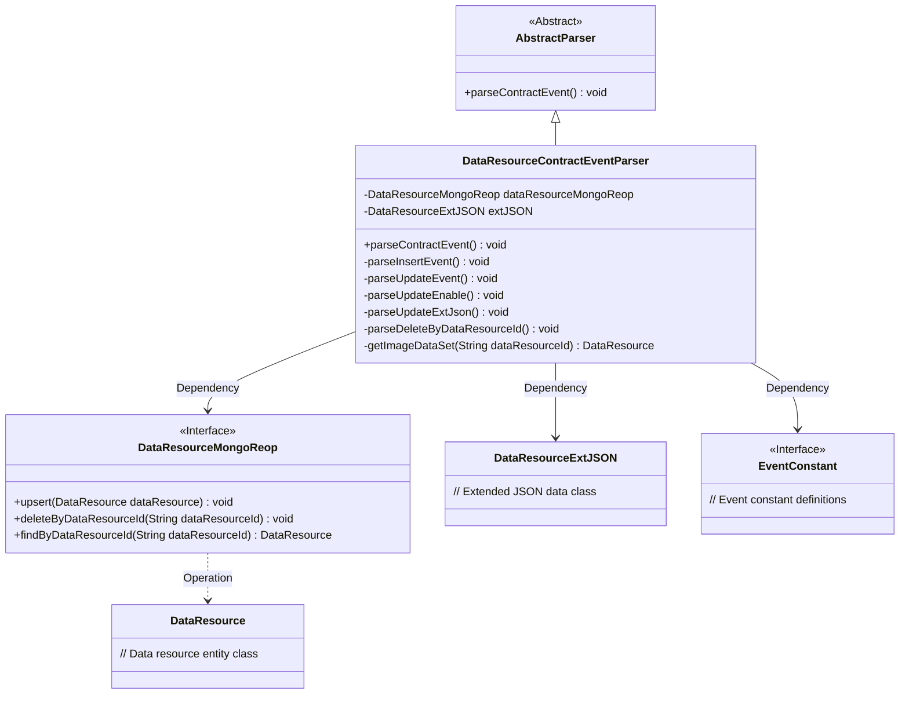
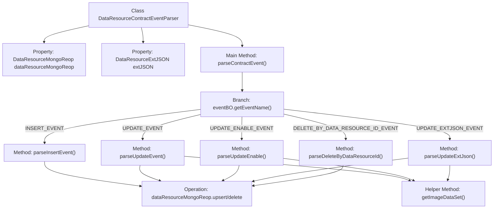
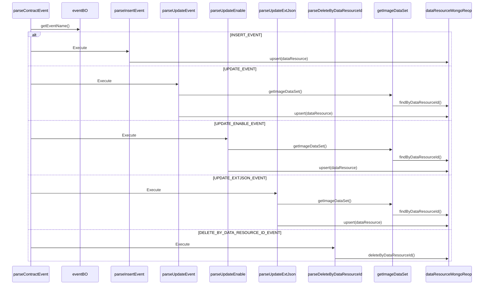

# Basic Information

|      |      |
|------|------|
| Name | DataResourceContractEventParser |
| Language | .java |
| Code Path | WeFe/union/blockchain-data-sync/src/main/java/com/welab/wefe/parser/DataResourceContractEventParser.java |
| Package Name | com.welab.wefe.parser |
| Dependencies | ['com.alibaba.fastjson.JSONObject', 'com.welab.wefe.BlockchainDataSyncApp', 'com.welab.wefe.common.data.mongodb.entity.union.DataResource', 'com.welab.wefe.common.data.mongodb.entity.union.ext.DataResourceExtJSON', 'com.welab.wefe.common.data.mongodb.repo.DataResourceMongoReop', 'com.welab.wefe.common.util.StringUtil', 'com.welab.wefe.common.wefe.enums.DataResourceType', 'com.welab.wefe.constant.EventConstant', 'com.welab.wefe.exception.BusinessException', 'org.apache.commons.lang3.StringUtils'] |
| Brief Description | The DataResourceContractEventParser class parses data resource events, handling insert, update, enable, extended JSON update, and delete operations, storing data via MongoDB. |

# Description

The `DataResourceContractEventParser` class inherits from `AbstractParser` and is used to parse data resource-related events. It contains fields for `DataResourceMongoReop` and `DataResourceExtJSON`, processing different event types via the `parseContractEvent` method. Supported events include insertion, update, update of enabled status, update of extended JSON, and deletion by ID. Insertion events set various attributes of the data resource and save it; update events modify specified attributes; updates to extended JSON and enabled status only modify the corresponding fields; deletion events remove data based on ID. All operations interact with the database through `dataResourceMongoReop` to ensure data consistency.

# Class Summary

| Name   | Type  | Description |
|-------|------|-------------|
| DataResourceContractEventParser | class | The DataResourceContractEventParser class parses data resource events, handling insert, update, enable status, extended JSON, and delete operations, using MongoDB for data storage. |

## Class DataResourceContractEventParser

|      |      |
|------|------|
| Access Modifier | public |
| Type | class |
| Name | DataResourceContractEventParser |
| Description | The DataResourceContractEventParser class parses data resource events, handling insert, update, enable status, extended JSON, and delete operations, using MongoDB for data storage. |

### UML Class Diagram

This class diagram illustrates the structure of a data resource contract event parser. The DataResourceContractEventParser inherits from AbstractParser and implements parsing logic for various contract event types (e.g., insert, update, delete). It depends on the DataResourceMongoReop interface for MongoDB operations, utilizes DataResourceExtJSON to handle extended data, and references EventConstant for event type constants. The parser processes specific events through multiple private methods, with core operations including CRUD on data resources and strict validation of data existence. The overall design reflects event-driven architecture and layered processing principles.

### Internal Method Call Graph

This flowchart illustrates the event handling logic of the DataResourceContractEventParser class. The core process involves routing different event types (INSERT/UPDATE/DELETE, etc.) to corresponding handler methods through the parseContractEvent method. All branches ultimately perform MongoDB operations, including data insertion/update/deletion. The sequence diagram details the invocation sequence among components during event parsing, highlighting the branch routing based on event types and the data persistence process.

### Field List

| Name  | Type  | Description |
|-------|-------|------|
| extJSON | DataResourceExtJSON | Defined the extended JSON field extJSON for protected data resources. |
| dataResourceMongoReop = BlockchainDataSyncApp.CONTEXT.getBean(DataResourceMongoReop.class) | DataResourceMongoReop | Obtain an instance of DataResourceMongoReop by injecting it through the CONTEXT container of BlockchainDataSyncApp. |

### Method List

| Name  | Type  | Description |
|-------|-------|------|
| parseUpdateEvent | void | Parse the update event, retrieve the resource ID and update time, update the data resource attributes, and save them to the database. |
| parseDeleteByDataResourceId | void | Parse and delete records of the specified data resource ID. |
| parseUpdateEnable | void | Parsing Update Activation Status: Retrieve the resource ID, activation status, and update time from eventBO, then update the corresponding data resource and save it to MongoDB. |
| parseContractEvent | void | Parsing contract event methods, invoking corresponding processing logic based on event names, including insert, update, enable, extended JSON update, and delete operations. Invalid events will throw an exception. |
| parseInsertEvent | void | Parse the insertion event, set the properties of the DataResource object, and store it in the database. The properties include ID, name, description, tags, data volume, public level, usage statistics, etc. |
| getImageDataSet | DataResource | This method retrieves the image dataset from MongoDB by ID, throwing a business exception if it does not exist. |
| parseUpdateExtJson | void | Parse the updated extended JSON data, retrieve the resource ID and update time, update the data resource, and save it to the database. |

