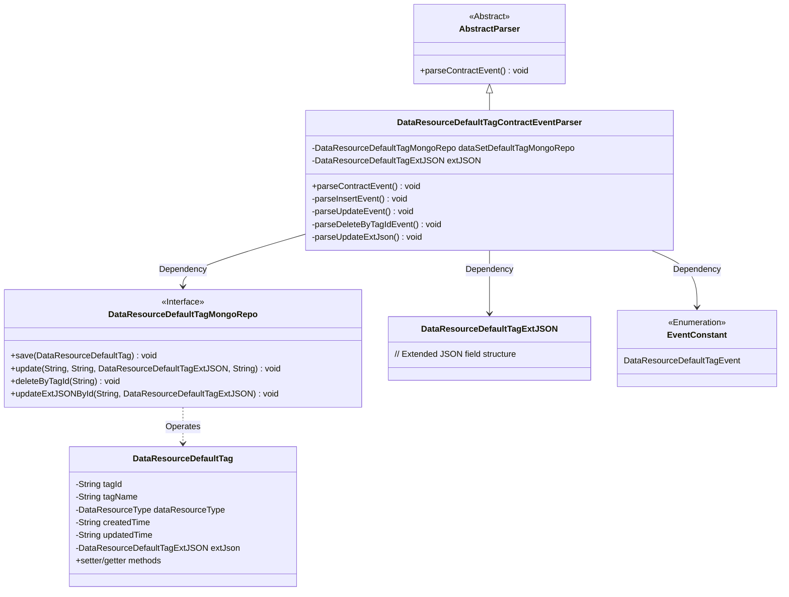
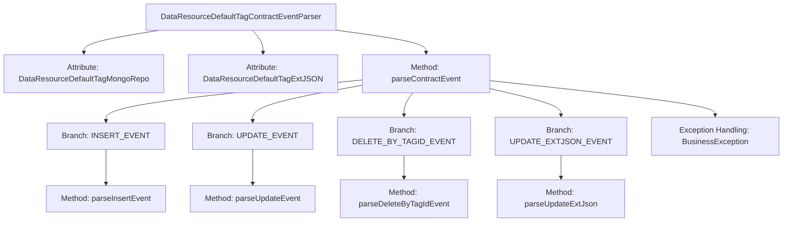
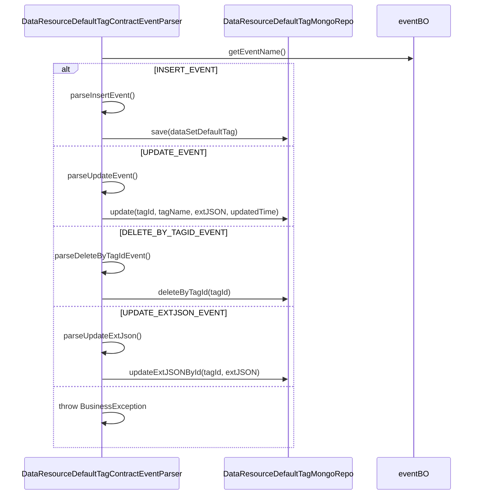

# Basic Information

|      |      |
|------|------|
| Name | DataResourceDefaultTagContractEventParser |
| Language | .java |
| Code Path | WeFe/union/blockchain-data-sync/src/main/java/com/welab/wefe/parser/DataResourceDefaultTagContractEventParser.java |
| Package Name | com.welab.wefe.parser |
| Dependencies | ['com.alibaba.fastjson.JSONObject', 'com.welab.wefe.BlockchainDataSyncApp', 'com.welab.wefe.common.data.mongodb.entity.union.DataResource', 'com.welab.wefe.common.data.mongodb.entity.union.DataResourceDefaultTag', 'com.welab.wefe.common.data.mongodb.entity.union.DataSetDefaultTag', 'com.welab.wefe.common.data.mongodb.entity.union.ext.DataResourceDefaultTagExtJSON', 'com.welab.wefe.common.data.mongodb.entity.union.ext.DataSetDefaultTagExtJSON', 'com.welab.wefe.common.data.mongodb.repo.DataResourceDefaultTagMongoRepo', 'com.welab.wefe.common.data.mongodb.repo.DataSetDefaultTagMongoRepo', 'com.welab.wefe.common.util.StringUtil', 'com.welab.wefe.common.wefe.enums.DataResourceType', 'com.welab.wefe.constant.EventConstant', 'com.welab.wefe.exception.BusinessException', 'org.apache.commons.lang3.StringUtils'] |
| Brief Description | The class for parsing default tag contract events of data resources, handling insert, update, delete, and update extended JSON events, using MongoDB for data storage. |

# Description

The code defines a class named `DataResourceDefaultTagContractEventParser`, which inherits from `AbstractParser` and is used to parse and process contract events related to default tags of data resources. The class includes operations on a MongoDB repository, performing data access via the injected `dataSetDefaultTagMongoRepo`. Key functionalities involve parsing four types of events: insertion events (creating new tags and saving them to the database), update events (modifying tag names and extended JSON), deletion events by tag ID, and extended JSON update events. Each event handling method extracts necessary information from input parameters and invokes corresponding MongoDB repository methods to execute operations. Business exceptions are thrown in case of errors.

# Class Summary

| Name   | Type  | Description |
|-------|------|-------------|
| DataResourceDefaultTagContractEventParser | class | The DataResourceDefaultTagContractEventParser class parses data resource default tag events, handling insert, update, delete, and update extended JSON operations, using MongoDB for data storage. |

## Class DataResourceDefaultTagContractEventParser

|      |      |
|------|------|
| Access Modifier | public |
| Type | class |
| Name | DataResourceDefaultTagContractEventParser |
| Description | The DataResourceDefaultTagContractEventParser class parses data resource default tag events, handling insert, update, delete, and update extended JSON operations, using MongoDB for data storage. |

### UML Class Diagram

This class diagram illustrates the structure of a data resource default tag contract event parser. The DataResourceDefaultTagContractEventParser inherits from an abstract parser, operates on data tag entities via a MongoDB repository, and handles four event types (CRUD). Core dependencies include the tag entity class, JSON extension structure, and event enumeration constants, reflecting an event-driven parsing mechanism in blockchain data synchronization scenarios.

### Internal Method Call Graph

This flowchart illustrates the core structure and event handling logic of the DataResourceDefaultTagContractEventParser class. The class processes different event types (INSERT/UPDATE/DELETE/EXTJSON update) by invoking corresponding methods, ultimately interacting with the MongoDB repository to complete data operations. The sequence diagram details the interaction sequence between components during event processing, highlighting the branch routing mechanism based on event names. All operations revolve around tagId to ensure data consistency and transactional integrity.

### Field List

| Name  | Type  | Description |
|-------|-------|------|
| dataSetDefaultTagMongoRepo = BlockchainDataSyncApp.CONTEXT.getBean(DataResourceDefaultTagMongoRepo.class) | DataResourceDefaultTagMongoRepo | Get the DataResourceDefaultTagMongoRepo instance, injected via the CONTEXT of BlockchainDataSyncApp. |
| extJSON | DataResourceDefaultTagExtJSON | The protected DataResourceDefaultTagExtJSON type variable extJSON. |

### Method List

| Name  | Type  | Description |
|-------|-------|------|
| parseUpdateEvent | void | Parse the update event to retrieve the tag ID, name, and update time, then update the default tag data in MongoDB. |
| parseContractEvent | void | Parsing contract event methods, invoking different processing logic based on event names: insert, update, delete by tag ID, update extended JSON. Invalid events throw an exception. |
| parseInsertEvent | void | Parsing insertion event: Create a DataResourceDefaultTag object, set the tag ID, name, resource type, creation and update time, and extension JSON, then save it to MongoDB. |
| parseDeleteByTagIdEvent | void | The method parses the tag deletion event, retrieves the tag ID, and then calls the MongoDB repository to delete the corresponding tag data. |
| parseUpdateExtJson | void | Parse and update the extended JSON data, then call the MongoDB repository by tagId to update the extJSON field of the corresponding record. |

