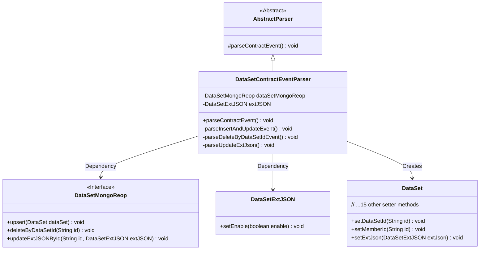
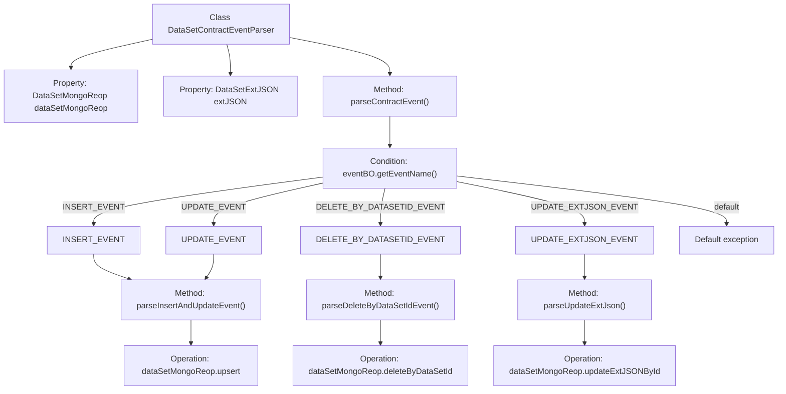

# Basic Information

|      |      |
|------|------|
| Name | DataSetContractEventParser |
| Language | .java |
| Code Path | WeFe/union/blockchain-data-sync/src/main/java/com/welab/wefe/parser/DataSetContractEventParser.java |
| Package Name | com.welab.wefe.parser |
| Dependencies | ['org.apache.commons.lang3.StringUtils', 'com.alibaba.fastjson.JSONObject', 'com.welab.wefe.BlockchainDataSyncApp', 'com.welab.wefe.common.data.mongodb.entity.union.DataSet', 'com.welab.wefe.common.data.mongodb.entity.union.ext.DataSetExtJSON', 'com.welab.wefe.common.data.mongodb.repo.DataSetMongoReop', 'com.welab.wefe.common.util.StringUtil', 'com.welab.wefe.constant.EventConstant', 'com.welab.wefe.exception.BusinessException'] |
| Brief Description | The DataSetContractEventParser class parses contract events, handles insert, update, delete, and update extended JSON operations, and stores the data in MongoDB. |

# Description

DataSetContractEventParser is a class that inherits from AbstractParser and is used to parse contract events related to datasets. It contains an instance of DataSetMongoReop and a DataSetExtJSON object. The main method, parseContractEvent, processes different operations based on the event name: INSERT_EVENT and UPDATE_EVENT invoke the parseInsertAndUpdateEvent method, DELETE_BY_DATASETID_EVENT calls the parseDeleteByDataSetIdEvent method, and UPDATE_EXTJSON_EVENT triggers the parseUpdateExtJson method. The parseInsertAndUpdateEvent method creates and populates a DataSet object, then performs an upsert operation. The parseDeleteByDataSetIdEvent and parseUpdateExtJson methods delete a dataset by ID and update the extended JSON, respectively. Unrecognized events will throw a BusinessException.

# Class Summary

| Name   | Type  | Description |
|-------|------|-------------|
| DataSetContractEventParser | class | The DataSetContractEventParser class parses contract events, handles insert, update, delete, and update extended JSON operations, and stores the data in MongoDB. |

## Class DataSetContractEventParser

|      |      |
|------|------|
| Access Modifier | public |
| Type | class |
| Name | DataSetContractEventParser |
| Description | The DataSetContractEventParser class parses contract events, handles insert, update, delete, and update extended JSON operations, and stores the data in MongoDB. |

### UML Class Diagram

This code describes a dataset contract event parser that inherits from an abstract parser, primarily handling four types of events (insert/update/delete/extended JSON update). The class diagram illustrates core class relationships: the parser operates on datasets via a MongoDB repository, uses an extended JSON object to store additional attributes, and creates dataset entities for persistence. Key points include dispatching event types, fine-grained mapping of dataset fields, and implementing data access through the repository pattern.

### Internal Method Call Graph

This code implements a processor for parsing dataset contract events, inheriting from the AbstractParser class. Its core functionality involves executing corresponding database operations based on different event types (INSERT_EVENT, UPDATE_EVENT, etc.), including inserting/updating datasets, deleting datasets by ID, or updating extended JSON data. The flowchart illustrates the complete workflow from event parsing to specific operations, featuring event type decision branches and corresponding database operation method call paths, ultimately performing MongoDB CRUD operations. The code structure is clear, employing switch-case logic to handle different event types, with each event type mapped to a dedicated parsing method.

### Field List

| Name  | Type  | Description |
|-------|-------|------|
| dataSetMongoReop = BlockchainDataSyncApp.CONTEXT.getBean(DataSetMongoReop.class) | DataSetMongoReop | Obtain an instance of DataSetMongoReop by injecting it through the CONTEXT container of BlockchainDataSyncApp. |
| extJSON | DataSetExtJSON | Protected extended JSON dataset object. |

### Method List

| Name  | Type  | Description |
|-------|-------|------|
| parseDeleteByDataSetIdEvent | void | This method parses the delete event, retrieves the ID from the event object, and invokes MongoDB to delete the corresponding dataset. |
| parseInsertAndUpdateEvent | void | The method parseInsertAndUpdateEvent creates a DataSet object and sets its attributes, including ID, name, row and column counts, features, etc., and finally calls the upsert method to save it to the database. |
| parseContractEvent | void | Parsing contract event methods involves handling different logic based on event names: inserting or updating events by enabling extJSON and parsing, deleting events by processing dataset IDs, updating events by parsing extJSON, and throwing exceptions for invalid event names. |
| parseUpdateExtJson | void | The method `parseUpdateExtJson` retrieves the ID from `eventBO` and invokes the `updateExtJSONById` method of `dataSetMongoReop` to update the `extJSON` data for the specified ID. |

