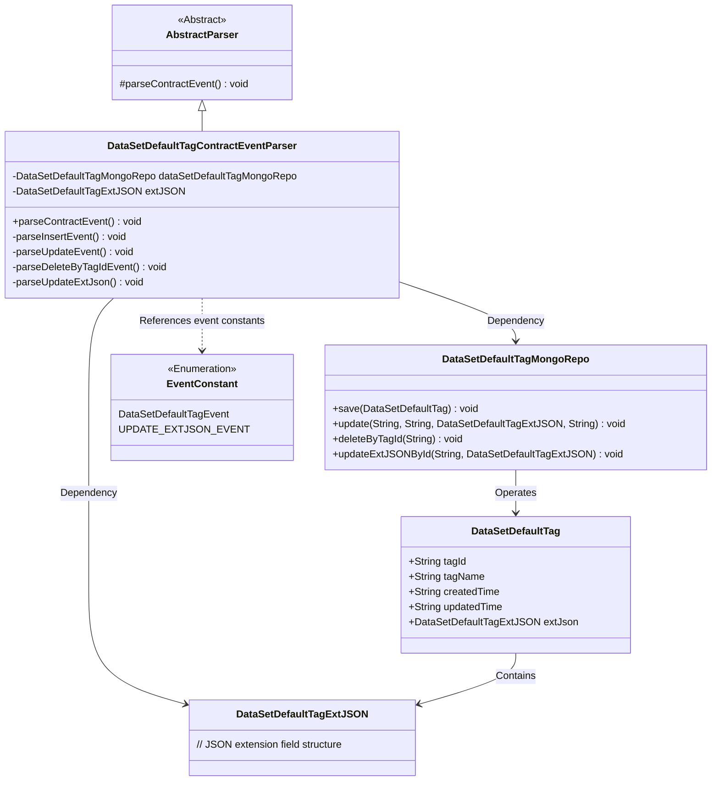
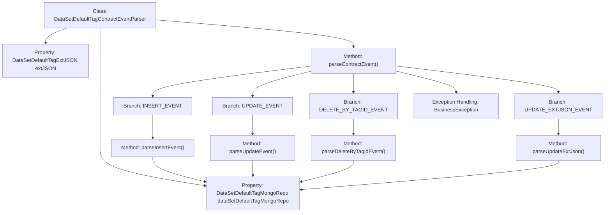

# Basic Information

|      |      |
|------|------|
| Name | DataSetDefaultTagContractEventParser |
| Language | .java |
| Code Path | WeFe/union/blockchain-data-sync/src/main/java/com/welab/wefe/parser/DataSetDefaultTagContractEventParser.java |
| Package Name | com.welab.wefe.parser |
| Dependencies | ['org.apache.commons.lang3.StringUtils', 'com.alibaba.fastjson.JSONObject', 'com.welab.wefe.BlockchainDataSyncApp', 'com.welab.wefe.common.data.mongodb.entity.union.DataSetDefaultTag', 'com.welab.wefe.common.data.mongodb.entity.union.ext.DataSetDefaultTagExtJSON', 'com.welab.wefe.common.data.mongodb.repo.DataSetDefaultTagMongoRepo', 'com.welab.wefe.common.util.StringUtil', 'com.welab.wefe.constant.EventConstant', 'com.welab.wefe.exception.BusinessException'] |
| Brief Description | Java class for parsing default label contract events in datasets, including methods for inserting, updating, deleting, and updating extended JSON, using MongoDB for data storage. |

# Description

DataSetDefaultTagContractEventParser is a class that inherits from AbstractParser and is used to parse contract events related to dataset default tags. It interacts with MongoDB through dataSetDefaultTagMongoRepo and handles four types of events: insertion, update, deletion by tagId, and extJSON update. Insertion events create new DataSetDefaultTag objects and save them to MongoDB; update events modify the tag name and extJSON; deletion events remove records based on tagId; and extJSON update events only modify the extJSON field. All operations involve CRUD (Create, Read, Update, Delete) operations on MongoDB.

# Class Summary

| Name   | Type  | Description |
|-------|------|-------------|
| DataSetDefaultTagContractEventParser | class | Default dataset label event parsing class, handling insert, update, delete, and extended JSON update operations, interacting with MongoDB. |

## Class DataSetDefaultTagContractEventParser

|      |      |
|------|------|
| Access Modifier | public |
| Type | class |
| Name | DataSetDefaultTagContractEventParser |
| Description | Default dataset label event parsing class, handling insert, update, delete, and extended JSON update operations, interacting with MongoDB. |

### UML Class Diagram

This class diagram illustrates the core structure of a dataset default tag contract event parser. The DataSetDefaultTagContractEventParser inherits from an abstract parser, manipulates DataSetDefaultTag entities through MongoDB repository operations, and handles events such as insert/update/delete. The entity contains basic tag information and extended JSON structure, with event types defined by enumeration constants. The parser invokes corresponding private methods based on different event types to complete interactions with MongoDB.

### Internal Method Call Graph

This flowchart illustrates the structure of the DataSetDefaultTagContractEventParser class and its key method invocation relationships. Inheriting from AbstractParser, this class contains two properties and five core methods. The parseContractEvent() method serves as the main entry point, dispatching different processing methods (insert/update/delete/update extended JSON) based on event types. All methods ultimately interact with the database through dataSetDefaultTagMongoRepo. The flowchart clearly presents the event dispatching logic and exception handling path, demonstrating the processing workflow for dataset default tag events in blockchain data synchronization scenarios.

### Field List

| Name  | Type  | Description |
|-------|-------|------|
| extJSON | DataSetDefaultTagExtJSON | The protected DataSetDefaultTagExtJSON type variable extJSON. |
| dataSetDefaultTagMongoRepo = BlockchainDataSyncApp.CONTEXT.getBean(DataSetDefaultTagMongoRepo.class) | DataSetDefaultTagMongoRepo | Get the DataSetDefaultTagMongoRepo instance, injected via the CONTEXT of BlockchainDataSyncApp. |

### Method List

| Name  | Type  | Description |
|-------|-------|------|
| parseInsertEvent | void | Parse the insertion event, set the DataSetDefaultTag property, and save it to MongoDB. |
| parseContractEvent | void | Method for parsing contract events, which calls the corresponding processing logic based on the event name, including insertion, update, deletion by tag ID, and updating extended JSON. Invalid events will throw an exception. |
| parseUpdateEvent | void | Parse the update event to obtain the tag ID, name, and update time, then update the default tag data in MongoDB. |
| parseDeleteByTagIdEvent | void | Parse the delete tag event and remove the corresponding data from MongoDB based on the tag ID. |
| parseUpdateExtJson | void | The method `parseUpdateExtJson` retrieves the `tag_id` from `eventBO` and invokes `dataSetDefaultTagMongoRepo` to update the `extJSON` field corresponding to that ID. |

