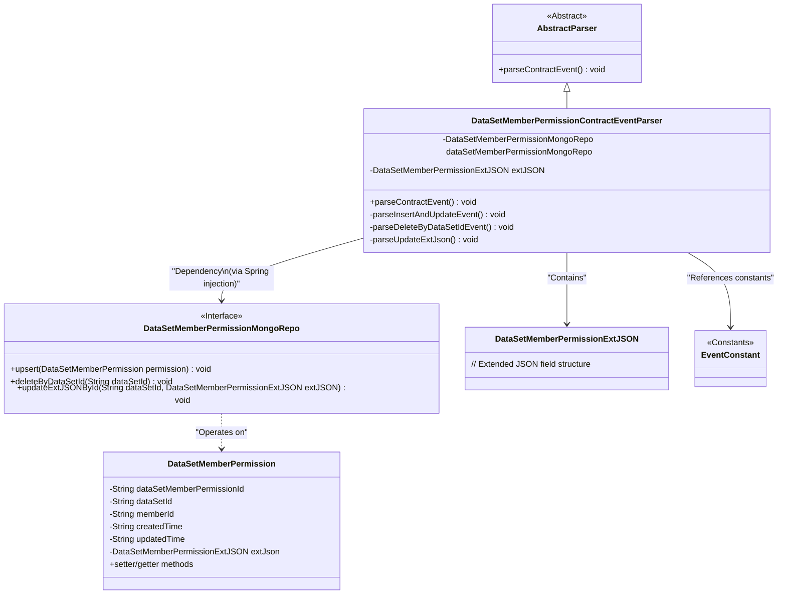
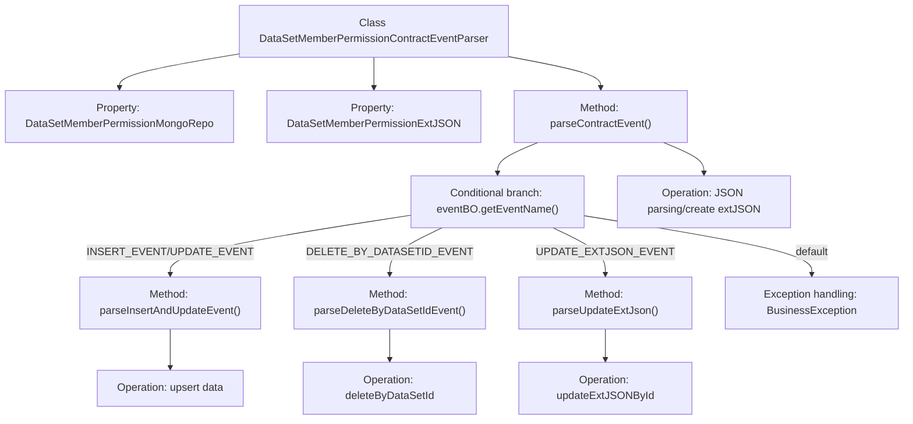

# Basic Information

|      |      |
|------|------|
| Name | DataSetMemberPermissionContractEventParser |
| Language | .java |
| Code Path | WeFe/union/blockchain-data-sync/src/main/java/com/welab/wefe/parser/DataSetMemberPermissionContractEventParser.java |
| Package Name | com.welab.wefe.parser |
| Dependencies | ['com.alibaba.fastjson.JSONObject', 'com.welab.wefe.BlockchainDataSyncApp', 'com.welab.wefe.common.data.mongodb.entity.union.DataSetMemberPermission', 'com.welab.wefe.common.data.mongodb.entity.union.ext.DataSetMemberPermissionExtJSON', 'com.welab.wefe.common.data.mongodb.repo.DataSetMemberPermissionMongoRepo', 'com.welab.wefe.constant.EventConstant', 'com.welab.wefe.exception.BusinessException', 'org.apache.commons.lang3.StringUtils', 'java.util.Map'] |
| Brief Description | A class for parsing contract events, handling CRUD operations on dataset member permissions, including insertion, update, deletion, and extended JSON updates, with data stored in MongoDB. |

# Description

The `DataSetMemberPermissionContractEventParser` class inherits from `AbstractParser` and is used to parse dataset member permission-related contract events. It interacts with MongoDB via `dataSetMemberPermissionMongoRepo` and handles four types of events:  
- `INSERT_EVENT` and `UPDATE_EVENT` parse and insert or update member permission data.  
- `DELETE_BY_DATASETID_EVENT` deletes records based on the dataset ID.  
- `UPDATE_EXTJSON_EVENT` updates the extended JSON field.  
All operations are performed based on the event data in `eventBO` and the `extJsonStr` parameter.

# Class Summary

| Name   | Type  | Description |
|-------|------|-------------|
| DataSetMemberPermissionContractEventParser | class | A class for parsing dataset member permission contract events, handling insert, update, delete, and extended JSON update operations, using MongoDB for data storage. |

## Class DataSetMemberPermissionContractEventParser

|      |      |
|------|------|
| Access Modifier | public |
| Type | class |
| Name | DataSetMemberPermissionContractEventParser |
| Description | A class for parsing dataset member permission contract events, handling insert, update, delete, and extended JSON update operations, using MongoDB for data storage. |

### UML Class Diagram

This class diagram depicts the structure of a dataset member permission contract event parser. The DataSetMemberPermissionContractEventParser inherits from the abstract class AbstractParser, utilizes the DataSetMemberPermissionMongoRepo interface through dependency injection for MongoDB operations, and contains DataSetMemberPermissionExtJSON as an extended field container. It invokes corresponding parsing methods based on different event types (INSERT/UPDATE/DELETE), ultimately persisting the processed DataSetMemberPermission object to the database. The entire design employs the strategy pattern to handle different event types, complying with the open-closed principle.

### Internal Method Call Graph

This code flowchart illustrates the complete processing logic of the dataset member permission contract event parser. The core flow starts with the parseContractEvent() method, which dispatches to three sub-handling methods based on event type: parseInsertAndUpdateEvent() for insert/update events, parseDeleteByDataSetIdEvent() for deletion by dataset ID, and parseUpdateExtJson() for extended JSON updates. Each sub-method involves different MongoDB operations including upsert, deleteByDataSetId and updateExtJSONById. The process incorporates initial JSON data parsing and exception handling branches, forming a complete closed-loop for contract event processing.

### Field List

| Name  | Type  | Description |
|-------|-------|------|
| dataSetMemberPermissionMongoRepo = BlockchainDataSyncApp.CONTEXT.getBean(DataSetMemberPermissionMongoRepo.class) | DataSetMemberPermissionMongoRepo | Retrieve the Bean instance of the DataSetMemberPermissionMongoRepo class from the application context and assign it to the protected variable. |
| extJSON | DataSetMemberPermissionExtJSON | The protected DataSetMemberPermissionExtJSON type variable extJSON. |

### Method List

| Name  | Type  | Description |
|-------|-------|------|
| parseDeleteByDataSetIdEvent | void | Method parses the deletion event, retrieves the dataset ID, and deletes the corresponding permission record. |
| parseInsertAndUpdateEvent | void | Parse the insert and update events, retrieve data from the eventBO, set the properties of the DataSetMemberPermission object, and finally perform an upsert operation in MongoDB. |
| parseContractEvent | void | Analysis of contract event methods, invoking different processing logic based on event types: insert/update, delete by dataset ID, update extended JSON, with invalid events triggering exceptions. |
| parseUpdateExtJson | void | Parse and Update Extended JSON: Retrieve the dataset ID based on event data, then invoke the MongoDB repository to update the extended JSON field corresponding to that ID. |

