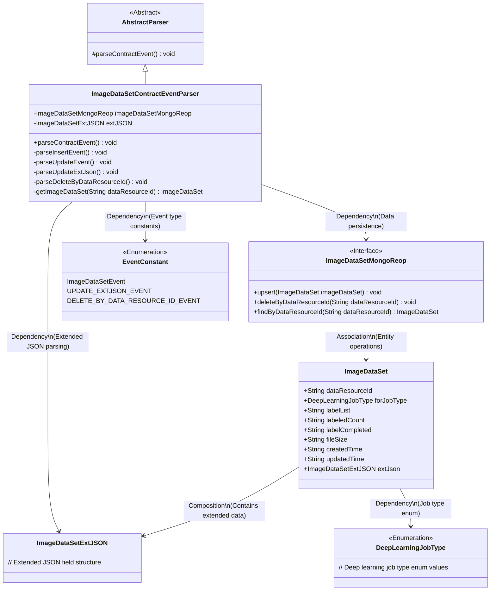
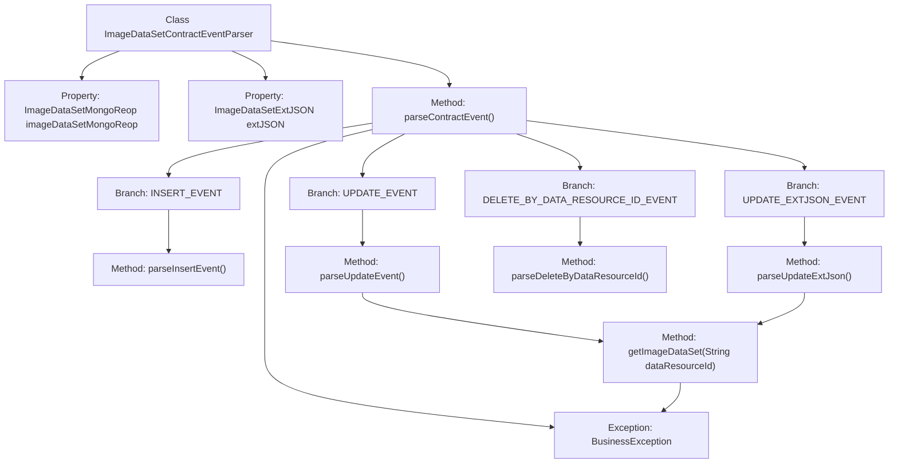
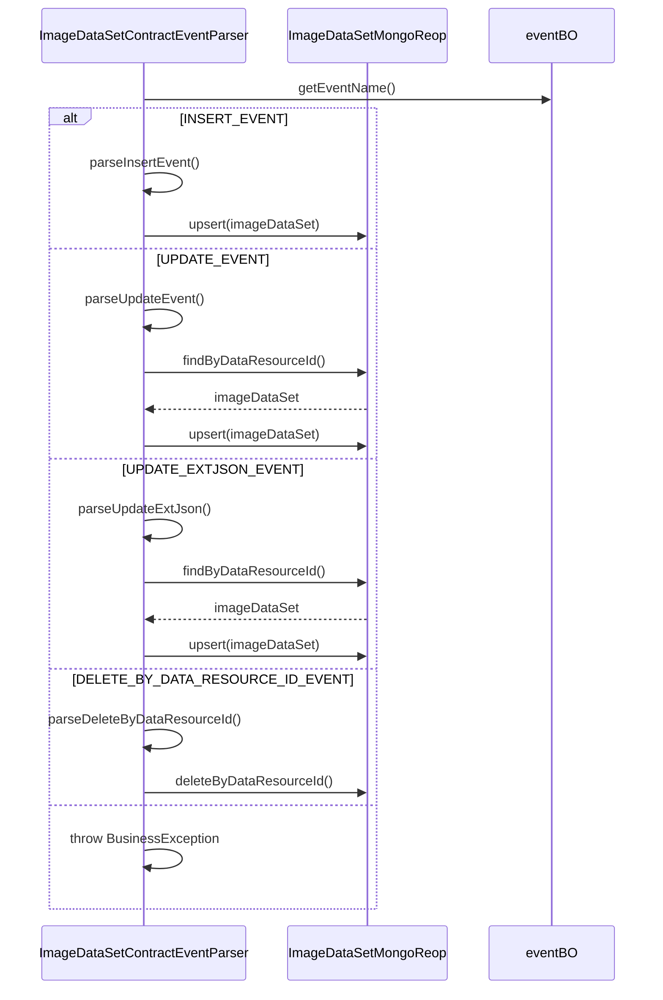

# Basic Information

|      |      |
|------|------|
| Name | ImageDataSetContractEventParser |
| Language | .java |
| Code Path | WeFe/union/blockchain-data-sync/src/main/java/com/welab/wefe/parser/ImageDataSetContractEventParser.java |
| Package Name | com.welab.wefe.parser |
| Dependencies | ['com.alibaba.fastjson.JSONObject', 'com.welab.wefe.BlockchainDataSyncApp', 'com.welab.wefe.common.data.mongodb.entity.union.ImageDataSet', 'com.welab.wefe.common.data.mongodb.entity.union.ext.ImageDataSetExtJSON', 'com.welab.wefe.common.data.mongodb.repo.ImageDataSetMongoReop', 'com.welab.wefe.common.util.StringUtil', 'com.welab.wefe.common.wefe.enums.DeepLearningJobType', 'com.welab.wefe.constant.EventConstant', 'com.welab.wefe.exception.BusinessException', 'org.apache.commons.lang3.StringUtils'] |
| Brief Description | The ImageDataSetContractEventParser class inherits from AbstractParser and parses image dataset events, including operations such as insert, update, and delete, while managing data storage in MongoDB. |

# Description

The `ImageDataSetContractEventParser` class inherits from `AbstractParser` and is used to parse contract events related to image datasets. It contains fields `ImageDataSetMongoReop` and `ImageDataSetExtJSON`, and processes different event types via the `parseContractEvent` method: `INSERT_EVENT` creates a new dataset and sets various attributes; `UPDATE_EVENT` updates existing dataset attributes; `UPDATE_EXTJSON_EVENT` updates the extended JSON; `DELETE_BY_DATA_RESOURCE_ID_EVENT` deletes data by ID. Each method performs data operations through the MongoDB repository and handles exception cases.

# Class Summary

| Name   | Type  | Description |
|-------|------|-------------|
| ImageDataSetContractEventParser | class | The ImageDataSetContractEventParser class parses image dataset events, handling operations such as insert, update, and delete, and interacts with MongoDB to store data. |

## Class ImageDataSetContractEventParser

|      |      |
|------|------|
| Access Modifier | public |
| Type | class |
| Name | ImageDataSetContractEventParser |
| Description | The ImageDataSetContractEventParser class parses image dataset events, handling operations such as insert, update, and delete, and interacts with MongoDB to store data. |

### UML Class Diagram

This class diagram illustrates the core structure of an image dataset contract event parser. The ImageDataSetContractEventParser inherits from AbstractParser, implements data persistence through the ImageDataSetMongoReop interface, and handles event types like INSERT/UPDATE/DELETE. The system relies on ImageDataSetExtJSON for extended data processing, uses EventConstant to define event type enumerations, and identifies job types via the DeepLearningJobType enum. The layered design ensures clear module responsibilities with decoupled event handling and data operations.

### Internal Method Call Graph

This flowchart illustrates the core logical structure of the ImageDataSetContractEventParser class, including 4 event handling branches and exception handling paths. The sequence diagram details the interaction flow under different event types, highlighting CRUD operations with the MongoDB repository. After obtaining the event type through eventBO, the parser enters the corresponding event handling method and ultimately completes data persistence operations via imageDataSetMongoReop. The entire process incorporates strict data validation and exception handling mechanisms.

### Field List

| Name  | Type  | Description |
|-------|-------|------|
| imageDataSetMongoReop = BlockchainDataSyncApp.CONTEXT.getBean(ImageDataSetMongoReop.class) | ImageDataSetMongoReop | Obtain an instance of ImageDataSetMongoReop by injecting it through the CONTEXT container of BlockchainDataSyncApp. |
| extJSON | ImageDataSetExtJSON | Defined a protected ImageDataSetExtJSON type variable extJSON. |

### Method List

| Name  | Type  | Description |
|-------|-------|------|
| parseUpdateEvent | void | Parse the update event, retrieve the data resource ID and update time, then update the image dataset attributes and save them. |
| parseInsertEvent | void | Parse the insertion event, create an ImageDataSet object, and set various attributes including data source ID, task type, label list, etc., and finally perform an update or insert operation in MongoDB. |
| parseContractEvent | void | Method for parsing contract events, which invokes different processing logic based on event names, including operations such as insertion, update, deletion, etc. Invalid events will throw an exception. |
| parseUpdateExtJson | void | Parse and update extended JSON data: Retrieve resource IDs and update timestamps, update the image dataset's extended JSON and modification time, and save to MongoDB. |
| parseDeleteByDataResourceId | void | Parse and delete the image dataset corresponding to the specified data resource ID. |
| getImageDataSet | ImageDataSet | Retrieve the image dataset by data resource ID, and throw a business exception if it does not exist. |

