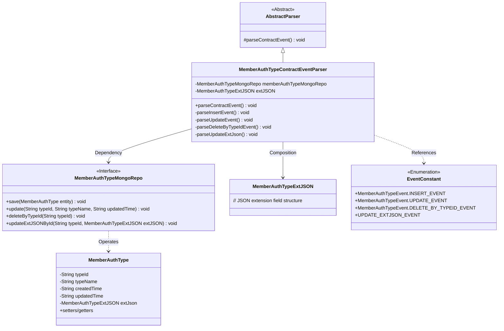
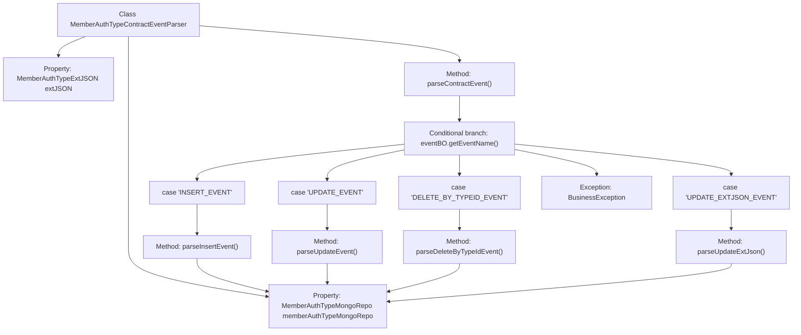

# Basic Information

|      |      |
|------|------|
| Name | MemberAuthTypeContractEventParser |
| Language | .java |
| Code Path | WeFe/union/blockchain-data-sync/src/main/java/com/welab/wefe/parser/MemberAuthTypeContractEventParser.java |
| Package Name | com.welab.wefe.parser |
| Dependencies | ['com.alibaba.fastjson.JSONObject', 'com.welab.wefe.BlockchainDataSyncApp', 'com.welab.wefe.common.data.mongodb.entity.union.MemberAuthType', 'com.welab.wefe.common.data.mongodb.entity.union.ext.MemberAuthTypeExtJSON', 'com.welab.wefe.common.data.mongodb.repo.MemberAuthTypeMongoRepo', 'com.welab.wefe.common.util.StringUtil', 'com.welab.wefe.constant.EventConstant', 'com.welab.wefe.exception.BusinessException', 'org.apache.commons.lang3.StringUtils'] |
| Brief Description | The `MemberAuthTypeContractEventParser` class parses member authentication type events, handling insert, update, delete, and extended JSON update operations, and stores data using MongoDB. |

# Description

The `MemberAuthTypeContractEventParser` class inherits from `AbstractParser` and is used to parse member authentication type-related events. It relies on `MemberAuthTypeMongoRepo` for database operations and includes four event-handling methods: `parseInsertEvent` creates a new record and saves it to MongoDB; `parseUpdateEvent` updates the type name and modification time; `parseDeleteByTypeIdEvent` deletes records based on the type ID; and `parseUpdateExtJson` updates the extended JSON data. The main method, `parseContractEvent`, routes events to their corresponding handlers based on the event name, throwing an exception if the event is invalid. All methods interact with the database through `memberAuthTypeMongoRepo`.

# Class Summary

| Name   | Type  | Description |
|-------|------|-------------|
| MemberAuthTypeContractEventParser | class | The `MemberAuthTypeContractEventParser` class parses member authentication type events, handling insert, update, delete, and extended JSON update operations, and stores data using MongoDB. |

## Class MemberAuthTypeContractEventParser

|      |      |
|------|------|
| Access Modifier | public |
| Type | class |
| Name | MemberAuthTypeContractEventParser |
| Description | The `MemberAuthTypeContractEventParser` class parses member authentication type events, handling insert, update, delete, and extended JSON update operations, and stores data using MongoDB. |

### UML Class Diagram

This class diagram illustrates the structure of a member authentication type contract event parser. The MemberAuthTypeContractEventParser inherits from an abstract parser and depends on a MongoDB repository interface and an extended JSON entity through member variables. The core method parseContractEvent() dispatches to four private processing methods based on event types, handling insert, update, delete, and extended field update operations respectively. All operations interact with the database through the MemberAuthTypeMongoRepo interface, operating on the MemberAuthType entity class. Event type constants are maintained by the EventConstant enumeration.

### Internal Method Call Graph

This code flowchart illustrates the core structure and logical flow of the MemberAuthTypeContractEventParser class. Inheriting from AbstractParser, this class primarily handles parsing different types of member authentication contract events. The process starts with the parseContractEvent() method, which branches based on event names (eventName) to invoke corresponding parsing methods (insert/update/delete/update extended JSON). Each specific parsing method interacts with memberAuthTypeMongoRepo for database operations, demonstrating a clear event-driven processing pattern. BusinessException is thrown in exceptional cases, while the overall structure adheres to the Open/Closed Principle, facilitating easy extension for new event type handling.

### Field List

| Name  | Type  | Description |
|-------|-------|------|
| memberAuthTypeMongoRepo = BlockchainDataSyncApp.CONTEXT.getBean(MemberAuthTypeMongoRepo.class) | MemberAuthTypeMongoRepo | Obtain an instance of MemberAuthTypeMongoRepo, injected via the CONTEXT of BlockchainDataSyncApp. |
| extJSON | MemberAuthTypeExtJSON | The protected member variable extJSON, of type MemberAuthTypeExtJSON. |

### Method List

| Name  | Type  | Description |
|-------|-------|------|
| parseInsertEvent | void | Parsing insertion event: Create a MemberAuthType object, set the type ID, name, creation time, update time, and extension JSON, then save it to MongoDB. |
| parseUpdateEvent | void | Parse the update event, retrieve the type ID, name, and update time, and update the member authentication type records in MongoDB. |
| parseContractEvent | void | Analysis of contract event methods, invoking corresponding processing logic based on event names, including addition, update, deletion, and extended JSON update events. Invalid events will throw an exception. |
| parseDeleteByTypeIdEvent | void | Parse the deletion event and delete the corresponding record from memberAuthTypeMongoRepo based on the typeId. |
| parseUpdateExtJson | void | The method parseUpdateExtJson updates the extJSON field in memberAuthTypeMongoRepo by typeId. |

