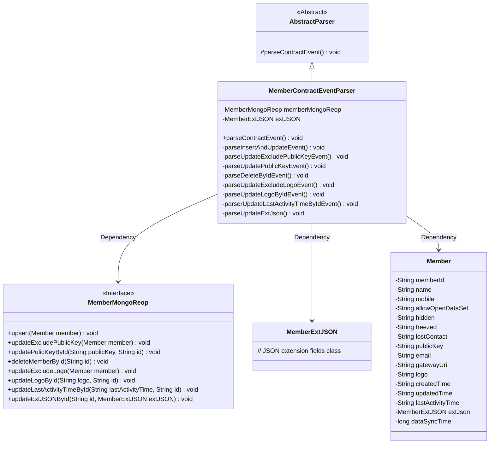
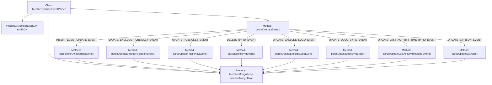

# Basic Information

|      |      |
|------|------|
| Name | MemberContractEventParser |
| Language | .java |
| Code Path | WeFe/union/blockchain-data-sync/src/main/java/com/welab/wefe/parser/MemberContractEventParser.java |
| Package Name | com.welab.wefe.parser |
| Dependencies | ['com.alibaba.fastjson.JSONObject', 'com.welab.wefe.BlockchainDataSyncApp', 'com.welab.wefe.common.data.mongodb.entity.union.Member', 'com.welab.wefe.common.data.mongodb.entity.union.ext.MemberExtJSON', 'com.welab.wefe.common.data.mongodb.repo.MemberMongoReop', 'com.welab.wefe.common.util.StringUtil', 'com.welab.wefe.constant.EventConstant', 'com.welab.wefe.exception.BusinessException', 'org.apache.commons.lang3.StringUtils'] |
| Brief Description | The MemberContractEventParser class parses member contract events, handling operations such as insert, update, and delete. These operations include updates to fields like member information, public keys, logos, etc., and synchronize the data to MongoDB. |

# Description

The MemberContractEventParser class inherits from AbstractParser and is used to parse member-related contract events. It includes multiple event handling methods, such as insert update, exclude public key update, public key update, delete, exclude logo update, logo update, last activity time update, and extended JSON update. Each method processes member data based on the event type and interacts with MongoDB via memberMongoReop. Processing time is logged during execution to ensure data synchronization.

# Class Summary

| Name   | Type  | Description |
|-------|------|-------------|
| MemberContractEventParser | class | The MemberContractEventParser class parses member contract events, handles operations such as insert, update, and delete, interacts with MongoDB to store member data, and includes logging and exception handling. |

## Class MemberContractEventParser

|      |      |
|------|------|
| Access Modifier | public |
| Type | class |
| Name | MemberContractEventParser |
| Description | The MemberContractEventParser class parses member contract events, handles operations such as insert, update, and delete, interacts with MongoDB to store member data, and includes logging and exception handling. |

### UML Class Diagram

This code demonstrates a member contract event parser in a blockchain data synchronization application. MemberContractEventParser inherits from AbstractParser and manipulates member data in MongoDB by parsing different event types (such as insert, update, delete, etc.). Core classes include the Member class for handling member data, the MemberExtJSON class for storing extended fields, and the MemberMongoReop interface that defines database operations. The parser invokes different private methods based on event types, with each method corresponding to specific database operations, enabling fine-grained control over data synchronization.

### Internal Method Call Graph

This code implements the MemberContractEventParser class, which inherits from AbstractParser and is primarily used for parsing member contract events. It invokes different parsing methods based on event types, such as insert/update events, exclude-public-key update events, public-key update events, etc. Each parsing method performs database operations via MemberMongoReop and records processing time. The flowchart illustrates the class structure, invocation relationships between key methods, and branch handling logic for different event types.

### Field List

| Name  | Type  | Description |
|-------|-------|------|
| extJSON | MemberExtJSON | Protect the member variable extJSON, of type MemberExtJSON. |
| memberMongoReop = BlockchainDataSyncApp.CONTEXT.getBean(MemberMongoReop.class) | MemberMongoReop | Obtain an instance of MemberMongoReop by injecting it through the CONTEXT context of BlockchainDataSyncApp. |

### Method List

| Name  | Type  | Description |
|-------|-------|------|
| parseUpdatePublicKeyEvent | void | Parse the public key update event, retrieve the ID and public key, and update the public key in MongoDB using the ID. |
| parseInsertAndUpdateEvent | void | Parse insertion and update events, create a Member object and set each attribute value, including ID, name, phone number, etc., then store it in the database and record the time consumed. |
| parseUpdateLogoByIdEvent | void | Analyze the Logo update event, retrieve the ID and Logo, and call the member database to update the Logo corresponding to the ID. |
| parseUpdateExcludeLogoEvent | void | The method `parseUpdateExcludeLogoEvent` is used to update member information while excluding the `logo` field. It extracts 12 data items including member ID, name, and phone number from the parameters, sets the synchronization time to the current time, and finally calls `memberMongoReop` to update the database. |
| parseDeleteByIdEvent | void | Parse the deletion event, retrieve the ID, and call the member library to delete the record corresponding to the ID. |
| parseUpdateExcludePublicKeyEvent | void | Parsing update to exclude public key events, setting member information and updating the database, recording time consumption. |
| parserUpdateLastActivityTimeByIdEvent | void | Method parses update events to update member records by ID and last activity time. |
| parseUpdateExtJson | void | Parse and update extended JSON data, locate by ID and update member extension information in MongoDB. |
| parseContractEvent | void | Analysis of contract event methods, invoking different processing logic based on event types, including operations such as addition, deletion, modification, and query, with business exceptions thrown in case of errors. |

